## Solution 

Read the welcome.txt file.

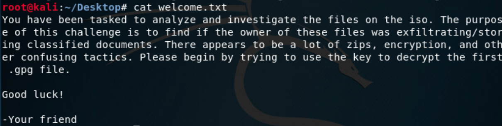

After examining the key, it looks almost, but not quite, like hexadecimal. Let's strip out the valid hex characters and
see what's left:

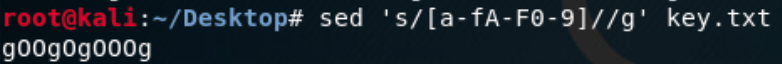

Just some lowercase `g`s and uppercase `O`s. Now let's strip those out from the key file:

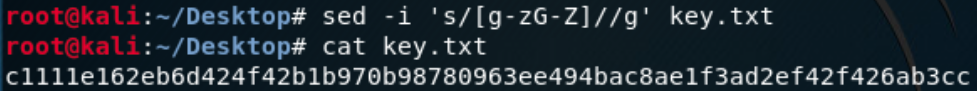

Find out how many characters remain:

A length-64 hex string encodes 32 bytes, or 256 bits. Let's use hash-identifier to confirm:

At the time of the competition, none of the wordlists provided by Kali matched this hash value. It's possible this has
changed since then. For the competition and as of writing, it was possible to find this hash at `md5hashing.net`,
giving the inverted hash value `supercalifragilisticexpialidocious`:

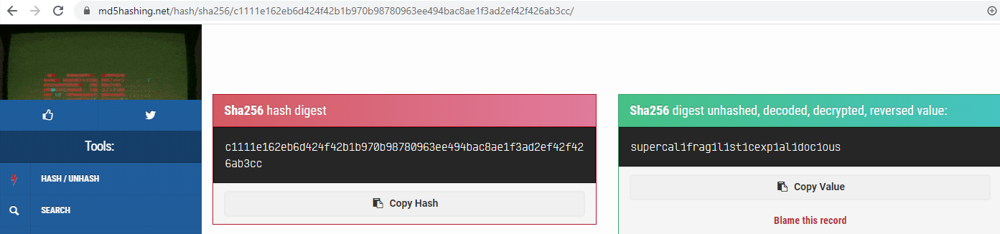

Let's try to decrypt the zipfile using this password:

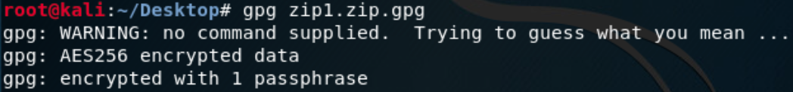

That worked, so let's unzip the result:

There's are a few files inside, so let's see what's in the guide:

Take a look at the contents of `profile.txt`:

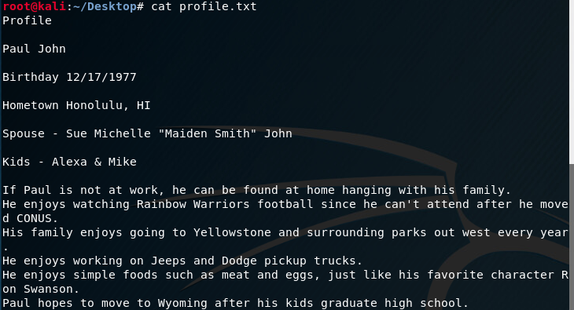

Let's take the guide's advice and make a wordlist out of `profile.txt`, removing most of the single characters and all
duplicates:

Next we use our handy word-mangling tool as suggested in the guide to get a huge variety of variants of every word in
the given word list. The `profile.txt` file hints that the person enjoys going to the state park annually. There are
other suggestions in that file, but this is the particular hint that helps us progress.

The following command will add years to the beginning and end of each word in our wordlist.

We also had a `Zip2 Hash.txt` in the challenge files list. Let's dump the hash itself into a separate file.

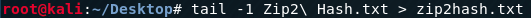

With the wordlist we just created, let's compare the wordlist with the hash:

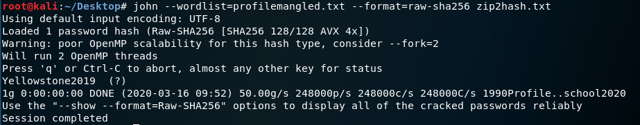

John quickly finds the password, `Yellowstone2019`:

Use the password to decrypt the second zip:

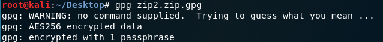

Unzip the decrypted file:

Let's move the extracted files into a separate directory.

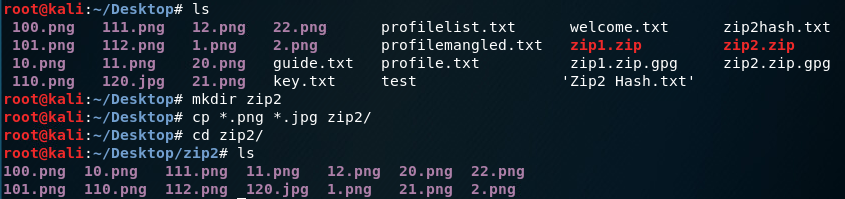

Have a look at the images:

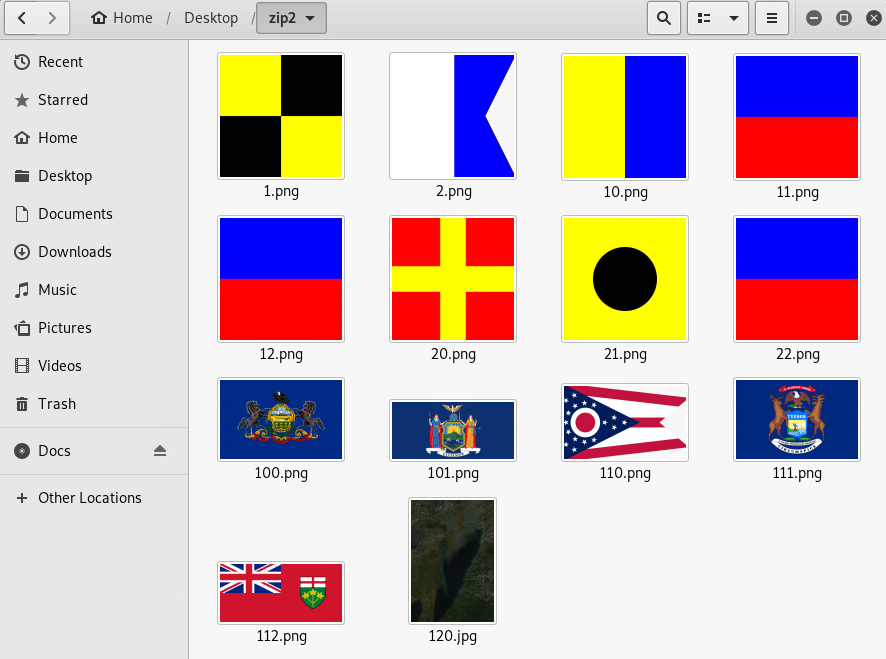

Examine the images' properties, noting the sizes:

Try binwalk on these images to see if there is anything hidden:

Looks like `100.png` has a hidden zip file. Let's just try to extract it:

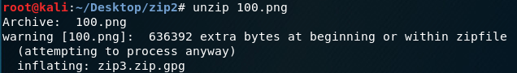

We have the third zipfile now. Let's inspect the images more closely. The image that stands out the most is `120.jpg`.
Not only are all the other pictures of flags or emblems, they are also all PNG files. It seems to be a picture of a
lake from above:

Let's inspect the other flags:

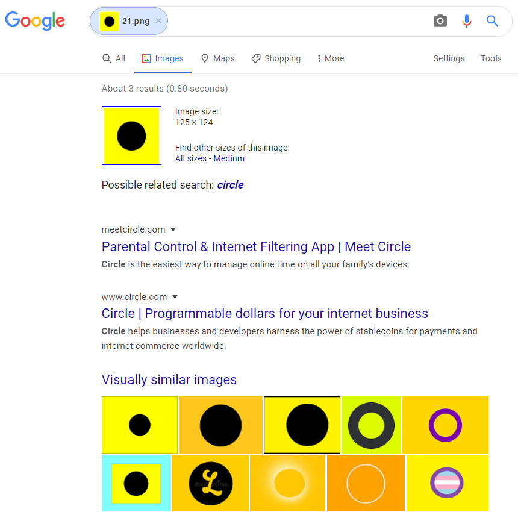

Checking the visually-similar images, it seems that these are state and maritime flags. Putting these clues together,
let's see what they have in common:

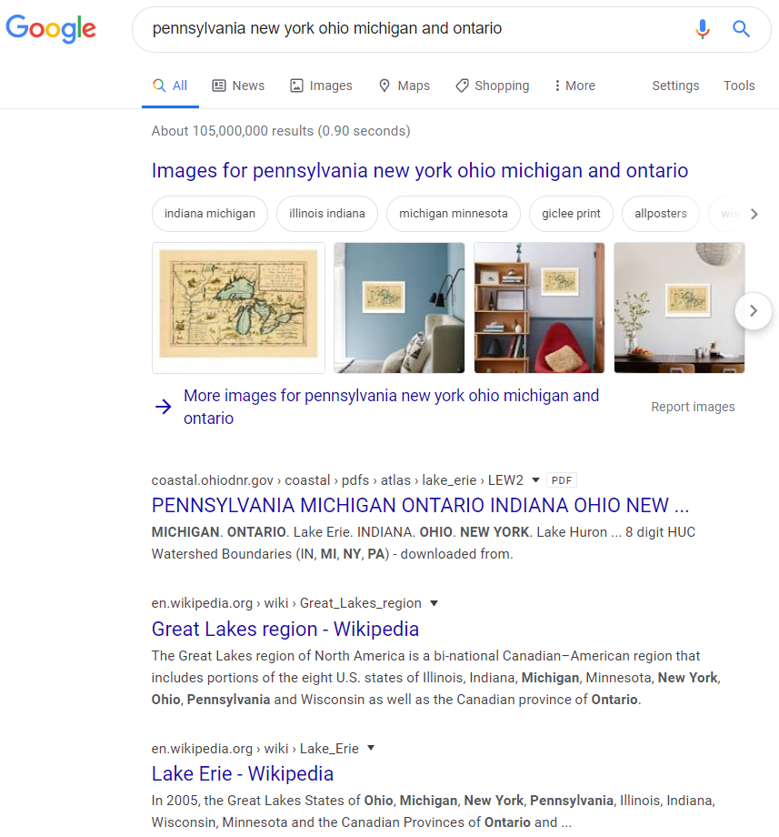

We can look through the flags and put together that some of the locations they represent border Lake Erie, and that the
aerial photo was a photo of Lake Erie. Let's try `Lake Erie` as the password:

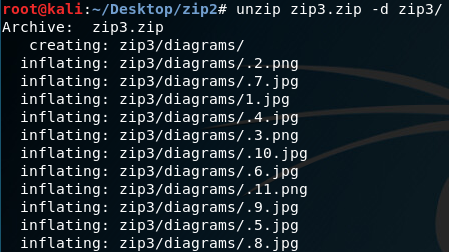

We can see that zip3 contained a bunch of hidden files:

Looking through these files, we can see that `.2.png` contains the flag:

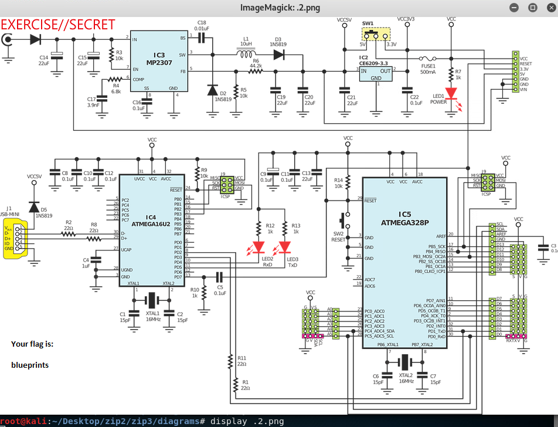

## Flag

blueprints

## License
Copyright 2020 Carnegie Mellon University. See the [LICENSE.md](../../../LICENSE.md) file for details.