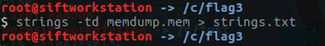
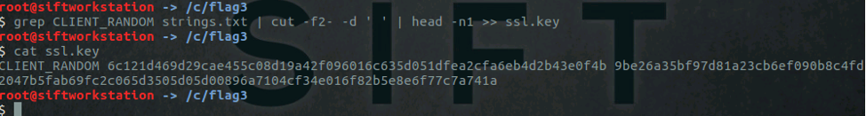
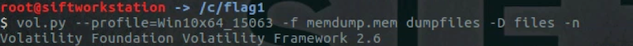

# Cutting through perimeter defenses

## Solution

### Background
The encrypted traffic is a simple https GET request, encrypted with TLS. The flag is in the https response, and is gzip deflated. The IP address of the https server is 138.219.5.37 and the client making the request has an IP address of 10.0.1.22.

### Analysis

Because this protocol is encrypted, Wireshark will not be able to decode the traffic right away. Wireshark can be configured to decrypt SSL/TLS traffic, but it needs to be configured to use the corresponding session key. 

The first step is to recover the session key from the supplied memory capture of the host suspected to have been involved in this incident. This can be accomplished in two ways.

The most straightforward way would be to run the `strings` tool against the memory capture, as shown below:

 

A TLS session key will begin with the text `CLIENT_RANDOM`, so the resultant strings should be searched for this pattern. This will reveal the key, which can be extracted into a separate file with the command shown below:

 
An alternate way of extracting the key would be to use the `volatility` memory forensics tool. Running the volatility `filescan` plugin as show below will reveal that a file named `sslkeylogfile.txt` has been opened:
 

This file can be extracted, and it will contain the session key:
 

 
Wireshark can now be configured to decrypt the TLS session.

Load the `analysis.pcap` file in Wireshark, then go to `Edit-> Preferences -> Protocols`, and select the `SSL` protocol.  Configure the `(Pre)-Master-Secret` to use the extracted key file as shown below:
 

Click OK. 

Type `ssl` into the Wireshark display filter box and click the blue `-> arrow` to apply the filter. This should force Wireshark to process the encrypted packets using the key provided in the previous step. It may also be necessary to click on one of the TLS packets to initiate the decryption process. 

Wireshark should now be able to decrypt the TLS traffic. If decryption was successful, two new tabs should appear at the bottom of the wireshark window: `Decrypted SSL` and `Uncompressed entity body` (as seen below). If decryption fails, double check that the file containing the key does not have any extraneous data in it.
 

The decrypted HTTP stream can be followed to easily see the flag:
 

The flag is the 11 characters contained inside of the `{ }`. 

  

Flag - `jabberwocky`

## License
Copyright 2020 Carnegie Mellon University. See the [LICENSE.md](../../../LICENSE.md) file for details.