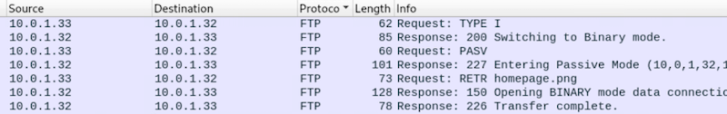
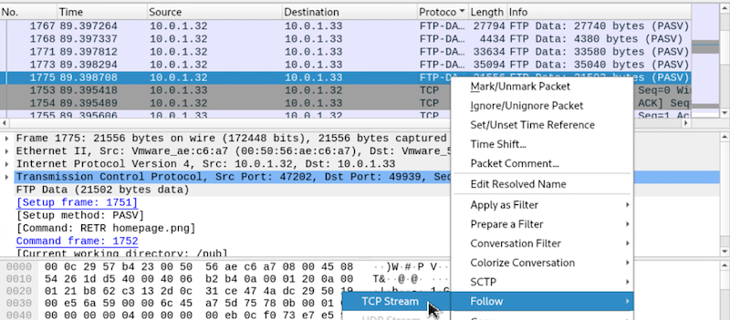
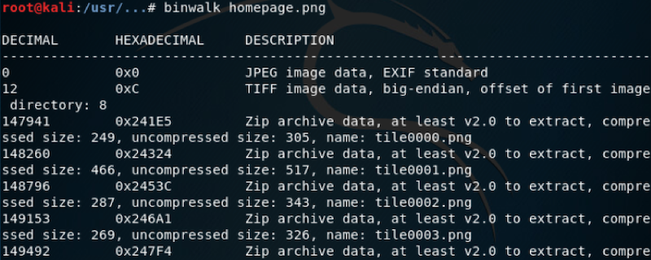

# Tile Town

## Solution

Let's start with the `cipher.txt.gpg` file. Decrypt this file with the password `07041776`.


View the contents of `cipher.txt` file.


To decrypt the ciphertext, we must first understand what format is the ciphertext. Due to all characters being alphabetical characters A through Z, this eliminates any cipher that utilizes hexadecimal, base64, or other formats that include numbers or special characters. Substitution and Transposition ciphers fit this cipher with a key. Open-source columnar transposition decryption programs can help decrypt this ciphertext.


<br> 

The instructions in the decrypted ciphertext say to `findandunzippcapsdotzipfile`. As mentioned in the challenge guide, during the competition, the `pcaps.zip.gpg` was hidden somewhere on the kali virtual machine, and participants had to search for it. Another file named `pcapziphint.txt` was also present in the same folder as `pcaps.zip.gpg`. 

View the contents of `pcapziphint.txt`. It contains the hash of the gpg password for the `pcaps.zip.gpg`file - `AA5AB35A9174C2062B7F7697B33FAFE5CE404CF5FECF6BFBBF0DC96BA0D90046`.

Search for that hash on the internet, and you'll find that it is the hash of the word `USA`.

Decrypt `pcaps.zip.gpg` with the password `USA`. 
```
gpg pcaps.zip.gpg
```
Unzip the archive.
```
unzip pcaps.zip
```

View the contents of `pcapinstructions.txt` file. It says that a picture was divided into 100 image chunks in a grid-like pattern. The pieces of the overall picture were transferred across the network. Your task is to extract the images from the pcap and re-assemble them to re-create the original picture. The pictures are believed to have been sent/titled in some order. Some suggestions would be to recreate the images in order beginning with the first column and moving right, or the first row and moving down. The original picture is believed to be a 300x150 or 300x180. Once you recreate the image, your flag is the city/town this image represents.

Open each pcap file (`eth0.pcap` ... `eth4.pcap`) using `Wireshark`. Within `eth4.pcap` file, you'll find that `homepage.png` file was sent across the wire via FTP.



To export this `homepage.png`, find the FTP-DATA packet with the tag `(RETR homepage.png)`, and follow the TCP Stream.



Save the raw data as the original file name `homepage.png`.

Binwalk the `homepage.png` file. Here you will see that it is a zip archive, and it contains all `tile00XX.png` files.



Unzip `homepage.png` to extract all `tile00XX.png` files. 
```
unzip homepage.png 
```
Create a new directory and place all the tiles in that directory. Use file explorer to have a better view of all the tiles. As mentioned in the instructions, the original picture is believed to be a 300x150 or 300x180. View the size of any tile. You'll see it is 30x18. Therefore, if we placed tiles in a 10x10 grid, then that should represent the original picture of 300x180.


Use the `convert` command to convert each horizontal row into one image, then merge all horizontal rows to create an image of the original flag.


A Google reverse image search (images.google.com) will reveal this image's city.


<br><br>

Flag - `siouxfalls`


## License
Copyright 2020 Carnegie Mellon University. See the [LICENSE.md](../../../LICENSE.md) file for details.