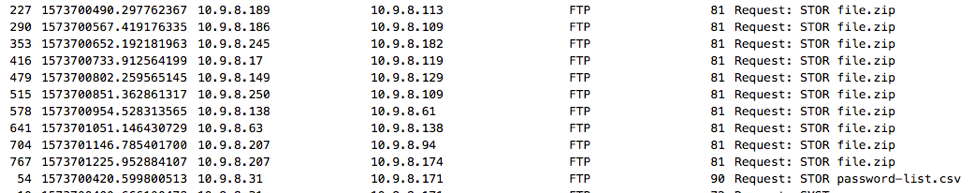
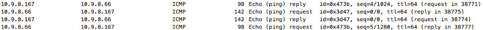
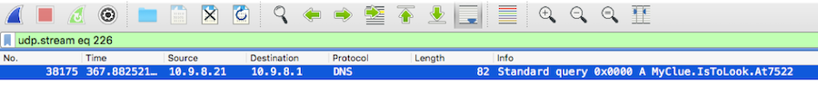
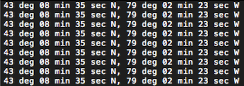

# Field of Streams: Needles in a Haystack

## Solution

Use Wireshark to open the pcap file.

### Finding the FTP files

Enter a filter in Wireshark for `ftp or ftp-data` (It might help to export this as a new capture to save on processing time each round). You can make this easier by then sorting the resulting packets by the `info` column and looking for just when `STOR` commands were used.

The first thing that should stand out is the `password-list.csv` file. You can follow `ftp-data` stream for any `STOR` command associated with the csv file to see the data itself.

At this point, you can convert the traffic to the `RAW` format and `Save as` to save the CSV file to your machine. Viewing this file, you will notice 10,000 rows of 3 columns. Each row represents a password mixture.

You should also extract the FTP files, all labeled as `file.zip`, using the same process until you find the one that has a matching hash value. For time’s sake, the correct `file.zip` should be the one sent between `10.9.8.245` and `10.9.8.182`.

At this point, you have the password file and have correctly identified the correct zip file that contains the flag. The next step will be to find the unusual traffic that contains the hints for assembling the password.

### Finding the Hidden Data in Streams/Conversations

Given the hint in the challenge guide, you can instantly eliminate any types of encrypted traffic, such as HTTPS/SSL, and SSH. (the dataset has been reduced from the original to remove garbage protocols that weren’t used)

There are only a handful of protocols in use: DNS, FTP, ICMP, SSH, TCP, and TLS. TLS, SSH, and any of the TCP traffic over port 443 can be eliminated from contention. Filter this out (i.e. `not ssl.record.version and not ssh and not (tcp.port == 443)`). This leaves DNS, FTP, ICMP, and other random TCP packets to investigate. This also reduces the capture from over 650,000 packets to roughly 40,000. You may export it as a new capture.

#### ICMP

ICMP is a good place to look, as there are only 22 packets (11 pings) sent in the entire capture, and all in one burst. One of these packets is much larger than the rest.

The packet bytes pane will show the cleartext message

The piece of the password associated with the ICMP traffic is `722`.

#### DNS

DNS might be another good place to look, and you can reduce the Conversations statistics (`Statistics -> Conversations`) to just DNS as well. Reviewing this data, you'll find that all DNS requests are made to 8.8.8.8 or 8.8.4.4 except for one. This request is made to another machine on the 10.9.8.0/24 network, which goes against the challenge guide’s network info details. Also, the source and destination port are both 53, which would not happen normally.

This request was made to:

 

The piece of the password associated with the DNS traffic is `7522`.

From looking at the FTP traffic, you can deduce that you have used every relevant packet in the first step and that FTP is not a threat either.

#### TCP

TCP is the most likely suspect remaining, as it is one of the few protocols remaining. Since it is stated in the challenge guide that the two machines sending data are on the local network, only traffic between 10.9.8.0/24 hosts is in play, and you can eliminate the FTP traffic and any other protocol already analyzed. Use the wireshark filter as `!ftp && !dns && !icmp && ip.src== 10.9.8.0/24 && ip.dst == 10.9.8.0/24`. Export the resultant packets as a new capture.

The resulting conversations only show a handful of streams that actually contain the data being sent. Use `Statistics -> Conversations`, and you'll find that only one converation uses the exact same source and destination port 10,000, which is a very exact number.

Following the stream for this traffic provides the text:

 

The piece of the password associated with the TCP traffic is `5800`.

Rearranging the protocols in alphabetical order would be DNS, ICMP, TCP, or `7522`, `722`, `5800`. These numbers correspond to the rows that contain the correct password values in each column.

The three rows contain `pkFa`, `Gr1r`, and `rrSq`, when combined makes the password to open the zip file.

Inside the zip is the `flag.txt` file containing the coordinates.
 
 

  

Flag - `43°08′35″N 79°02′23″W`

## License
Copyright 2020 Carnegie Mellon University. See the [LICENSE.md](../../../LICENSE.md) file for details.