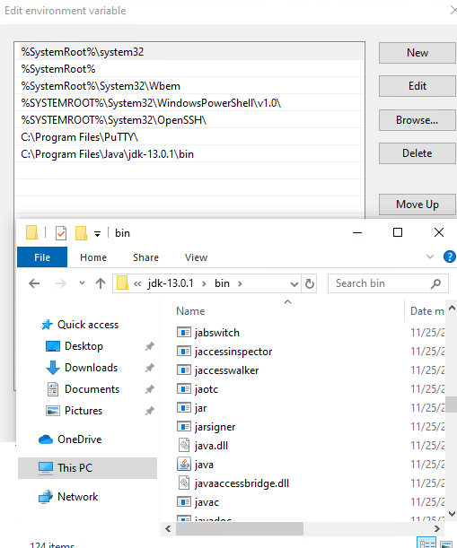
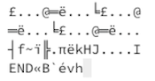
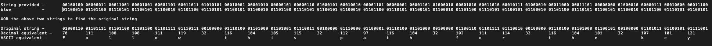

# Zork for Cyber Adventurers

## Solution

To start the game, execute `java -jar Adventure.jar`. You'll need JDK installed on your system. (For Windows system, make sure the environment variable `Path` is set to JDK installation folder housing the `jar` executable as shown below). 

Your task is to play the game, solve the problems asked by the game, enter the responses in the game, and finally, the game should display the flag for this challenge.

**Problem 1**

Execute the binary `mystery` in the `original images` folder to analyze how the data is embedded into images. `mystery` file uses the string (`abcdefghijklmnopqrstuvwxyz`) in `flag.txt` file and embeds it into the three images in a mutated way. View the resulting images in a Hex editor. 

            mystery.png 
 
            mystery2.png 
 
            mystery3.png 

As seen in the resulting images, the string is chunked into all three images, and the two characters added to the second image also get increased in their ASCII value.

* `bcfklmno` or the letters in positions 2, 3, 6, 11-15 are stored in `mystery3.png`
* `eghijpqrstuvwxyz` or the letters in positions 5, 7-10, 16-26 are stored in `mystery.png`
* Remainder characters `a` and `d`, or letters in positions 1 and 4 are added to `mystery2.png` but 
    * `a` is increased by 21 in the ASCII table and thus becomes `v`
    * `d` is increased by 4, and thus becomes `h`

The next step is to analyze the embedded images using a hex editor and see what is stored in these images.

            mystery.png 
 
            mystery2.png 
 
            mystery3.png 

Using the above information, we know that the letters stored above correspond to the following positions of the original string:

The answer to problem 1 is `Th3K3yT0Th3Ch3stLi3$Ah3ad.`

**Problem 2**

Try the three passwords present in the csv file until one works. The second password (`fxt8m1k1045o`) in the csv file will open the zip file. The submission (`nekq7bfni9jq`) to this problem is present inside the text file present within the zip file.

**Problem 3**

For this problem, the first step is to find the binary value for the word `blue`. This can be done by converting each letter of the word to its corresponding ASCII number and then converting the ASCII number to its binary value. You may use online resources to convert characters to ASCII numbers, and numbers to binary values.

The binary value for the word blue is `01100010 01101100 01110101 01100101`.
Apply this value to the string provided in `Problem3.txt` by simply repeating it over and over until you can XOR the entire string. 

Once you've XOR'd to find the original string, convert the original string into decimal and then into ASCII. 

Save the resultant string (`Follow this path for the key`) in a text file (without any new line character), and then find the MD5 of the text file. Make sure to do this last step on a Windows system. The MD5 hash value should be `3606d3c98cde43c521a0e0bb969f1db3`, which is also the answer for Problem 3.

**Problem 4**

For this challenge, you may use Excel or a similar application to analyze the logs. Use the filtering capability and view the unique values present in the `User-Agent` column. 

As shown above, the two enumeration tools used are `nmap` and `sqlmap`. The source IP address (`c-ip` or the client IP column) is `192.168.51.182`. The second enumeration tool targeted `login.aspx` page on the webserver.

**Problem 5**

Use `Wireshark` to analyze the pcap file, and filter the `ICMP` packets sent from `10.10.10.66` to `10.10.10.10`. 

The answer is 100.

**Problem 6**

Use `Excel` or a similar application to analyze the IIS web logs. The answer to this problem is present in the `s-ip` (server IP) column, which is `192.168.51.14`.

**Problem 7**

Find MD5 hash of all three files. Take the first 11 characters from file 1's hash, characters 12-22 from file 2's hash, and the last 10 characters from file 3’s hash to create one concatenated hash (`ac790cb4e9c371aa2195f39dd4af9895`) and use this to unzip `Problem7.zip` file. The resultant hash is also the answer to this problem.

**Problem 8**

Simply add the four file sizes together. 16,712 + (3 x 16,222) = `65,378` bytes.

**Problem 9**

For this challenge, you must write a script that will attempt to brute force the zip file by trying all possible password permutations and run them against the file. Once you have cracked the file, the text file contained within will provide the answer for this problem. The script (`Problem9.py`) is available for download. Place the script in the same folder as the other files for this problem. You'll need python to run this script. Execute the script and extract the zip file. The answer for this problem is `2a5koc2rwvss`.

**Problem 10**

Use `Wireshark` to open the pcap file. Rearrange the packets according to the `Protocol` column. Analyze all different protocols one by one and see if you find a protocol for which the traffic is beaconing at a fairly regular interval. 

The beaconing traffic is using `SSH` protocol, which is different from SSHv2. The regular SSH traffic occurs roughly every 60-70 seconds, is always precisely 3 packets, isn’t encrypted, only goes in one direction, and always has the same length/size, which is irregular or stands out. Follow any of these streams, as they are all the same, and you will see a bunch of iptables data plus a line with the answer (`47ip5j8q7noq`) in the middle. 

  

Flag - `39°17'47"N 76°35'30"W`

## License
Copyright 2020 Carnegie Mellon University. See the [LICENSE.md](../../../LICENSE.md) file for details.