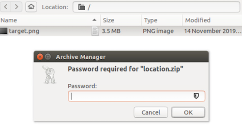
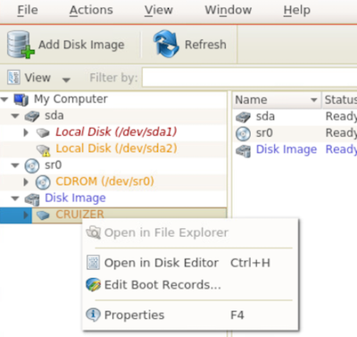
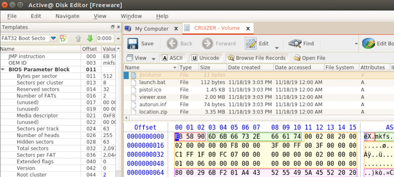
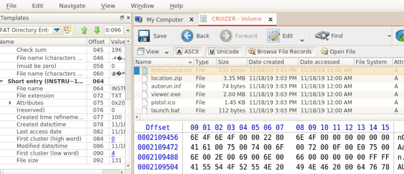
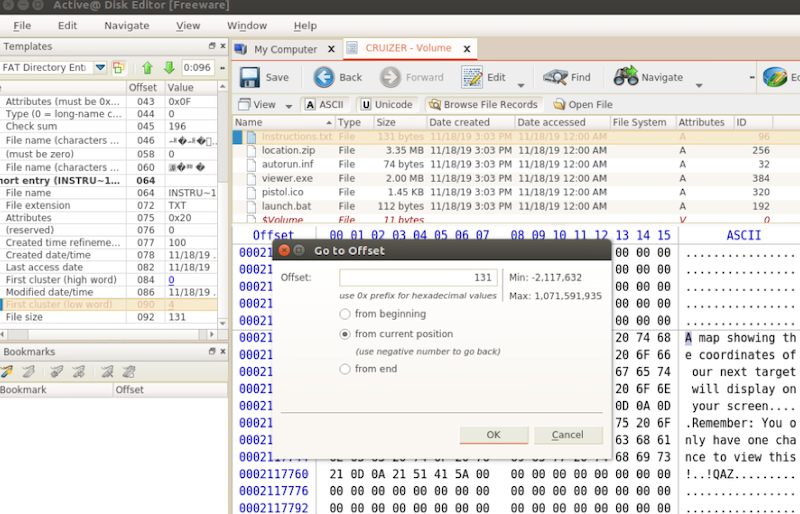
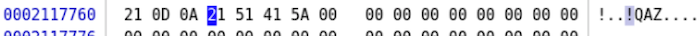
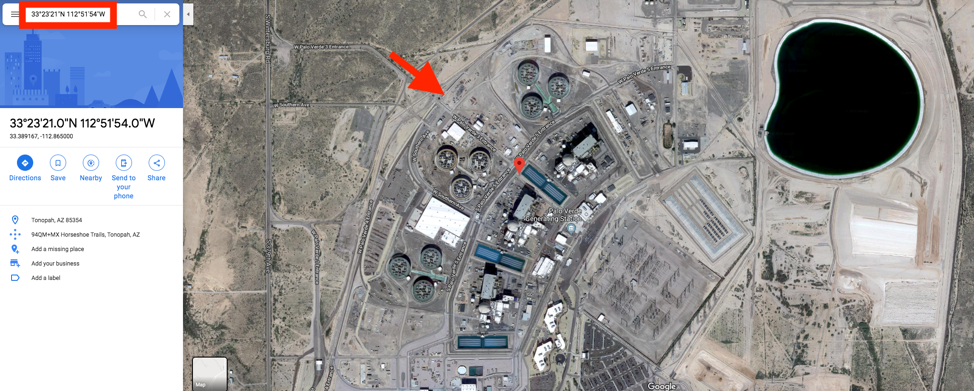

#  Slackin’

## Solution

### Background
This challenge hides the key to unlock an encrypted zip file in filesystem slack space. The key is distributed in 4-character chunks across 5 different files found on the captured thumb drive image. Attempts to analyze the `viewer.exe` executable found on the thumb drive will fail, as its contents have been replaced with zeroes. 

You must use a hex-editor or similar low-level tools to examine the fat32 file system. Such an analysis will reveal that 4 bytes have been appended to the files containing cluster slack space.

### Analysis
Start by examining the disk image’s partition layout with `mmls`. 
```
mmls analysis.dd
```

Use `fsstat` to reveal that it is a `FAT32` file system.
```
fsstat -o 63 analysis.dd
```

The next step is to mount the file system using the `mount` command.
```
mount -o ro,noatime,loop,offset=$((63*512)) analysis.dd /mnt/windows_mount
```
 
Browse the mounted file system and view the files present within it. We know the file containing the flag is inside of `location.zip` file, but it is password protected.
 


### Finding the Password
The most straight forward tool to use in this analysis is `Active@ Disk Editor`. Use this tool to open the disk image `analysis.dd` image.

After the disk image opens, you’ll see a screen that looks like a hex-editor. This view is not particularly useful, so close the tab labeled `Disk Image. – RAW Data (Binary)…`.

You should now be back at the Disk Editor Home screen. Right-click on `CRUIZER` (the disk image you previously loaded) and select `Open in Disk Editor`.
 


You should now see a tab labled `CRUIZER – Volume`. Close the `How To` windows that may have popped open on the right-hand side of the screen. Click the `Browse File Records` button on the menu bar. 

 

Click the `Name` column heading in the `Browse File Records` window. This will sort the files by filename. The way the zip password is distributed is in 4-byte chunks in alphabetical order for all files that contain file system cluster slack space. So 1st 4 bytes are stored in `Instructions.txt`, next 4 in `location.zip`, and so on. Refer to the table below (close to the end of the document) for a complete listing. 

To recover the password bytes, do the following:
Click the 1st file record, `Instructions.txt`. Observe that the template data in the left-hand pane has been changed to reflect the file record. 
 

 
We’re interested in the data stored in clusters. Scroll down in the left-hand pane until you see `First Cluster (low word)`. For the file `Instructions.txt`, this will be a value of `4`. The cluster is hyperlinked, so clicking on it will take you directly to the clusters which store the file’s data. Click `4` to proceed to the first cluster of the file.

Now your cursor should be on the first byte of the 1st cluster of the file. Observe from the left-hand pane. The `File Size` field tells us the size of the data stored in the file (in bytes). Any space between the end of the file size in bytes and the remainder of the cluster is `slack space`, and data can be hidden there. In the case of `Instructions.txt`, the file size is `131 bytes`. Much smaller than the cluster size of `4096 bytes`! Slack space exists in this file, so we should navigate to the end of the file byte stream and examine the remaining bytes. 

To do this, select `Navigate -> Go to Offset` from the top menu. When the dialog box appears, enter the file size value as the Offset, select `from current position`. Click OK.
 
 
 
The cursor will move to the end of the file. Observe that there are bytes hidden in the slack space here:
 


The bytes are 0x21, 0x51, 0x41, 0x5A… which in ASCII translate to `!QAZ`… the first 4 characters of the password!

Repeat this process for all files which contain slack space.  

Password chunks and corresponding files:

Sequence | Filename | Characters
--- | --- | ---
1 | Instructions.txt | !QAZ
2 | location.zip | 2wsx
3 | autorun.inf | #EDC
4 | pistol.ico | 4rfv
5 | launch.bat | %TGB

Note: viewer.exe was skipped in this sequence, it is exactly 512 clusters in length and therefore has no slack space. 

 

### Revealing the Flag
Use the recovered password: `!QAZ2wsx#EDC4rfv%TGB` to open `target.png` file. It is a simple keyboard walk password, so as to make it more easily recognizable. 





<br> <br>

Flag - `33°23′21″N 112°51′54″W` (the location of the Palo Verde Nuclear Power plant)

## License
Copyright 2020 Carnegie Mellon University. See the [LICENSE.md](../../../LICENSE.md) file for details.