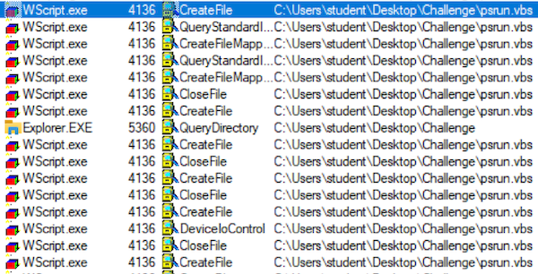
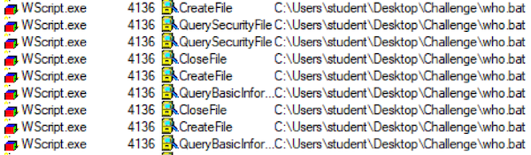
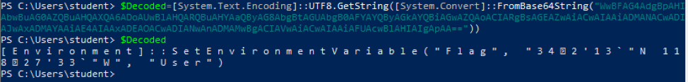

# Special Effects

## Solution

The Challenge file is an SFX archive packed with WinRar. It has a script that will automatically execute upon extraction.

To analyze the script execution, place the executable in a folder with an easy name to recognize. For this solution guide, the executable is placed in a folder called `Challenge` on the Desktop.

You may use `Sysinternals Procmon` tool to analyze the events. Open `ProcMon` and adjust the filter to only show events that have the folder name in the path. 

With this filter enabled, the next step is to execute the archive by double clicking it and following the prompts. 

You can scroll through the thousands of events that occur with this executable. The interesting thing to note is when the WScript engine is called. This means that Windows is running some other program written in a scripting language. You'll notice that this program is called `psrun.vbs`.

Scroll down a little further and you'll see `who.bat` executing as well.

These are interesting files since these are executed by the original file that we had double clicked. 

Use the **open archive** option from 7zip to view the contents of the original `Challenge.exe` executable. This shows a whole bunch of files from the Sysinternals Tools.

Scroll down to the `psrun.vbs` file in the 7zip console, right click and select **Edit**. This is a simple VBScript that calls `who.bat`. 

The next step is to look at the batch script. Follow the same process for viewing `who.bat`. You'll see that this batch script executes a PowerShell script. The script is encoded and you'll need to decode it to figure out what it does. 

Another encoded PowerShell script is present inside it, so we should do the same thing to decode it again. (It helps to copy the output into a notepad and remove the spaces so as to get the correct output)

The output shows that a PowerShell command sets an environment variable. Let's view that environment variable.

And that is the flag for this challenge.

  

Flag - `34°2'13"N 118°27'33"W`

## License
Copyright 2020 Carnegie Mellon University. See the [LICENSE.md](../../../LICENSE.md) file for details.