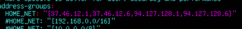
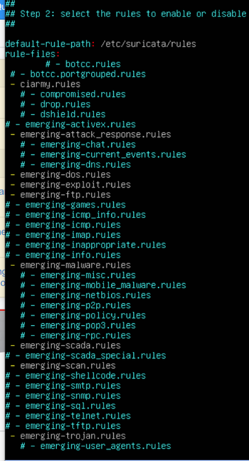
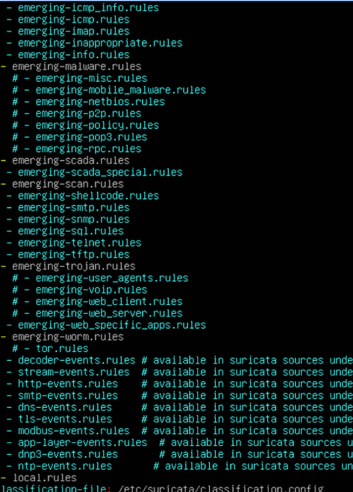
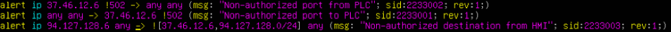

# Meerkat Lookout 

## Solution

The first step is to download and install `Ubuntu 18.04` and then download and install `suricata-4.0.5.tar.gz` on it. This solution guide is based on `Ubuntu 18.04 Desktop` version.

Follow the steps below to install Suricata -
* Install dependencies
    ```
    sudo apt-get install build-essential
    sudo apt-get install pkg-config
    sudo apt-get install libpcre3-dev
    sudo apt-get install libyaml-dev
    sudo apt-get install libpcap-dev
    sudo apt-get install libz-dev
    ```
* Install Suricata
    ```
    tar -xzvf suricata-4.0.5.tar.gz 
    cd suricata-4.0.5/ 
    ./configure –prefix=/usr/ --sysconfdir=/etc/ --localstatedir=/var/
    sudo make
    sudo make install-full
    sudo ldconfig
    ```
* Configure Suricata
    * Edit the config file
        ```
        sudo nano /etc/suricata/suricata.yaml 
        ```
        Modify HOME_NET to only be the PLC, HMI, and Firewall's IP addresses (not the entire network) <br>
         <br>
        Enable/Disable IDS rules as mentioned in the challenge guide <br>
        <br>
         <br>
    * Save and close the config file
* Create custom rules
    * Open the custom rules file 
    ```
    sudo nano /etc/suricata/rules/local.rules 
    ```
    Add the following rules
     <br>
    * Save and close the file
* Run suricata against the pcap file
    ```
    sudo suricata -c /etc/suricata/suricata.yaml -r pd2000-i2.pcap 
    ```
    All the alerts are saved in `/var/log/suricata/fast.log` file
* Analyze the alerts to complete the tasks and determine the flag
    * The first task is to determine non-local.rules SID being triggered against HMI. Run the command `cat fast.log | grep -v 2233001 | grep -v 2233002 | grep -v 2233003 | grep 94.127.128.6`, to focus on just the non-local rules triggered against HMI system. The answer is `2010936`.
    * The second task is to determine the two RFC1918 IP addresses that are not located in HMI's /24 network, and that the HMI system is reaching out to. To do so, run the command `cat fast.log | grep 2233003`. The IP addresses are `10.0.0.3` and `10.0.0.4`.
    * The last task is to find the lowest non-approved port that triggered 2233001 and/or 2233002. To do so, run the command `cat fast.log | grep '2233001\|2233002'`. There are three ports that triggered 2233001 and/or 2233002 - 22, 80, 443. The lowest of those is `22`.
* Compile the flag based on the syntax mentioned in the challenge guide.
    *   [SID]-[lowest IP address]-[highest IP address]-[port]
    *   Flag is `2010936-10.0.0.3-10.0.0.4-22`


<br><br>

Flag - `2010936-10.0.0.3-10.0.0.4-22`

## License
Copyright 2020 Carnegie Mellon University.  
Released under a MIT (SEI)-style license, please see LICENSE.md in the project root or contact permission@sei.cmu.edu for full terms.
