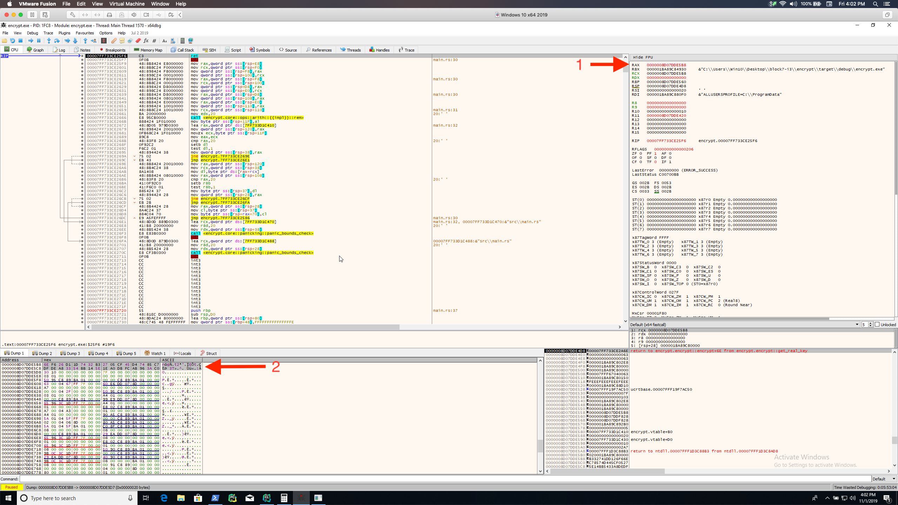
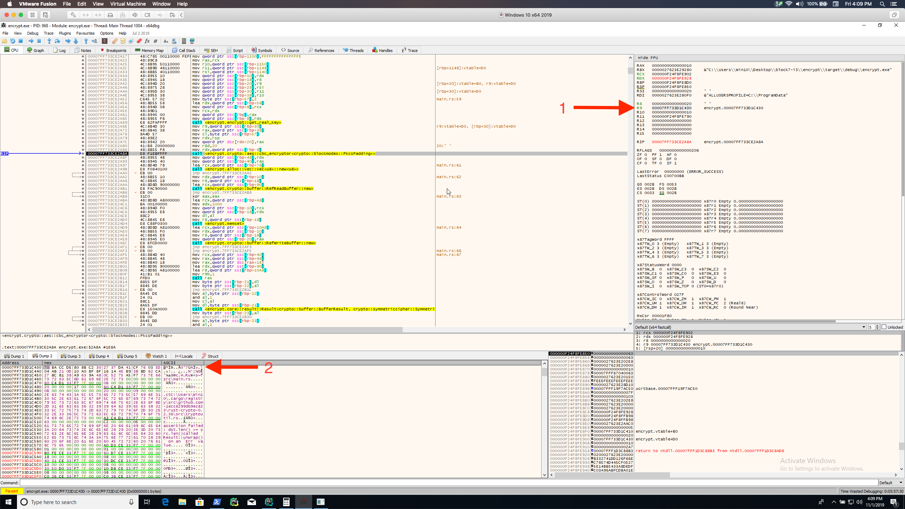

# Fun With Crypto

## Solution

This solution will not be a full walkthrough of solving the challenge. The `encrypt.pdb` and `encrypt.rs` files will
be a lot more valuable than a written guide.

### Decryption Command

`C:\path\to\decrypt.exe 'C:\path\to\flag.txt.ct' "6E F6 26 D1 1D 74 32 B3 27 05 CF 45 D4 74 85 C7 DF DE A8 33 54 BB 14 5E 1E A0 DB FC AB 96 3A C0" "70 ba cc de 80 8b c2 30 27 37 da 41 cf 76 03 5d"`

### Encryption key in debugger

### Encryption IV in debugger

## License
Copyright 2020 Carnegie Mellon University.  
Released under a MIT (SEI)-style license, please see LICENSE.md in the project root or contact permission@sei.cmu.edu for full terms.
