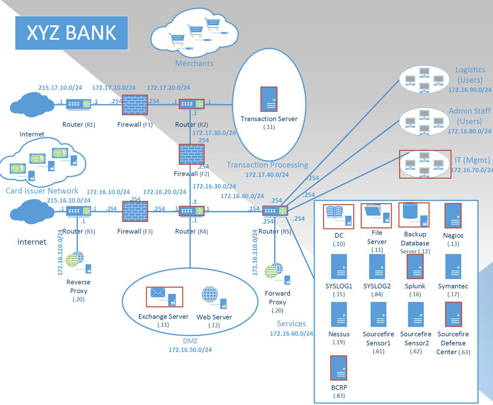

# Big Compromise

#### Category: Analyze and Investigate
#### Difficulty Level: 250
#### Executive Order Category: Big Data Analysis

## Background

The IT team at XYZ bank believes they have a data compromise. The suspected activity took place some time ago, so they
have only limited access to archived data. This includes web proxy logs, firewall logs, and an export of their syslog
collection from the time question. Not all of their hosts were forwarding events to syslog, but several key servers
within their architecture were sending their Windows Security Events.

## Update

For the purposes of this repository, this challenge, and its individual counterpart ai250-I1, have been combined. These
two challenges were very similar and primarily differed in the questions asked and the specific datasets used.

The questions below have been updated to reflect this update and ai250-i1 will point to this challenge.

## Requirements

Your team must identify several key pieces of information including:

1. What was the first executable downloaded? Note, at least 3 questionable downloads occurred.
2. What is the workstation IP of the user computer that downloaded the first EXE?
3. What is the threat actor's remote /24 IP block, from which these downloads occurred? Note, several questionable
downloads involve the same remote subnet.
4. What internal server has been observed communicating with this suspected threat actor IP block? Note, after the
initial compromise the attack pivoted to a high-value target.
5. What is the remote command and control (C2) port to which the second compromised system connects?
6. What user computer connected to the compromised server and is likely involved in this attack?
7. From the diagram, observe that fw3 is the primary Internet egress point for user workstations. There is one user
machine, previously observed downloading nefarious tools that is communicating outbound to 56.34.125.0/24. What 3
protocols are being used?
8. What tool downloaded by this user is most likely being used to establish a covert communication channel with a host
on the 56.34.125.0/24 network?
9. What is the name of the workstation used by the internal IP address discovered in the previous question? Note, this
requires correlation with data from the Splunk event export.

## Flag

The flag for this challenge was originally a combination of answer found for previous questions. Since both ai250
challenges have been combined, the flag for the version in this repository will not match any valid flag from the
competition.

## Hint

There may be several suspicious activities observed. Focus your response on the specific requirements your team is being
asked for.

## License
Copyright 2020 Carnegie Mellon University.  
Released under a MIT (SEI)-style license, please see LICENSE.md in the project root or contact permission@sei.cmu.edu for full terms.
