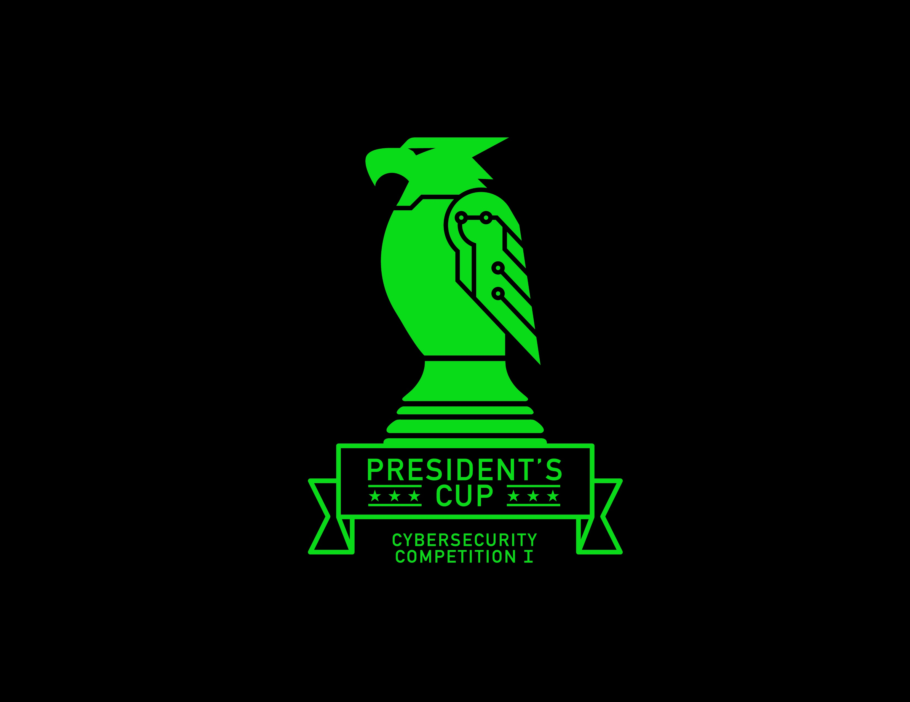

# Johny Doesn't Know Security

## Solution

In this example, the remote target system has the IP address `172.16.212.199`. Substitute this address for the address
of your configured target system in the below steps.

1. Perform an `nmap` scan. `nmap -p- 172.16.212.199`. Port `1235` is open.
2. Try connecting to the system on that port: `nc -nv 172.16.212.199 1235`. There is a listening server.
3. Try throwing various inputs at this server to see if any cause a crash. The MOD command does crash the server when
more than 160 characters are entered. This indicates a buffer overflow is probably possible.
4. The included `exploit.py` contains an exploit, but you will need to at least run the commented `msfvenom` command
with your attacking system's IP address to update the payload script, as well as the IP address variable near the top
of the script.
5. Run a netcat listener to wait for your reverse shell to connect in one terminal window: `nc -nlvp 443`. Then run the
exploit script in another window: `python exploit.py`. Please see the comments in the exploit script for more details
about the exploit.
6. The exploit opens a non-root shell for the `johny` user.
7. There is a `notes.txt` file in the user's home directory containing a hashed password (MD5). You can find the reverse
of this hash on an online hash reversing tool, such as `https://crackstation.net/`. This recovers the password
`iloveowls`.
8. Running `sudo -l` indicates that the `johny` user can run the `cleanup.sh` script in his home directory. This script
is writeable by this user, and you can add the command `cat /root/flag.txt` into it.
9. Once the script is modified, run `echo iloveowls | sudo -S ./cleanup.sh` with the reversed password to get the flag.
Note that just running `sudo ./cleanup.sh` may not work correctly because of the nature of the exploit (gives an error).

## License
Copyright 2020 Carnegie Mellon University.  
Released under a MIT (SEI)-style license, please see LICENSE.md in the project root or contact permission@sei.cmu.edu for full terms.
