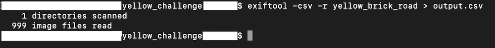
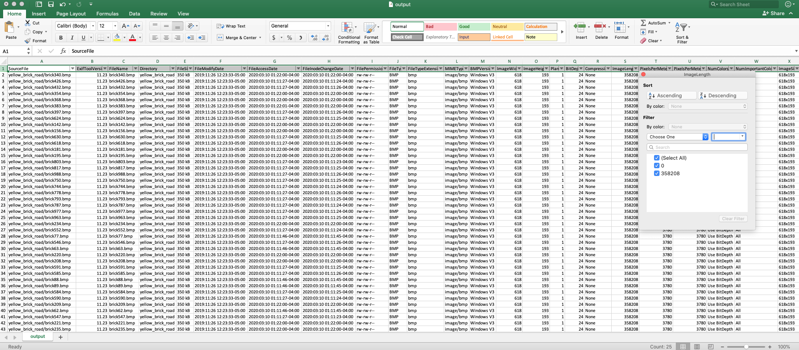
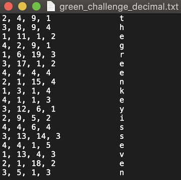
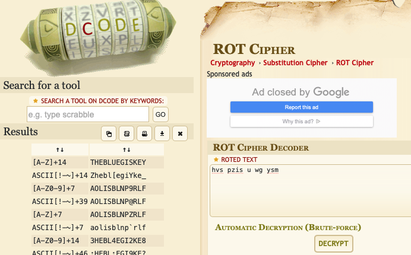
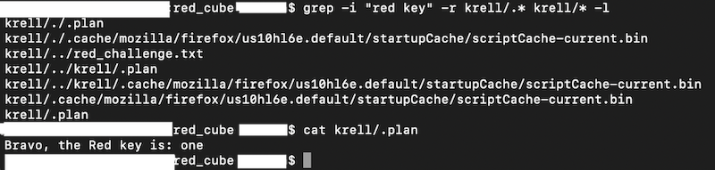
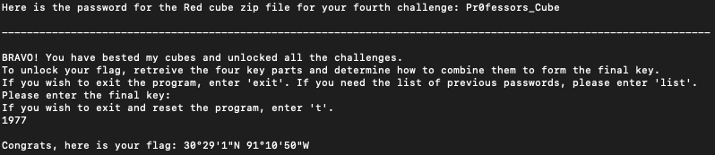

# Cube Craze

## Solution

This challenge involves solving 4 Rubik cubes and a task associated with each cube. 

Execute the command `java -jar cube.jar`. Review the instructions presented to you. As mentioned in the instructions, there are five commands. You may run `h` command to view the help menu.  

**Yellow Challenge**

The first step is to solve a 2x2 cube, which is named Yellow cube. The main idea is to execute each of the four commands (`r`, `y`, `b`, `g`) and examine the change that happens to the cube with each command execution. For example - when entering `r` in 2x2 cube, the top row values changes, but the bottom row remains intact. Use the information that you have gathered to solve the cube. There are multiple ways to solve the cube. One of the answer sequences for this cube is - `g`, `y`, `y`, `r`. On solving the yellow cube, the program will display the password (`Pocket_Cub3`) for the `yellow_cube.zip` file. Use the password to extract the zip file. 

Within the `yellow_challenge` folder, you'll find a text file with challenge instructions, and a folder containing 999 images. Review the challenge instructions. There are multiple ways to tackle this challenge - 

_Solution 1_

View each image one by one. The key for this challenge is present in plain site in image `brick173.bmp`.

_Solution 2_

Compare the EXIF data for all the images and determine the outlier. The `Image Length` tag for image `brick173.bmp` is different from all other images present in that folder. To automate this process, you may use the `exiftool` tool against all the pictures and write that info in a CSV file. 

Use `Microsoft Excel` or something similar to open the CSV file. Use the filtering capability, and you'll notice that each tag has pretty much the same value for all images except 2-3 tags. One such tag is `Image length`. This tag contains two unique values - 358208 and 0. 

The Image length for all images is 358208 except brick173.bmp for which the value is 0. 

_Solution 3_

The text file and the folder name both give a reference to `yellow_brick_road`. You may convert this to its number components - 
Yellow brick road== 25 5 12 12 15 23 2 18 9 3 11 18 15 1 4 = 173. This also points to image `brick173.bmp`. 

`The yellow key is 1001`.

**Green Challenge**

The next step is to solve a 3x3 cube, which is named Green cube. Follow the same procedure as you did for 2x2. Overall determine what each command does and then use that information to solve the cube. One of the answer sequences is - `b`, `r`, `y`, `g`, `g`. Enter the sequence to retrieve the password for the `green_cube.zip` file. Use the password (`0G_Rubik`) to extract the zip file. 

Within the `green_challenge` folder, you'll find a text file with some binary values in it, and a folder containing four pdf files. This challenge involves a `book cipher`. You'll first convert each binary value in the text file to a corresponding decimal number, and then decipher each row as follows-  

*   1st number represents the file number
*	2nd number represents the line number in that file
*	3rd number represents the word on that line
*	4th number represents the letter in that word

The phrase formed is `the green key is seven`.

**Blue Challenge**

The next step is to solve a 4x4 cube, which is named Blue cube. One of the answer sequences for this cube is - `r`, `g`, `y`, `g`, `b`. Enter the sequence to retrieve the password for the `blue_cube.zip` file. Use the password (`Rub1ks_Revenge`) to extract the zip file. 

Within the `blue_challenge` folder, you'll find a text file and some randomly named files. This challenge involves deciphering a `ROT cipher` applied to the file names. You may use an online resource to brute force the ROT cipher.

From the output, we know that it is a `ROT-14 cipher`. The phrase formed by rearranging the words/filenames is `the blue key is g`.

**Red Challenge**

Moving on to the last cube (5x5), also named as Red cube. One of the answer sequences for this cube is - `g`, `y`, `g`, `r`, `b`, `y`. Enter the sequence to retrieve the password for the `red_cube.zip` file. Use the password (`Pr0fessors_Cube`) to extract the zip file. (You'll need to use 7zip to extract this file)

Within the `red_cube` folder, you'll find a text file with some instructions in it, and a folder containing user `krell's` home directory. The red cube challenge has been slightly modified in order to open-source this challenge. During the actual competition, the entire challenge was present on the Virtual Machine and was not available as a downloadable asset. The only thing present in the red challenge folder was a text file with the following instructions - _The password for the user Krell is: Krazy. Your key is hidden amongst the user's personal data_. To solve the challenge during the competition, all you had to do was switch user to krell (`su krell`), and run the command `finger krell`. Or search through all the files in the user's home folder looking for the keyword `red key`.

To open-source this challenge, the entire folder belonging to user krell was exported out and is present as part of the `red_cube` folder. Based on the instructions available in the `red_challenge.txt` file, you can either recreate the user `krell`, import the contents of the folder onto a Linux machine, and then run the command `finger krell` to find the key. Or do a keyword search for `red` or `red key` against all the files present in the `red_cube` folder. The key is present in the `.plan` hidden file, and `the Red key is: one`.

The last step is to combine the keys from all four challenges. 
* Red challenge - One => 1
* Yellow challenge - 1001 => 9
* Blue challenge - g => 7
* Green challenge - seven => 7

Enter the final key `1977` in the cube program to retrieve the flag.

  

Flag - `30°29′1″N 91°10′50″W `

## License
Copyright 2020 Carnegie Mellon University.  
Released under a MIT (SEI)-style license, please see LICENSE.md in the project root or contact permission@sei.cmu.edu for full terms.
