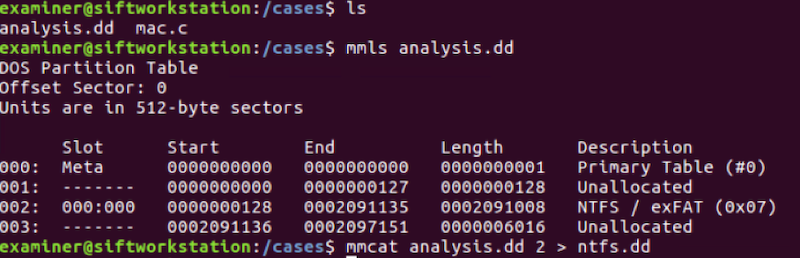
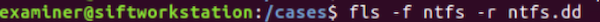
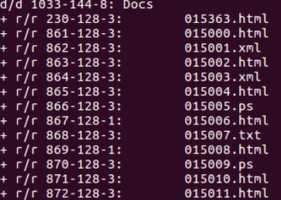
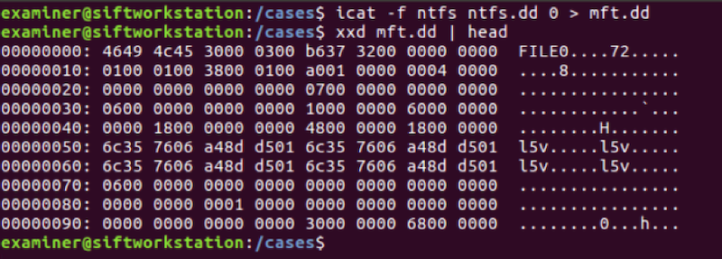

# Buried In The Sands Of Time

## Solution

### Background
This challenge makes use of a steganographic technique to hide data in the two least-significant bytes of an NTFS file system. NTFS timestamps are extremely granular, so small amounts of data can be added/subtracted to the timestamp without significantly altering the timestamp presented to the system. The data appended to the timestamp is also encoded via several bit-shift techniques to obfuscate its existence in the time stamps. Therefore, extracting the data will require reverse-engineering the encoding scheme and writing a program to extract and decode the data, rather than simply using a string search tool or a hex editor to view the bytes. 

### Analysis
You are given a disk image and a sample of the source code used to encode the message. 

The first step is to extract the NTFS partition from the disk image into a separate disk image (`ntfs.dd`), as show below:

Reviewing the provided steganographic source code (`mac.c`) will reveal that the encoding happens across files in a directory sequentially by file name. The sleuthkit tool `fls` can be used to identify the MFT entries which correspond to the files contained in the disk image:

The encoding was performed on files in the `Docs` directory, beginning with file `015000.html` (the first file sequentially in the directory listing). This corresponds to `MFT entry 861`. This MFT entry is the message header (length), entries `862-872` store the flag.  

Because this steganographic technique involves manipulating timestamps on an NTFS filesystem, all pertinent data can be found in the Master File Table (MFT). Now that the NTFS partition has been extracted into a separate file, `icat` can be used to extract the MFT into a separate file for analysis:

 

The next step is to reverse engineer the encoding scheme and implement a decoding function. This can be done in python3 (python 2.7 works as well, but doesn’t display the degree character in the coordinates properly). The code is contained in `solution3.py`. It will parse the MFT and decode the flag in the timestamps:
 

  

Flag - `26°42'1"N 80°22'29"W`

## License
Copyright 2020 Carnegie Mellon University.  
Released under a MIT (SEI)-style license, please see LICENSE.md in the project root or contact permission@sei.cmu.edu for full terms.
