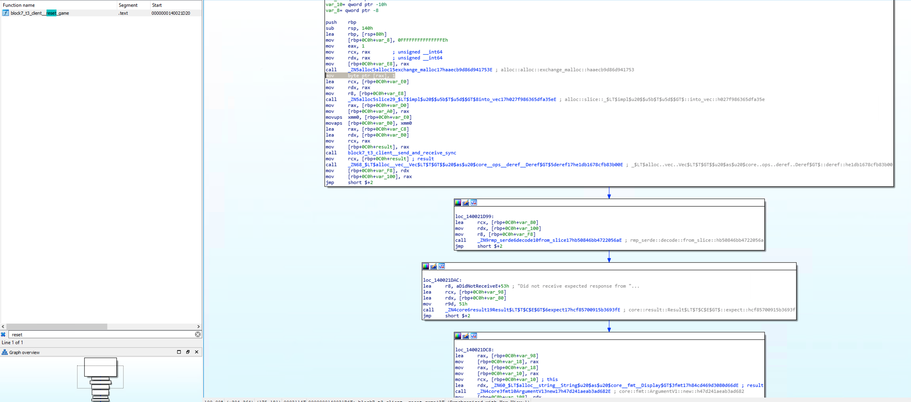
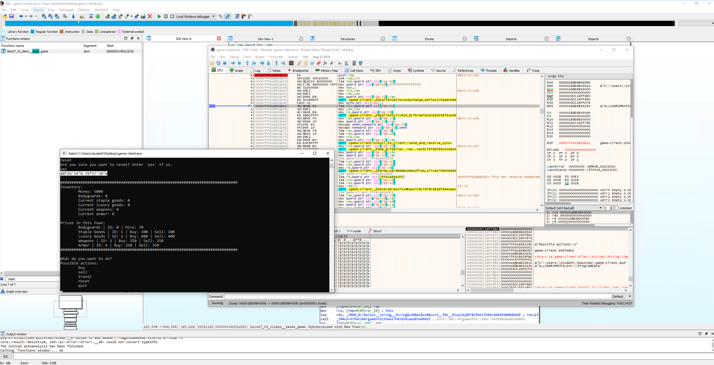

# Finding Hidden Functionality

## Solution

This solution will not be a full walkthrough of solving the challenge. The `block7-t3-client.pdb`, `client.rs` , and
`opcodes.rs` files will give you almost all of the required information.

### General solution

In this challenge, the simplest way to solve it is to locate one of the game functions by finding references to the
strings presented in the text interface. All of these functions should look very similar to each other, except for
the buy and sell functions (which need to add extra information to the outgoing buffer). Once you've found a few of
these functions the opcode pattern emerges and you can determine that they are all powers of two. All you need to do is
modify the byte added to the buffer, either by changing the assembly in your debugger to insert a different value,
editing the byte in memory, or patching the binary to change the instruction.

### reset_game function

### Coordinates after sending the correct opcode to the server

## License
Copyright 2020 Carnegie Mellon University.  
Released under a MIT (SEI)-style license, please see LICENSE.md in the project root or contact permission@sei.cmu.edu for full terms.
