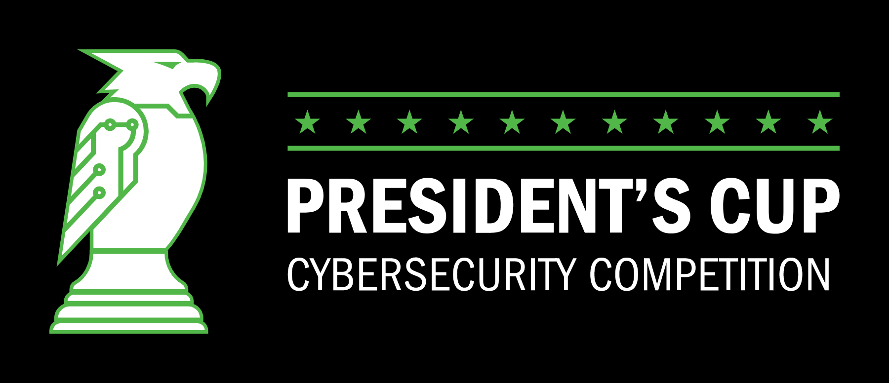

# President's Cup Cybersecurity Competition 2020 Challenges (Season 2)

## Summary

This repository contains cybersecurity challenges developed for the 2020 President's Cup Cybersecurity Competition.

## Layout

All of the challenge content can be found in the `/individual-a`, `/individual-b`, and `/team` directories, each mapping to the respective competition track. Each challenge sub-directory follows this format:

```
{round}-{name}
```

### round

The individuals and teams competitions each contained three successive rounds, with the first round being an open to Federal employees and members of the U.S. military. Each successive round downselected to ultimately determine a winner.

### name
The challenge name in kebab-case is the final part of the directory name.

## ⚠️ Large Files ⚠️
Some of the challenges includes large files as a separate download. See the README.md in each challenge folder for the download location.

## License
Copyright 2022 Carnegie Mellon University.  
Released under a MIT (SEI)-style license, please see LICENSE.md in the project root or contact permission@sei.cmu.edu for full terms.
