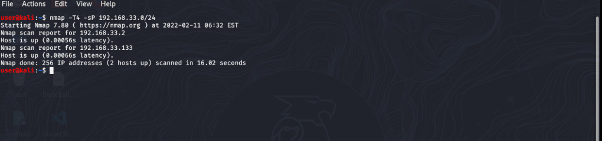
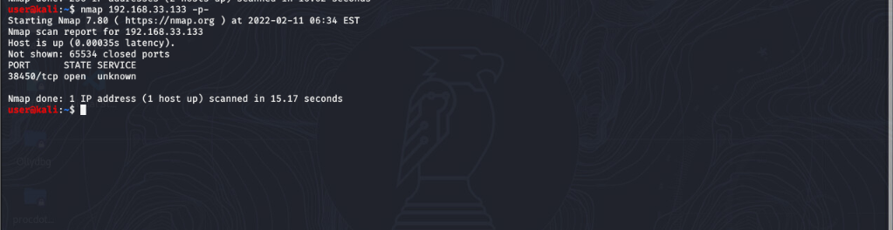
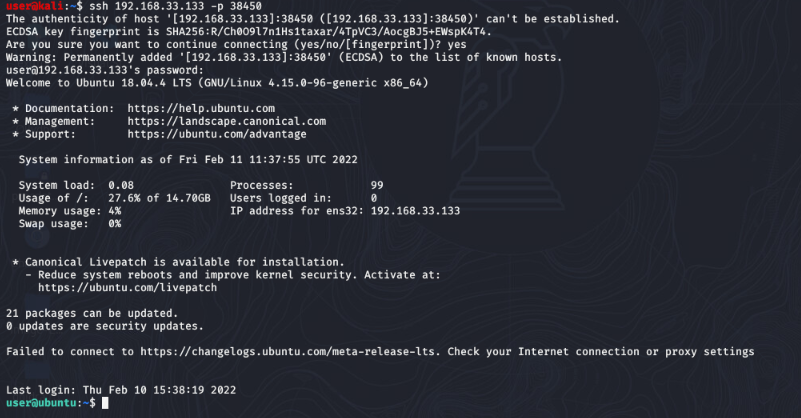

# Team Effort Solution

1. You will first need to find the IP address for the remote box. To do this type in the following command, 

```bash
nmap -T4 -sP 192.168.33.0/24
```



2. Then you'll need to perform a port scan on the IP address which can be done with the following command:

```bash
nmap <your-ip-address> -p-
```



3. Now you'll be able to connect to the target. This can be done by entering the following command 

```bash
ssh <your-ip-address> -p <your-port-number>
```



4. Now change your directory to where you put the challenge folder go into the token folder and open the token file, the hex in the file is the answer to question 3.
