# Memory Mayhem Solution

1)  What is the first listed base address of the malicious process that invoked an RDP process? 0x000000013fec0000

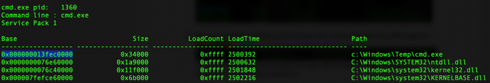

Check dlllist for the first process that invokes mstsc.exe. You will notice that the cmd.exe process (1360) is located in c:/windows/temp. This should be a clear indicator that the process is not legitimate. You can also cross-reference this information using the netscan command.

2)  What is the name of the malicious configuration file that invoked an RDP process? liJw5p6c8x.rdp

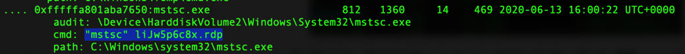

You can determine this by using the pstree -v command and searching for ".rdp.".

3)  The user changed their main login password. What is the new password? P@ssw0rd!12345

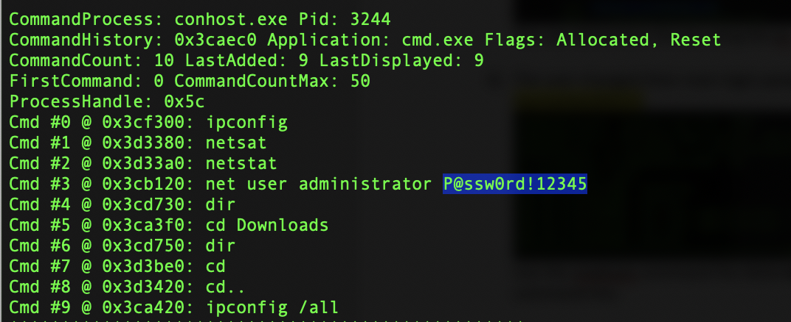

Use the cmdscan command the determine that the password was changed via the command line.

4)  What is the IP address and port where the RDP exploit originated? 192.168.91.140:8080

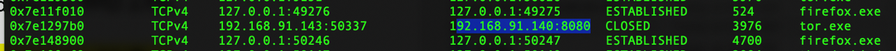

Use the netscan command to determine the network address for PPID 3796.

5)  What was the last .txt file the user had open? nycmarketoverview2017.txt

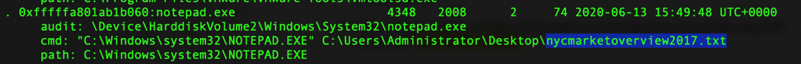

Use the pstree -v command and then query ".txt" to see which file was the last opened.

6)  What is the LastWrite time in hours, minutes, and seconds of the USB
thumb drive that was attached to the victim's computer? 15:55:06

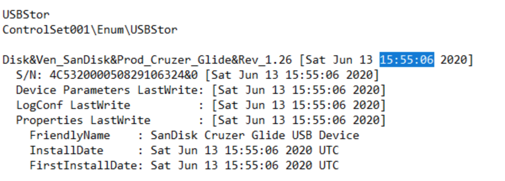

Dump the registry and then use REGRIPPER to view the system hive file and then query "USB" to determine the volume ID needed for the answer.

7)  What is the base address of the exploit that invoked the malicious process that invoked an RDP process? 0x0000000001080000

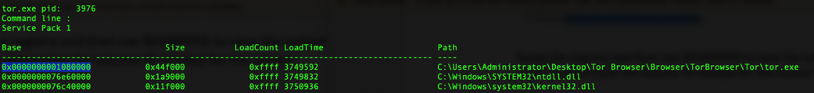

Running dlllist against the notepad.exe process seen in the pstree list will display that the file invokes winhttp.dll.

8)  What is the default dumped executable file name of the exploit that invoked the malicious process that invoked an RDP process? executable.3976.exe

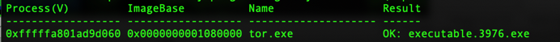

Use the procdump command to dump PID 3976 into a folder and then determine the name. This is different than performing a dlldump.

9)  What is the first PID associated with the marketing.doc file found on the victim's machine? 3884

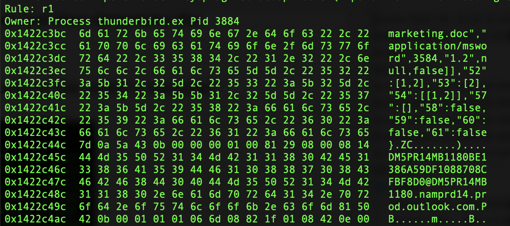

This can be determined many different ways. One way is to perform the yarascan command and search for a marketing.doc string (e.g., yarascan -Y "marketing.doc").

10) What is the first listed allocation address for the originating exploit that gained entry into the victim's machine? 0xfffffa801c8cc000

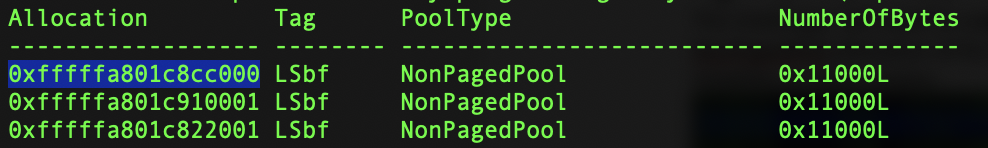

Use the bigpools \--tags=LSbf command since you will not be able to pull the dlls for the original system process (4) as seen using netscan since the exploit leveraged SMB (445). The challenger will need to understand how EternalBlue functions (e.g., large NonPagedPoll allocation of 0x11000 bytes) to properly search for the material via Volatility or other means.

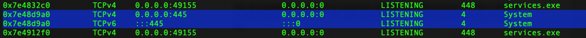
