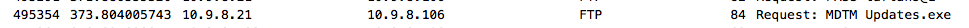
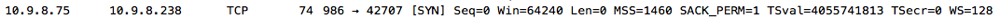

# Packet Out, Packet In, Let the Incidents Begin Solution

### Question 1

Start by filtering for all FTP traffic within the capture, e.g. "ftp or ftp-data" as a filter.

The results will reference three unique files in various requests: 
- `Updates.exe` 
- `openemu\_2091.zip`
- `nmap-770-1x86\_64.rpm`.

Note that while the `Updates.exe` request may show as an MDTM type, this implies restarting a previous transfer, and the FTP-DATA packets will show this file being transferred.

Out of these files, `nmap-770-1x86\_64.rpm` might be used to perform further reconnaissance.

In the above request, pay attention to which direction the transfer is going and identify the receiver. If the file was retrieved (**RETR**), the source will be the receiver. If the file was stored (**STOR**), the destination will be the receiver. In the example above, `10.9.8.21` would be the receiver since it retrieved the file.

### Question 2

**Statistics** \> **Conversations** and/or **Statistics** > **Endpoints** can be used to arrive at the answer.

For the Endpoints output, sort by the top receiver (Rx Bytes).

For Conversations, sort by Bytes and look at the Bytes A -\> B and Packets B -\> A columns to see who received the most. There may be multiple items for the same IP here, so some addition and checking might be required.

In either method, `10.9.8.67` is the highest receiver of data in bytes for this example.

### Question 3

Since all relevant traffic is contained with the `10.9.8.0/24` subnet, this can be filtered: `ip.src == 10.9.8.0/24 && ip.dst == 10.9.8.0/24`.

**View Statistics** \> **Conversations** output again and make sure to limit to just the current display filter. There will only be a limited number of conversations between these hosts.Follow each and see if anything looks like scan traffic, or eliminate those that obviously are not. However, since the duration of each conversation is shown,  seeing a large number of packets in a short amount of time, as well as both hosts sending/receiving roughly the same number of packets, is indicative of the scan.

Go back and filter for traffic between these two hosts only: `ip.addr 10.9.8.75 && 10.9.8.238`. Since `10.9.8.75` is sending the SYN packets and `10.9.8.238` is sending back mainly RSTs, `10.9.8.75` is the initiator of the scan against `10.9.8.238`.

### Question 4

In order for a port to be registered as open, it must send back something other than an RST flag.

The ports that respond will have a slightly different Info result than those that respond with an RST.

Another option is to filter on only packets that include syn and ack flags:
- `ip.src 10.9.8.75 && ip.dst == 10.9.8.238 && tcp.flags.syn==1 && tcp.flags.ack == 1`.

This will show only the ports that responded, which in this case are `42707`, `39505`, `35009`, `38999`, `32785`, and `34539`.

Based on the above, `42707` is the highest valued port. 

### Question 5

Search for `badstuff` in the packet capture. String option and search packet bytes must be used (not just packet list or details).

One packet will show a result and players should then follow this stream.

Since the file was contained within a zip file, the players must extract the zip in its raw form to view the contents after following the stream.

Choose to **Save as** and save the file as a `.zip` file with any name. Then, open the zip file to view the contents, which is a file named `badstuff.sh`. This information can be found from just the packet bytes information, but this is a good way to confirm suspicions.

After extracting the raw zip file and opening the contents, view the `badstuff.sh` file to see the text string inside. 

## Answers

- Question 1: `10.9.8.21`
- Question 2: `10.9.8.67`
- Question 3: `10.9.8.75`
- Question 4: `6 42707`
- Question 5: `tryonhh4`