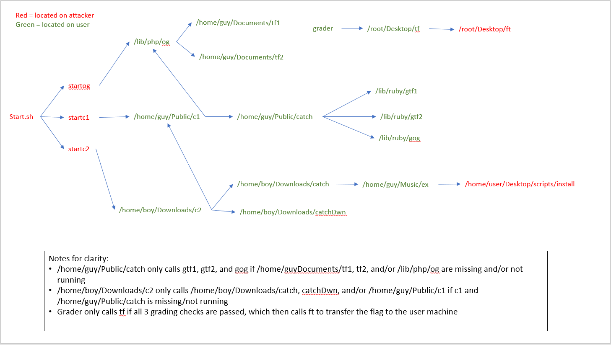

This challenge is only partially open sourced. The files in the challenge directory are provided to give a starting point if you want to recreate the challenge on your own. The full challenge can be completed on the hosted site.

The diagram below should be useful to understand the workflow of the challenge and serve as a how to for configuring your own machines when recreating the challenge in your own environment.

 

## Scripts on user machine: 

/lib/php/  
og - original script transferring data  
add the og file to the PATH variable - export PATH=$PATH:/lib/php/og

/home/guy/Public/  
c1 and catch - makes sure og is installed with correct file permissions, if not then retrieve it from attacker  
Permissions: 740 

/home/boy/Downloads/  
c2 - checks to make sure c1 is installed, if not then download c1 from attacker  

/home/guy/Documents/  
tf1 - expect script called in og to allow scp to transfer data file to attacker  
Permissions: 710  
tf2 - expect script called in og to allow scp to transfer contents file to attacker  
Permissions: 710  

/lib/ruby/  
gog - scp command to attacker to retrieve og script and reinstall it where it should be  
Permissions: 111   
gtf1 - download tf1 from attacker script and put it where needed  
gtf2 - download tf2 from attacker script and put it where needed 

/home/guy/Music/  
ex - reach out to attacker to execute script, install c1 in the correct location using maliciously set IP

/root/Desktop/  
grader - verifies 3 scripts have been removed, if it is then run expect script to external host for flag  
tf - called by grader if all three malicious scripts have been removed and writes out the contents of flag.txt file 

 

## Scripts on attacker machine:

run /root/Desktop/start.sh to start the challenge
run /root/Desktop/start2.sh to start the challenge

backup/  
setup a web server on the attacker machine that serves the install and run scripts

/home/user/Desktop/scripts/  
og - original script transferring data that is copied to user machine  
install - sends c1 to maliciously set IP to install in correct location on user  
c1 - checker 1 to make sure og is installed, if not then wget to attacker to retrieve it  
c2 - checker 2 to make sure c1 is installed, if not then download c1 from attacker somehow   

/root/Desktop  
startog - is run when computer is booted up and starts the three scripts on user to begin attack  
startc1 - starts c1 on user machine  
startc2 - starts c2 on user machine  
ft - called by /root/Desktop/tf on user machine to transfer the flag to the user machine  
start2.sh - mounts the .iso containing the flag, copies to /root/Desktop/flag.txt and changes permissions  
start.sh - calls startog, startc1 and startc2  
Permissions: 777 

## Commands to sudo-block (user depending): 

su 

/usr/bin/su 

passwd 

/usr/bin/passwd 

chmod 

/usr/bin/chmod 

chgrp 

/usr/bin/chmod 

chpasswd 

/usr/sbin/chpasswd 

usermod 

/usr/sbin/usermod 

useradd 

/usr/sbin/useradd 

visudo 

*user* ALL=ALL, !/usr/sbin/visudo
 