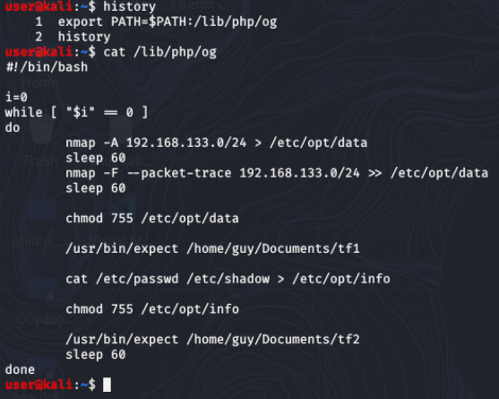
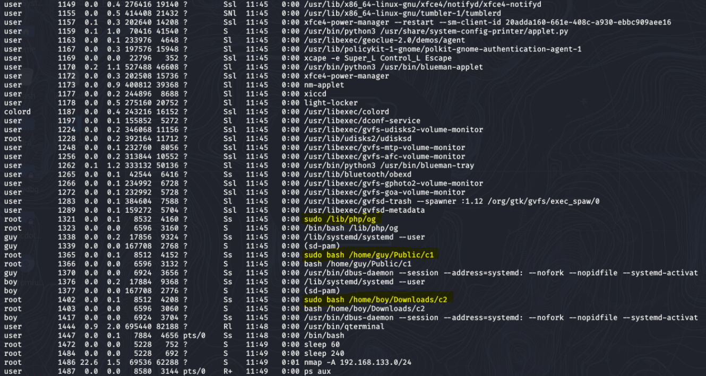
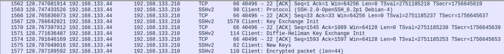
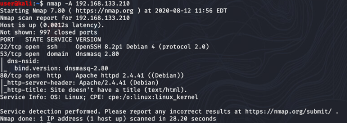
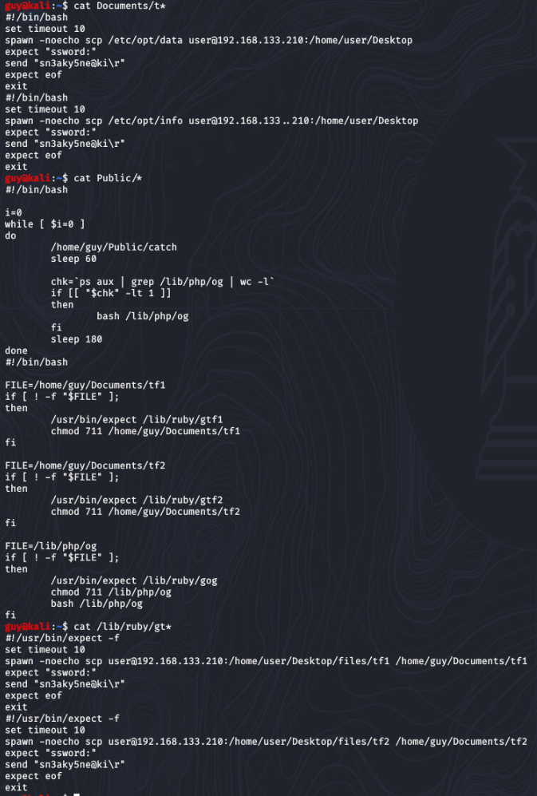

# Dark Dominoes Solution

  ## 1st script

  Log onto the user machine check the history and you'll see only one command is there and that was adding a file, `og` to the PATH variable. If you go to that file you'll see that there is a script that is running scans of the machine + network, and then executing some other scripts that do something but you aren't sure yet. This is 1 of the 3 main malicious scripts you must delete.

  


  ## 2nd script

  Next you would want to check the files that the `og` script was calling on, but you don't have access to that directory nor can you edit the og script. 

  After some more searching, you will find that the og script has re-appeared and is running again. This should hint that there is a second process/script running that checks, reinstalls and runs og if its missing. 

  You can run "ps aux" to see what is occurring and if you sift through it you'll see there are two scripts, `c1` and `c2` running from /home/guy/Public/c1 and /home/boy/Downloads/c2. Unfortunately you cant reach them without the right credentials.

  

  Your next step should be to sniff/capture the traffic to see where the files are going that are being created by the og script. You can determine that there are ssh packets being sent to the IP 192.168.133.210.

  

  Run an nmap scan on that host and see what ports may be open and how you could connect. You'll see port 22 and 80 are open, although scp/ssh commands are disabled on your user due to the attack, you can connect to the web page `192.168.133.210:80` and you'll see that the attacker has a site set up with backup scripts in case of any issues. 

  

  In these scripts you can find the credentials for the user `guy`, and so now you can run `su guy` and log into his account. You can now navigate to the `c1` script and accompanying files that `og` and `c1` call on. This is 2 of the 3 main malicious scripts you must delete. 

  ## 3rd script

  After checking the files available in `guy` directory, you can see that there are scp and ssh scripts running to the hidden malicious machine. It contains credentials to the machine, so now you can ssh into it as well and see what it has. 

  

  By now you must realize You cannot edit the scripts with the permissions you have now as it seems the suoders file has been tampered with. But now with the ability to access the hidden machine, you must go in and re-write the `og` script with custom code that when executed will give you access to the final user `boy`. 
  
  Example solution code:

    echo -e boy:easy | sudo chpasswd
    
    chmod -R 777 /home/boy
    
    Or something similar


  Once its been executed you can log into the `boy` account and you will find the last script labeled `c2` that checks and reinstalls `c1` if it is missing, therefore creating a domino affect that leads back to og getting installed and re-ran. You can delete it, and check that  `c1` and `og` haven't been reinstalled since it was done last. 

  ## Verify & grade

  Once all three are gone, run the command [grader](../challenge/user/root-desktop/grader.sh) which will verify that all three have been deleted. If you have done this correctly, then the submission answer for the challenge will be output to the terminal.

# Answers

```
  lay3rsOnLayers
```
