# Grr..

**Please note** - This challenge does not include any downloadable artifacts. This challenge can only be completed in the hosted environment.

## Solution

This challenge involves remotely analyzing an infected system and using that information to then clean that system, again remotely. We will use the GRR Rapid Response to perform remote live forensics and incident response. The infected system is already reporting into GRR Server. 

1. Login to the `Analyst` VM.

2. Browse to the GRR Web Console at `http://192.168.10.100:8000`. Login with `admin/tartans`.

3. Click on the search icon in the top right corner to view the client machines reporting to GRR Server. 

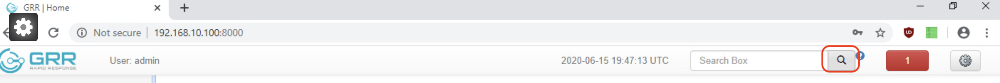

There should be just one machine listed here which is the infected system in question.

4. Click on the infected system.

### Determine Indicators of Compromise
We know that `wmpupdate.exe` is running on the system.

##### Process Executable Location
We can use the `ListProcesses` flow to determine the location of the process executable. `ListProcesses` will list all information related to all processes running on the client system.
1. Click on `Start new flows` -> `Processes` -> `ListProcesses` -> `Launch`

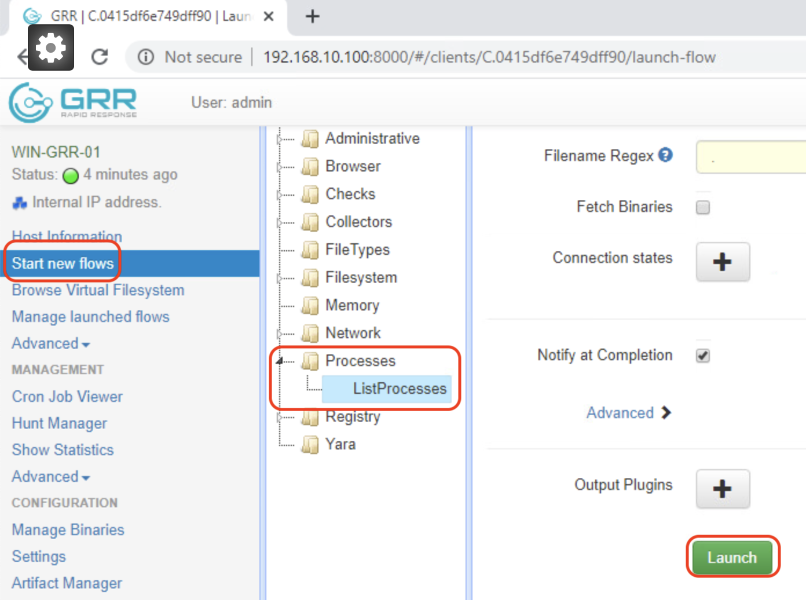

2. To view the results, click on `Manage launched flows` from the left pane.

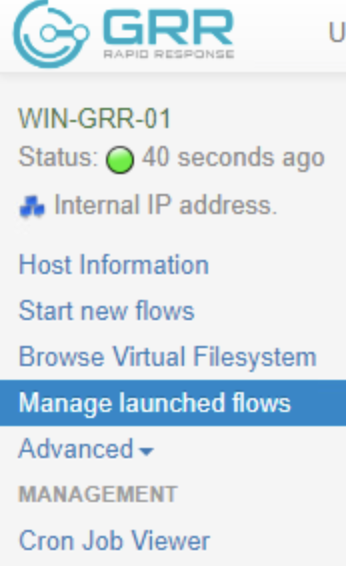

The resulting page displays the flows executed on this client machine so far. Notice the newly created flow at the top of the list.

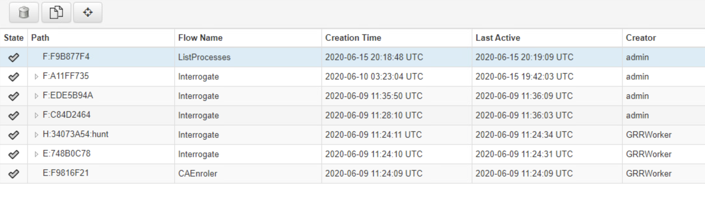

The flow might take a few minutes to complete. If you see a clock () symbol next to the newly created flow, wait for a minute or two, until it changes to a completed () symbol.

3. Once the flow is completed -
   - Click on that specific flow from the list
   - Click on the `Results` tab in the bottom pane
   - Search for the process in question.
  
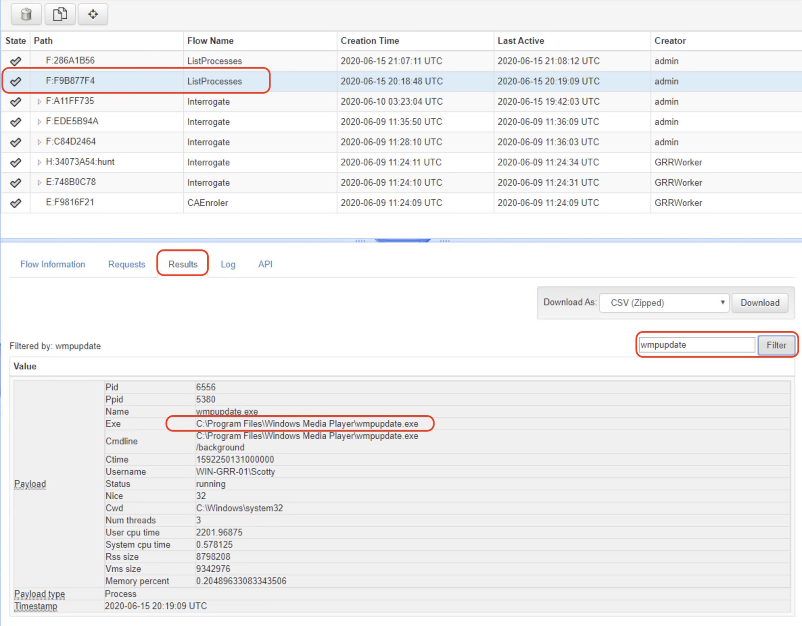

The location of the rogue process will show up in the search results.

##### Autorun registry key
The autorun registry keys are located at the following locations in Windows registry.
```
HKEY_LOCAL_MACHINE\Software\Microsoft\Windows\CurrentVersion\Run
HKEY_CURRENT_USER\Software\Microsoft\Windows\CurrentVersion\Run
```
We can navigate to both locations one by one to view which one stores the key associated with the rogues process.

1. Click `Browse Virtual Filesystem` from the left pane

2. From the right pane, navigate to `registry\HKEY_LOCAL_MACHINE\Software\Microsoft\Windows\CurrentVersion\Run` clicking the `Refresh Directory` button at each directory level in the path.

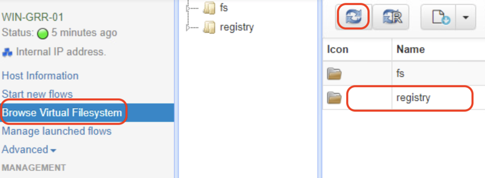

Refresh directory button triggers a refresh of the contents of the current directory as collected from the client.
   
3. At this location, you will find a key that corresponds to the rogue process. The full path to the autorun key including the key can also be copy/pasted from here into the submission field.

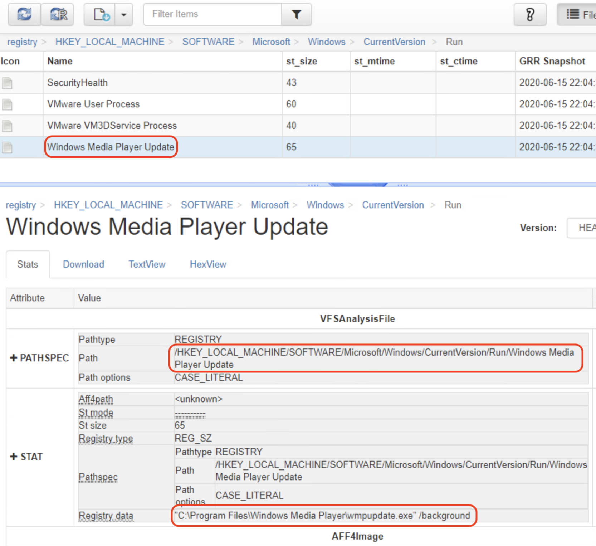

##### Firewall Rule
By default, Windows firewall rules are stored in Registry at `HKEY_LOCAL_MACHINE\SYSTEM\CurrentControlSet\Services\SharedAccess\Parameters\FirewallPolicy\FirewallRules\`
We can either navigate to this location and review each firewall rule one at a time or download the `SYSTEM` hive to `Analyst` VM and utilize searching capabilities in `Registry Viewer` to quickly search for the firewall rule in question. Since it is not possible to easily search through registry key values within GRR interface, it is better to just download a local copy of the `SYSTEM` hive.

1. Use `Browse Virtual Filesystem` to navigate to `fs\tsk\\?\Volume{....}\Windows\System32\config\` 

2. Click on the `SYSTEM` hive

3. Click on the `Download` tab

4. Click `Collect from the client`

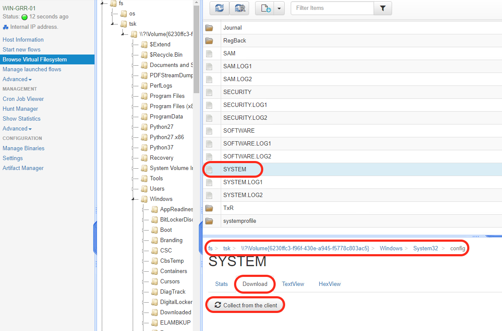

5. Click on `Download (... bytes)` to download the hive to the `Analyst` VM.

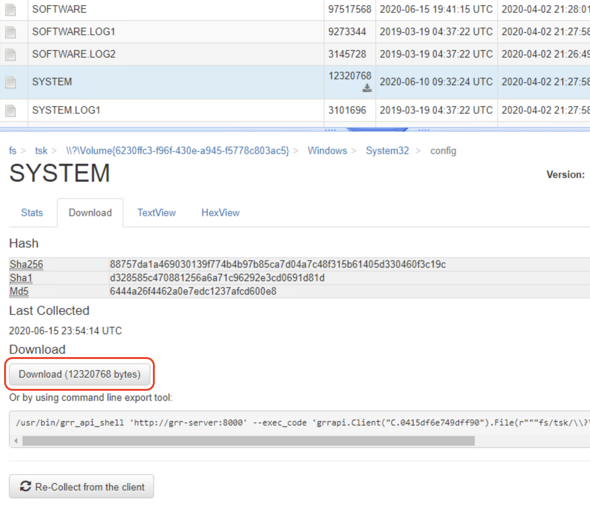

6. Use `Registry Viewer` on the Desktop to open the downloaded `SYSTEM` hive. It will open in Demo mode.

7. Within `Registry Viewer`, click on `Edit` -> `Advanced Find`

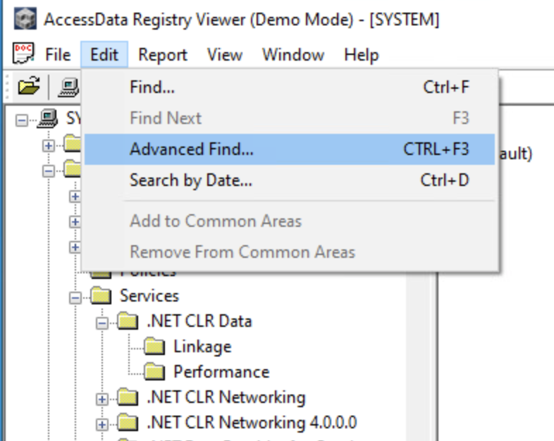

8. Search for the rogue process

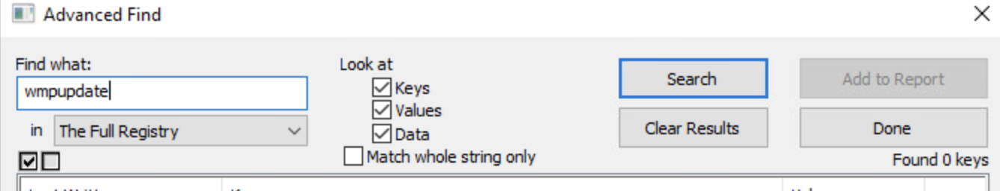

9. Follow the search result. You'll find that the name of the firewall rule is buried within the registry key value.

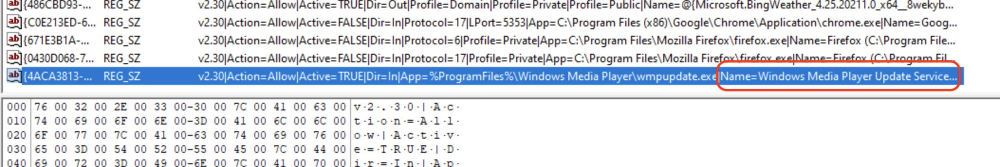

This concludes the section on determining IOCs associated with the rogue process.


### Clean the infected system

The next task is to clean the infected system. For the most part, to do any clean up activity we will need to enable the `ADVANCED` mode within GRR. To do so, 

1. Click on the gear icon in the top right corner.

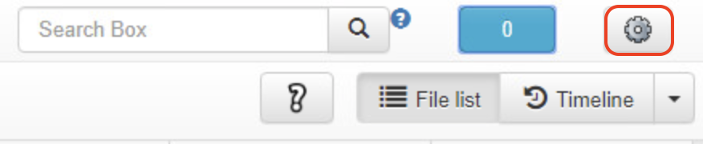

2. In the `Settings` windows, select `mode` as `ADVANCED`, and click `Apply`.

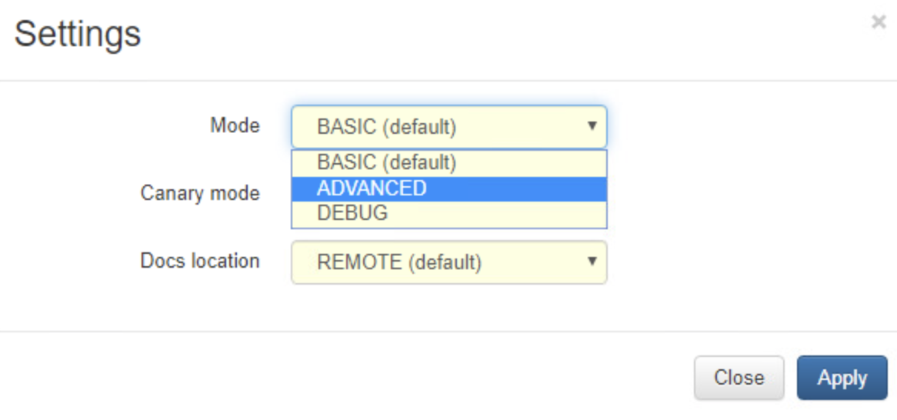

3. For performing any clean up activity, we will use the `ExecutePythonHack` flow that allows execution of signed python scripts on the client machine.

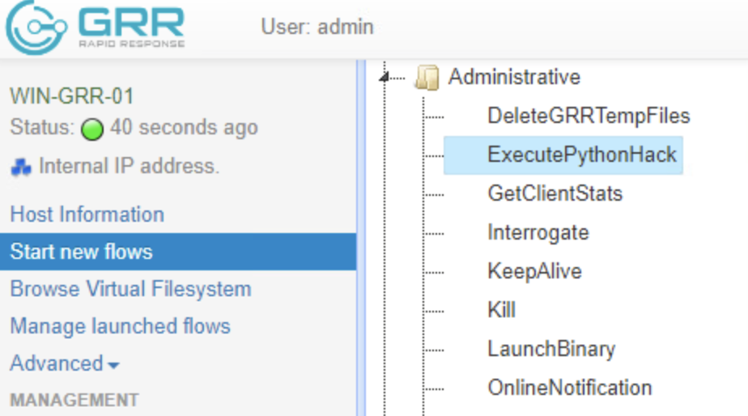

This means we will write short python scripts for stopping the rogue process, deleting the process executable, deleting the autorun registry key, deleting the firewall rule. We can write these scripts on the GRR server for easy import into the GRR admin interface. 

4. Login to GRR-Server

##### Stop the rogue process

1. Create the following script and save it as `stopprocess.py`

```
from os import *
os.system('taskkill /f /im "wmpupdate.exe"')
```

2. Sign and convert the python script to protobuf format and upload to the GRR server datastore

```
sudo grr_config_updater upload_python --file=stopprocess.py --platform=windows --arch=amd64
```

3. When asked, enter password as `tartans`
By default, all uploaded python files are accessible from the `Manage Binaries` section on the GRR interface.

4. Use the `ExecutePythonHack` flow and execute `windows/stopprocess.py` script. Click Launch.

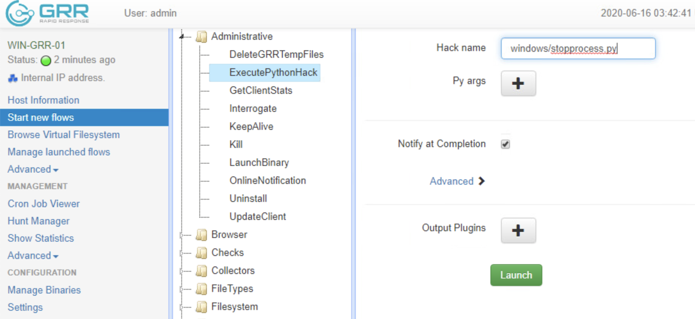

5. The result of the flow can be viewed in `Manage launched flows` section. Make sure the flow was successful.

6. At this time, access the grading results URL `http://192.168.10.102` and verify that you have passed `Grading Check 1`.

##### Delete the process executable

Following script can be used for deleting the process executable.

```
from os import *
os.remove("C:\Program Files\Windows Media Player\wmpupdate.exe")
```

Other steps of signing and uploading to GRR server datastore, and executing the python hack on the client machine are exactly the same as stopping the rogue process. 
This will allow you to pass `Grading check 2`.

##### Delete the autorun registry key

Following script can be used for deleting the autorun registry key.

```
from winreg import *
ConnectRegistry(None,HKEY_LOCAL_MACHINE)
open_key=OpenKey(HKEY_LOCAL_MACHINE,r'SOFTWARE\Microsoft\Windows\CurrentVersion\Run',0,KEY_ALL_ACCESS)
DeleteValue(open_key,'Windows Media Player Update')
```

Again the same steps as above to sign and upload script into GRR Server datastore, and launch a python hack against the infected system. This will allow you to pass `Grading Check 3`.

##### Delete the firewall rule

Following script can be used for deleting the firewall rule.

```
from winreg import *
ConnectRegistry(None,HKEY_LOCAL_MACHINE)
open_key=OpenKey(HKEY_LOCAL_MACHINE,r'SYSTEM\CurrentControlSet\Services\SharedAccess\Parameters\FirewallPolicy\FirewallRules',0,KEY_ALL_ACCESS)
DeleteValue(open_key,'{4ACA3813-2422-4E78-A74F-677E505FC731}')
```

Sign and upload the script into GRR Server datastore. Launch the python hack against the infected system, and pass `Grading check 4`.

### Submission

1. C:\Program Files\Windows Media Player\wmpupdate.exe

2. /HKEY_LOCAL_MACHINE/SOFTWARE/Microsoft/Windows/CurrentVersion/Run/Windows Media Player Update

3. Windows Media Player Update Service

4. (string of random characters)

5. (string of random characters)

6. (string of random characters)

7. (string of random characters)
