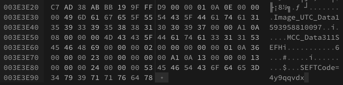
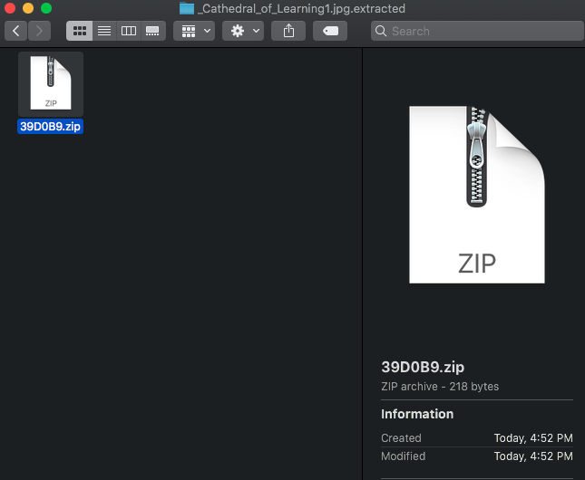

# More Than Meets the Eye Solution

Due to the randomness in each variation of the challenge, this guide will demonstrate how to examine the EXIF data in each image, the indicators that eliminate an image file from further analysis, and then how to find the codes embedded in each image for all four methods. The submission section will outline how each variant is different.

### Examining the EXIf data

Both Windows 10 and Kali include exiftool in order to easily view image EXIF data. The syntax for the tool is simple:
`exiftool filename.jpg`

Since this challenge is downloadable, players could also use any other tool of their choice, or online sources to view the data.

The key lines that the players should be looking for are the EXIF tags for phone camera model and make, the date the image was taken, and the location of the image when taken.

Make              : samsung
Camera Model Name        : SM-G930V
GPS Position          : 40 deg 26' 42.05" N, 79 deg 57' 6.35" W
Date/Time Original           : 2020:07:05 10:35:35
Create Date                        : 2020:07:05 10:35:35
(various other date markers should show July 5th ~10:30-11:30 AM as well, but it is important to look at dates referring to when the picture was taken, not when the file may have been modified/created. Image files with the "wrong" dates will be way off, many by months, not off by a matter of a day or two)

While perusing the EXIF data, files that are irrelevant will shows dates that are off from what is expected:
Date/Time Original              : 2020:02:07 13:41:21
Create Date                     : 2020:02:07 13:41:21

They will show camera makes and models that are incorrect:
Make                            : Apple iPhone11
Camera Model Name               : LG-G930V

Or the location data will not match anything close to Pittsburgh:
GPS Position                    : 37 deg 46' 12.00" N, 122 deg 28' 12.36" W
(which when plugged into Googlemaps is San Fransisco)
For Geolocation, it is easiest to simply look up the subject of the photo in Googlemaps and eliminate any image that DOES NOT match what it should rather than look up each item.

### Detecting Watermarked Codes (15% of total score)

The simplest codes to find are the ones watermarked on the images themselves. These codes are the codes for submission when focussed on the correct image file for that set as according to the EXIf data.

Images like the one above have the code watermarked in the lower-left corner on the barrel.

Images like the one above will have the code watermarked beneath the cannon.

Images like the one above have the code watermarked on the building along the left side.

### Detecting Codes within EXIF data (15% of total score)

This is another simple catch as long as players are examining ALL of the EXIF data. Within the EXIF data there is a User Comment tag. In some image files, the User Comment field will have an 8 character code. These codes are the codes for submission when focussed on the correct image file for that set as according to the EXIf data.

Flash                           : No Flash
Focal Length                    : 4.2 mm
User Comment                    : 5i28if5r
Flashpix Version                : 0100
Color Space                     : sRGB

### Detecting Hex/String Codes (30% of total score)

Players are hinted to look deeper into the files themselves. At some point the players should think to look either into the hex values of the images or perform a strings search of the image files. Either will produce the codes in these sets. These codes are the codes for submission when focussed on the correct image file for that set as according to the EXIf data.

Strings will always show the code at the end of the string output, since the codes are embedded at the end of the hex data.

`strings imagefile.jpg`
Results:
.
.
.
 $lOn
Image_UTC_Data1593958810097
MCC_Data311SEFHi
SEFTCode=mhot4sib

Alternatively, a hex editor will also show the code at the end of the file.

Note that the "SEFT" string is inconsequential and just happens to mark the end of the file originally. The code always follows the "Code=" string.

### Detecting and Extracting Embedded Zip Files (40% of total score)

First, in the EXIF data for the images that have zip files embedded within, there will a reference under the UserComment tag:
User Comment                    : The password to the zip is 8rhu6ecu5i

Players should use something like binwalk on Kali to detect that there are multiple files within the image, one of them being a zip file.

e.g.: `binwalk Cathedral_of_Learning1.jpg` 

DECIMAL       HEXADECIMAL     DESCRIPTION
--------------------------------------------------------------------------------
0             0x0             JPEG image data, EXIF standard
12            0xC             TIFF image data, little-endian offset of first image directory: 8
3788985       0x39D0B9        Zip archive data, encrypted at least v1.0 to extract, compressed size: 34, uncompressed size: 22, name: token.txt
3789181       0x39D17D        End of Zip archive, footer length: 22

Binwalk's output will show that a zip file is embedded in the image file and that it contains a file called token.txt, and that it is encrypted, or at least password protected by the password in the User Comment tag of the EXIF data.

Opening the zip file is as simple as renaming the file with a .zip extension instead of .jpg. It is unclear whether specific archive utilities or unzipping tools perform things differently, but you may have to unzip the files via command line if they do not prompt for a password or complain about not being a zip file via the default application GUI. Or you may have to open your archiving/zip utility and open the zip file manually that way. Long story short, sometimes double-clicking the renamed file will not automatically open it via your default zipping utility, depending on the system/application.

Alternatively, and perhaps, more intuitively, players can also use binwalk to extract the zip file:
`binwalk -e Cathedral_of_Learning1.jpg` 

Sometimes the binwalk extraction will indeed complete the file extraction but does not return you to the terminal command prompt. Once you see that the zip has been extracted you may kill the command. Keep in mind that the password associated with this image's EXIF tags and zip will work. Each image in this set will have an embedded zip file, all with unique passwords. 

Wihtin the zip file is the file token.txt. The contents of this file will be a simple string: "Your code is qyo44j3u"

These codes are the codes for submission when focussed on the correct image file for that set as according to the EXIf data.

### Submissions

The following lists will identify which image in each set contains the correct code for each variant of the challenge. Al other images should be ignored and are chaff files that should be eliminated from contention do to errors in the EXIF data.

Variation1
Set 1 - Cathedral_of_Learning5.jpg
	Code - fstkr6fo
	Method - Zip file embedded in image, the password to the zip is found in the user comment tag of the EXIf data (8rhu6ecu5i)
Set 2 - Carnegie_Library_of_Pittsburgh4.jpg
	Code - qqpsp3nt
	Method - Code is within EXIF user comment tag
Set 3 - Carnegie_Museums5.jpg
	Code - op4exkpn
	Method - Code is embedded in image hex data or perform a strings dump
Set 4 - Phipps_Conservatory1.jpg
	Code - m2yytk9q
	Method - Code is watermarked directly on the image in the lower-left corner over a black barrel
