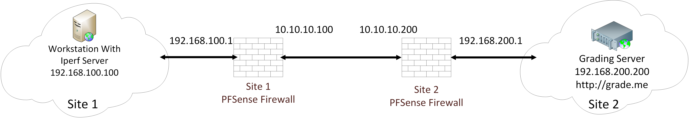

# PFirewall PFun

Configure one side of a VPN tunnel to connect to a remote site. Then, configure firewall rules to meet network requirements.

**NICE Work Role:**   

- [Cyber Defense Infrastructure Support Specialist](https://niccs.cisa.gov/workforce-development/nice-framework/workroles?name=Cyber+Defense+Infrastructure+Support+Specialist&id=All)

**NICE Tasks:** 

- [T0180](https://niccs.cisa.gov/workforce-development/nice-framework/tasks?id=T0180&description=All) - Perform system administration on specialized cyber defense applications and systems (e.g., antivirus, audit and remediation) or Virtual Private Network (VPN) devices, to include installation, configuration, maintenance, backup, and restoration.

## IMPORTANT
This challenge does not have any downloadable artifacts. The full challenge can be completed on the hosted site.

## Background  

Two network sites wish to be connected via a VPN tunnel. A simple network map of these two sites is included below. 

Site 2 (the remote site) has already configured their side of the VPN tunnel with the following settings:  
- IPSec Encapsulating Security Payload IPv4 Tunnel
- SHA512 Hashing
- 256bit AES Encryption
- Diffie Helman & PFK  Group 16 (4096 bit) Key Negotiation  
- Pre-Shared Key:  `tartans`

Your first task is to configure the Site 1 (local site) PFSense firewall to match the settings of the Site 2 firewall and complete the tunnel connection. 

Once the VPN tunnel is completed, you must configure the Site 1 firewall to have the following settings:
- Allow inbound TCP connections on port 12345 and block all other inbound ports
- Limit Bandwidth to/from Site 2 to 1Mbps

Important Note: There are iperf servers running on the Site 1 Workstation VM that are required to remain running for grading to succeed. Do not manually terminate the Powershell window that may briefly show on the workstation screen. 

## Network Map

## Getting Started
Visit the Site 1 PFSense firewall web configuration panel at `http://192.168.100.1`. The credentials for this site are in the section below. This is where you will make the required firewall changes. 

## Submission Format

This challenge will use an in-game grading website to assess your network configurations.   
Once you have the VPN tunnel properly configured, you can visit the website `http://grade.me` which is running on the grading server in Site 2. Click the button on the website to grade your progress and receive tokens. 

The submission for all parts of this challenge will be a 16 character ASCII string. All letters will be lower case.

There are 3 parts to a submission which correlate to each the firewall changes that need to be made.   Visit `http://grade.me` to grade the environment and receive tokens to submit. 
