# PFirewall PFun Solution

## Part 1 - Connecting the VPN

1. Launch the Site 1 Workstation VM. Do not manually close the Powershell window if it is still on the screen

2. Login to the PFSense admin console with the username `user` and the password `tartans`.

3. Navigate to the IPSec VPN page to configure the VPN settings
   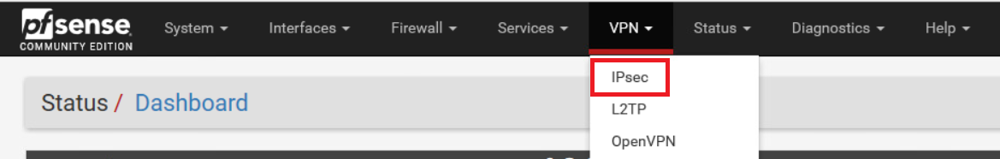

4. Click the button to add Part 1 (P1) of the VPN tunnel
   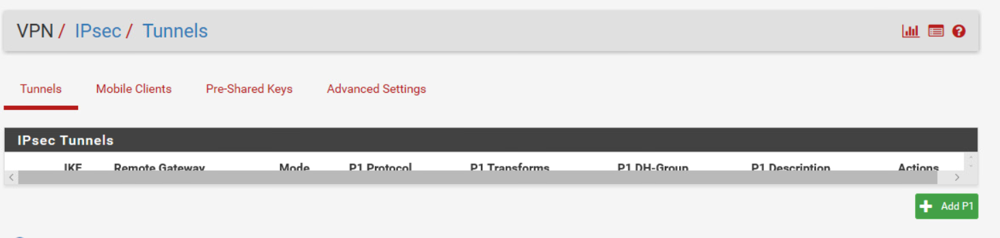

5. Change general setting of the VPN to match the image below. The Key Exchange setting should be `Auto` to accommodate any setting the other side has set. The remote gateway setting should be changed to the WAN IP address of the Site 2 firewall. 
   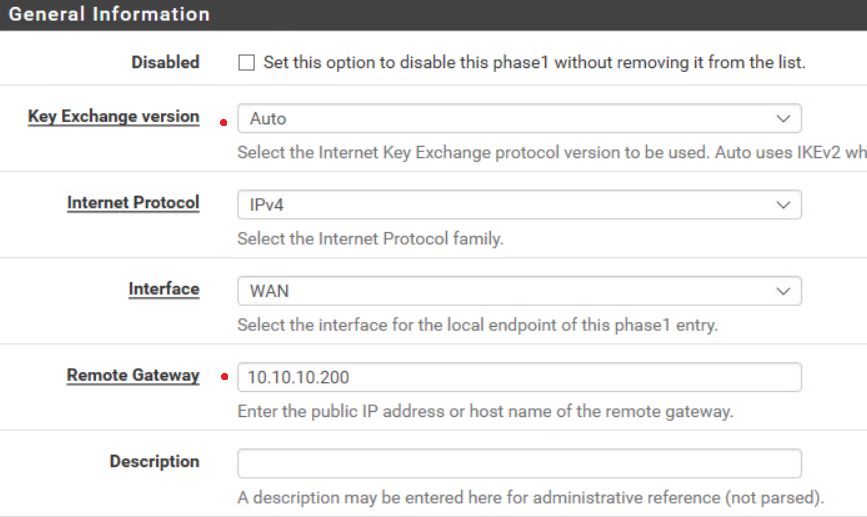

6. Enter the Pre-Shared Key of `tartans`
   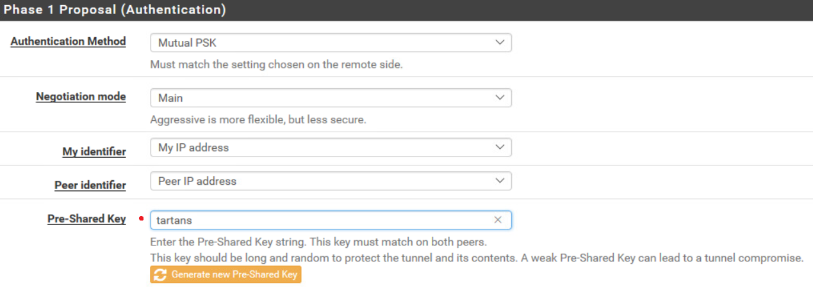

7. Change the encryption setting to match the requirements stated in the lab document. AES256, SHA512, and 4096 bit Diffie-Helman.
   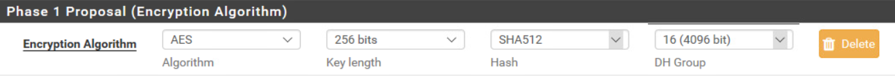

8. Add a Phase 2 entry for the VPN tunnel
   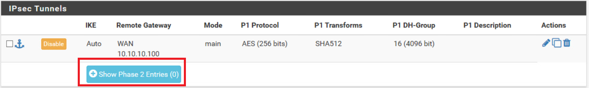

9. Enter the IP address for the remote network as `192.168.200.0/24`
   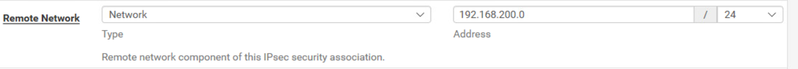

12. Ensure the VPN is connected and that you are able to reach the grading website by visiting http://grade.me 

13. Click the grade button to receive the first token (connections are blocked by default so no further configuration is need)

## Part 2 - Allowing Ports

1. Navigate to view firewall rules  
   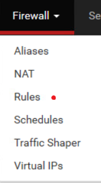

2. Create a rule on the IPSec interface which allows TCP connections on port 12345  
   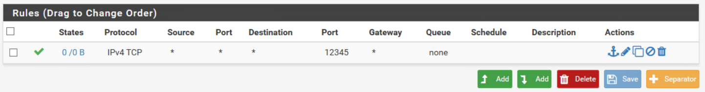

3. Re-grade the challenge on grade.me to receive the token for part 2. 

## Part 3 - Limiting Bandwidth

1. Navigate to the traffic shaper section of the firewall configuration  
   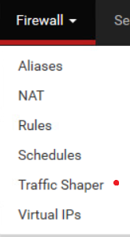

2. Configure 2 traffic limiters of 1Mbps in the Limiters section. Call these limiters in and out. 
   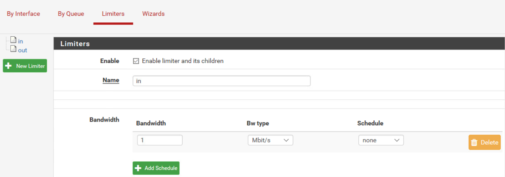

3. Navigate back to the Firewall IPSec Rules section of the configuration panel. Edit the rule which allows traffic to port 12345. Expand the `Advanced Settings` button and configure the in/out pipe to use the in/out limiters that were setup in step 2. 
   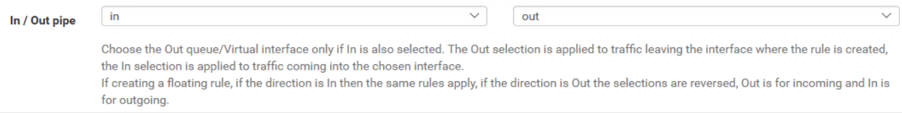

4. Save and apply this configuration. Then re-grade the challenge environment from grade.me to receive the final token. 

