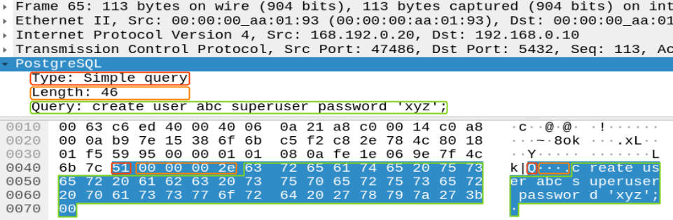

# Spot the Super! Solution

## PostgreSQL Superuser Creation Query

Let's open [example.pcap](../challenge/example.pcap) in Wireshark, and take a closer look at the contents
of the query used to create a superuser account:



The first important field is the ***type***. In our case, that's `Q` for
"simple query". Next, we have a 32-bit (4-byte) unsigned value indicating
the query ***length***. Finally, there's the ***body*** (full text) of the
query, as a NUL-terminated ASCII string.

## Developing an IDS rule

Let's start with the included [example rule](../challenge/example.rules) (the one alerting each time a
superuser logs into a PostgreSQL server):

```
alert tcp $EXTERNAL_NET any -> $HOME_NET 5432 (msg:"POSTGRES root login attempt"; flow:to_server,established; content:"user|00|postgres|00|database|00|postgres|00|"; classtype:protocol-command-decode; sid:3001001; rev:1;)
```

Examining Suricata's global configuration file (`/etc/suricata/suricata.yaml`),
we observe that the PostgreSQL server destination IP address (`192.168.0.10`)
matches the definition of `$HOME_NET`, and the source IP address is consistent
with `$EXTERNAL_NET`. Furthermore, we are looking for `tcp` traffic from `any`
source port to destination port `5432` (consistent with PostgreSQL) on the
server. Within the parentheses, we have a message (`msg`) to be displayed when
an alert is issued based on this rule, a number of matching criteria, and,
finally, a `classtype`, signature ID (`sid`), and revision (`rev`) number.

We modify the `msg` string to read something along the lines of
`"PostgreSQL superuser creation"`, and keep all the other *metadata* fields
(`classtype`, `sid`, and `rev`) unchanged: their only use is to identify the
specific rule when an alert is triggered down the line.

From the matching criteria, we also retain `flow:to_server,established;` as it
helps narrow down the search to only `established` TCP flows originated by an
external client (`to_server`).

The `content:` string matches when NUL-terminated ASCII strings `"user"`,
`"postgres"`, `"database"`, and `"postgres"` are detected in a contiguous
sequence within a packet payload, which occurs whenever the "postgres"
superuser account connects to the "postgres" database (which contains
PostgreSQL's administrative metadata). We must replace this `content:`
payload match criterion with one or more new ones that identify the
***creation*** of a new superuser account, based on the structure of such
a query as seen earlier.

Helpful information on payload matching keywords associated with `content:`
can be found in the [Suricata manual](https://suricata.readthedocs.io/en/suricata-5.0.3/rules/payload-keywords.html), and also in a
[blog post by Joel Esler](https://blog.joelesler.net/2010/03/offset-depth-distance-and-within.html) (one of the authors of the original Snort IDS, with
which Suricata is backward-compatible).

## Solution

A good rule to detect PostgreSQL superuser account creation may look like this:

```
alert tcp $EXTERNAL_NET any -> $HOME_NET 5432 (msg:"POSTGRES superuser creation attempt"; flow:to_server,established; content:"|51|"; depth:1; content:"create user "; distance:4; within:12; nocase; content:" superuser"; distance:0; classtype:protocol-command-decode; sid:3001002; rev:1;)
```

We first match the `Q` character (ASCII 51) indicating the "simple query" type.
Since it's a single character, we use `depth:1;` to limit the search for a
match to only the first character of the TCP payload (`depth` is an absolute
offset into the TCP payload).

Next, we look for the string `"create user "`, starting four bytes after the
previous match (`distance:4;`, skipping over the 32-bit query length field).
We limit the *relative* depth of this match to 12 characters (`within:12`),
because we're only interested in queries that begin with that keyword sequence.
The `nocase;` keyword is used to match regardless of whether the `create user`
command was issued in lower- or uppercase.

We then search for the string `" superuser"`, starting immediately after the
previous match (`distance:0;`), also regardless of lower- or uppercase. This
statement will match if the string `" superuser"` occurs anywhere throughout
the rest of the query payload, since various arguments and modifiers to the
`create user` command may occur in an arbitrary order.

Placing this rule into a file, named (e.g. `super.rules`) in the grading_script folder, and running the
grading script:

```bash
sudo ./grade_it.sh "$(<super.rules)"

```

will return all five tokens required for full credit.
