# Thanks for Logging Secrets Solution

The challenger is given a network packet capture (`https_capture.pcapng`) and a disk image (`win10-image.001`) with instructions that everything needed to decrypt the HTTPS traffic is present on the disk image. The title of the challenge "**T**hanks for **L**ogging **S**ecrets" provides a subtle hint that something has been logged pertaining to TLS. A common method to decrypt HTTPS traffic in Wireshark is to provide the SSL/TLS session keys for a given conversation. These session keys have been logged and are present on the `win10-image.001` disk image. The challenger must locate and extract the SSL/TLS session keys on the disk image, then configure Wireshark to use the session keys to decrypt the HTTPS traffic in the packet capture. 

This solution guide has 2 sections - one for solving the challenge using Windows 10, and one for solving the challenge using SIFT. The steps are nearly identical.

Tools Used:

1. **Wireshark**
2. **Autopsy**
3. **RegRipper**

## **Section 1 - Windows 10**

1. Open a new case in **Autopsy** and import `win10-image.001` as the data source (select `Disk Image or VM File` type) to perform forensic analysis on the disk image. *NOTE: None of the Autopsy Ingest Modules are actually required for the completion of this challenge. Detailed Autopsy set-up procedures are not provided in this solution guide.*

2. Most web browsers support the logging of SSL/TLS session keys whenever the environment variable `SSLKEYLOGFILE` is set. The `SSLKEYLOGFILE` environment variable contains the path to the file where the SSL/TLS sessions keys will be stored. This environment variable can be set at either the global or user level, but is most commonly set at the user level. User environment variables in Windows 10 are stored in the NTUSER registry hive located at `C:\Users\<user-id>\NTUSER.DAT`. The only user present on the disk image is "user", so this user's NTUSER registry hive is located at `C:\Users\user\NTUSER.DAT`. Use **Autopsy** to navigate to this location and view the environment variables. Identify the path that the `SSLKEYLOGFILE` environment variable points to.

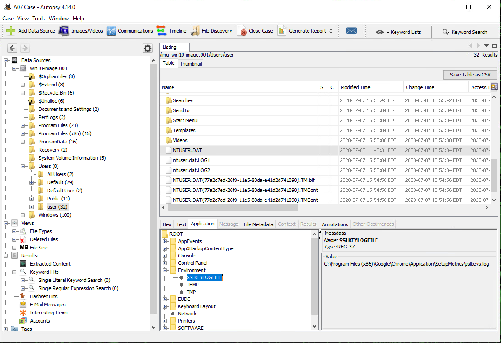

- *ALTERNATIVELY, extract the `NTUSER.DAT` file and use **RegRipper** to parse `NTUSER.DAT` and determine the path that the `SSLKEYLOGFILE` environment variable points to.*  

**NOTE** in this instance the keylog file is provided in the [sslkeys.log](./../challenge/sslkeys.log) file in the [challenge](./../challenge/) directory

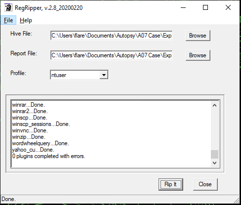  
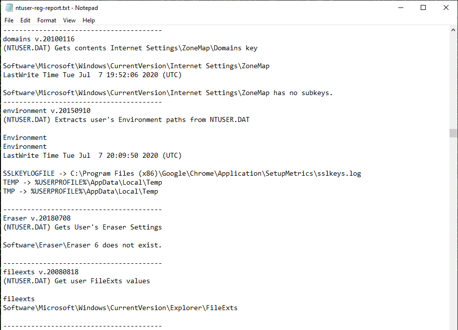  

3. Use **Autopsy** to navigate to the identified location where the SSL/TLS session key file `sslkeys.log` is stored. Extract the file.

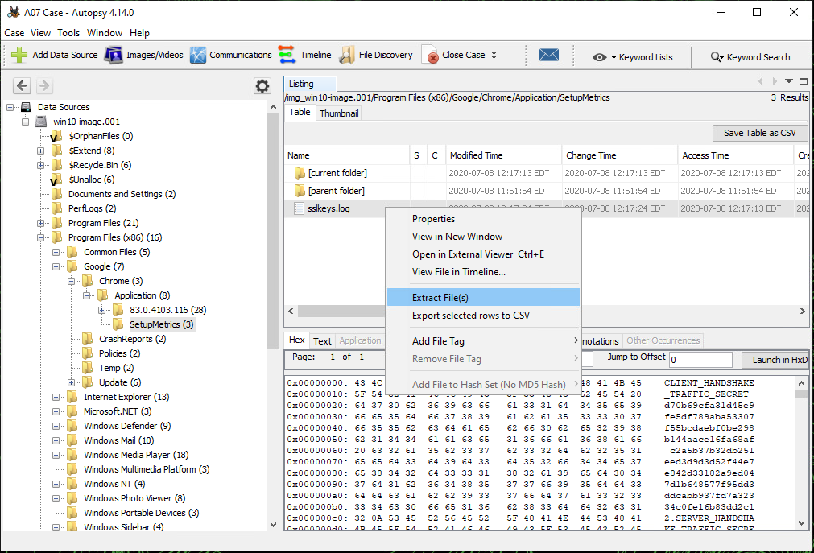

4. Configure **Wireshark** to use the extracted `sslkeys.log` file to decrypt the applicable HTTPS traffic. This configuration setting can be found by navigating to `Edit | Preferences | Protocols | TLS` and then setting the `(Pre)-Master-Secret log filename` field.

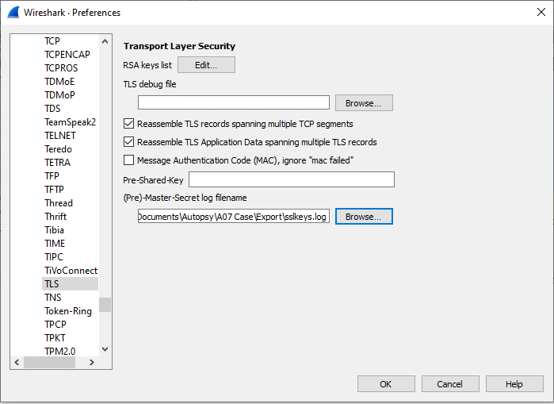

5. Use **Wireshark** to locate and view the decrypted HTTPS traffic that contains the token. Find the correct packet and view the "`Decrypted TLS`" contents pane or right-click and use the "`Follow TLS Stream`" option to view the entire conversation, including the token. 

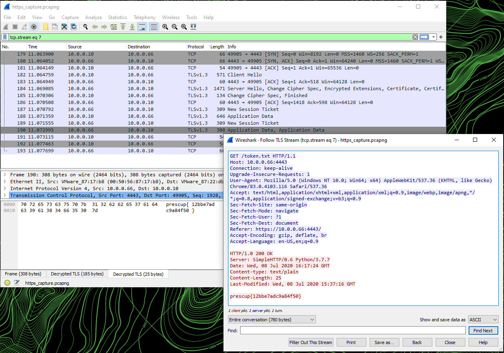

## **Section 2 - SIFT**

1. In the terminal, start **Autopsy** as an administrator and use a web browser to navigate to the local web server specified. 

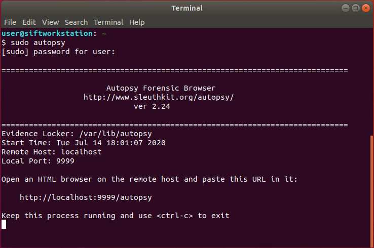

2. Open a new case in **Autopsy** and import `/media/user/Image/win10-image.001` to perform forensic analysis on the disk image. *NOTE: Detailed Autopsy set-up procedures are not provided in this solution guide.* 

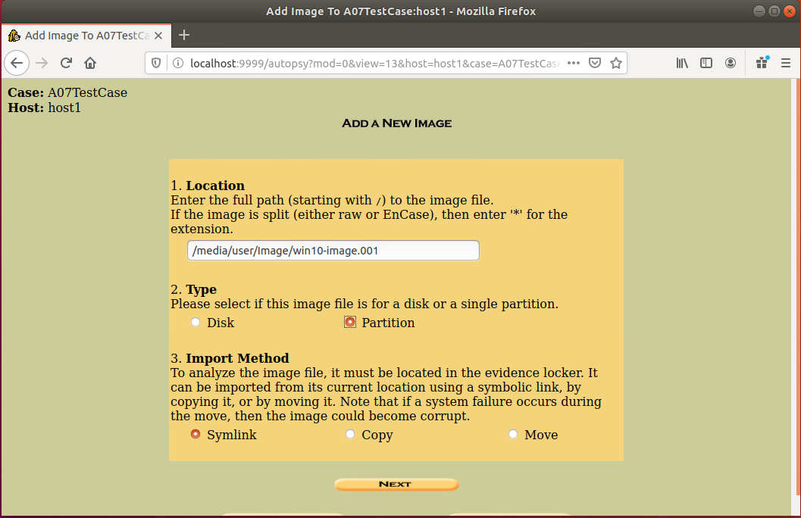

3. For the same reason as described in **Section 1 - Step 2** above, use **Autopsy** to navigate to and extract/save `C:\Users\user\NTUSER.DAT` using the `Export` hyperlink. 

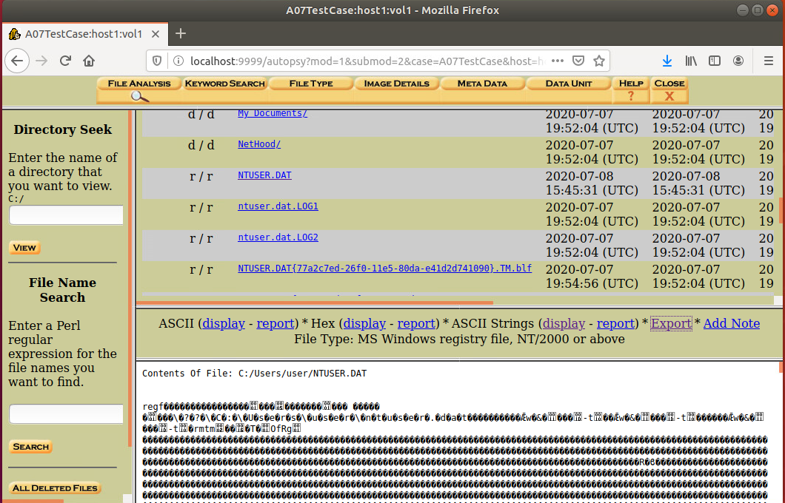

4. In a separate terminal, use **RegRipper** to parse `NTUSER.DAT` and determine the path that the `SSLKEYLOGFILE` environment variable points to.  

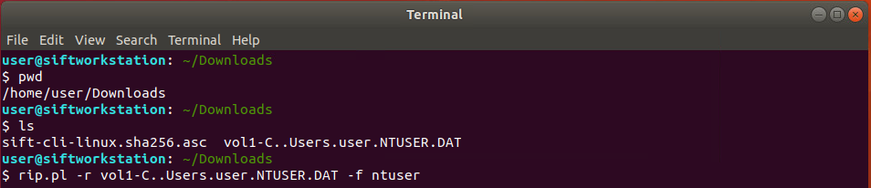
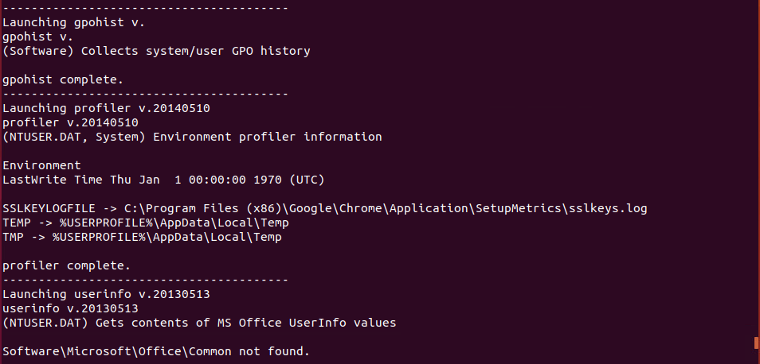

5. Use **Autopsy** to navigate to the identified location where the SSL/TLS session key file `sslkeys.log` is stored. Extract/save the file using the `Export` hyperlink.

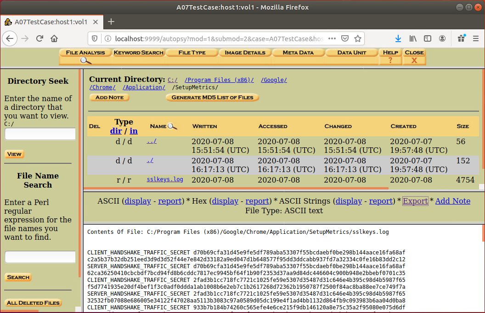

6. Configure **Wireshark** to use the extracted `sslkeys.log` file to decrypt the applicable HTTPS traffic. This configuration setting can be found by navigating to `Edit | Preferences | Protocols | SSL` and then setting the `(Pre)-Master-Secret log filename` field.

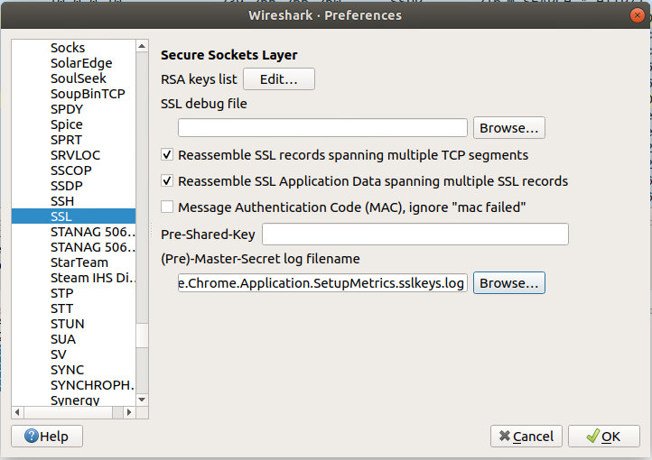

7. Use **Wireshark** to locate and view the decrypted HTTPS traffic that contains the token. Find the correct packet and view the "`Decrypted SSL`" contents pane or right-click and use the "`Follow SSL Stream`" option to view the entire conversation, including the token. 

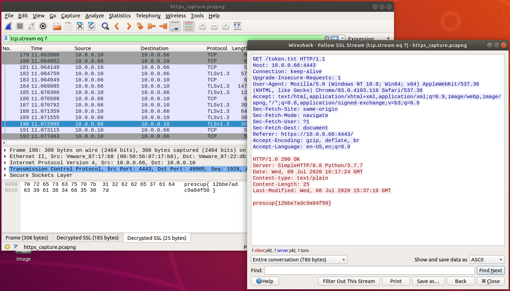

## Submission

The token submission is listed below:

 - Token submission: `12bbe7adc9a84f50`

