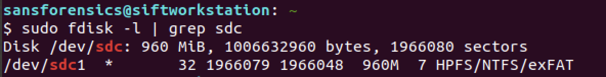

# DBYOD

Analyze forensic images of a laptop and a USB and answer a few questions.

**NICE Work Role:** 

- [Cyber Defense Forensics Analyst](https://niccs.cisa.gov/workforce-development/nice-framework/workroles?name=Cyber+Defense+Forensics+Analyst&id=All)

**NICE Tasks:**

- [T0238](https://niccs.cisa.gov/workforce-development/nice-framework/tasks?id=T0238&description=All) - Extract data using data carving techniques.
- [T0397](https://niccs.cisa.gov/workforce-development/nice-framework/tasks?id=T0397&description=All) - Perform Windows registry analysis.
- [T0532](https://niccs.cisa.gov/workforce-development/nice-framework/tasks?id=T0532&description=All) - Review forensic images and other data sources (e.g., volatile data) for recovery of potentially relevant information.

## IMPORTANT
This challenge is only partially open sourced. The files are provided to give a starting point if you want to recreate the challenge on your own. The full challenge can be completed on the hosted site.

## ⚠️ Large Files ⚠️
This challenge includes large files as a separate download. Please download
[this zip](https://presidentscup.cisa.gov/files/pc2/individual-a-round3-dbyod-largefiles.zip)
and extract in _this directory_ to get started.

## Background

"Bring Your Own Device" is against ACK-ME's policies. However, we saw an employee connecting his USB drive with a company laptop. We have forensically acquired the laptop and USB images. The USB image is corrupted as some initial sectors (~50) were mistakenly overwritten with other data. Your task is to analyze the forensic evidence available and answer a few questions.

## Getting Started

You can view the [challenge guide](challenge-guide.pdf) here.

The evidence drive contains the laptop image (`laptopimage.dd`) and the USB drive image (`usbimage.dd`).

Please note - 
* Just because an application is able to open a file does not mean that it is a complete file. In order to get the correct MD5, please make sure to get all the contents of the file as present in the file system.
* Following is the disk layout of the USB in question and might be helpful.



## Submission Format

Submission format is as follows - 

Part 1 of 6:  What time was the USB device first connected to the laptop?
```
20 DEC 2021 21:20:00 UTC
``` 
Part 2 of 6: Provide the name of the user that connected the USB to the laptop?
```
Firstname Lastname
```
Part 3 of 6: There are four files present on the USB. Arrange the files in the ASCII order of their actual filenames. Provide the md5 of the 1st file. 
```
1234abcd58a66530c95d257f811977ba
```
Part 4 of 6: There are four files present on the USB. Arrange the files in the ASCII order of their actual filenames. Provide the md5 of the 2nd file. 
```
1234abcd58a66530c95d257f811977ba
```
Part 5 of 6: There are four files present on the USB. Arrange the files in the ASCII order of their actual filenames. Provide the md5 of the 3rd file. 
```
1234abcd58a66530c95d257f811977ba
```
Part 6 of 6: There are four files present on the USB. Arrange the files in the ASCII order of their actual filenames. Provide the md5 of the 4th file. 
```
1234abcd58a66530c95d257f811977ba
```
