# DBYOD Solution

The first step is to open both images in autopsy. You'll notice that the laptop image opens up properly while the USB image does not.

## Question 1

Most of the USB related information is present in the registry.

`SYSTEM\ControlSet001\Enum\USBSTOR` contains information about all the USBs that have ever connected to the system.

1. Using autopsy navigate to `C:\Windows\System32\config`. This is where all the registry hives are located. Export/extract the SYSTEM hive out of autopsy and save it to the Desktop.

2. Open `SYSTEM` hive using `Registry Viewer` and navigate to `SYSTEM\ControlSet001\Enum\USBSTOR`. You'll notice that it contains information about 1 USB only. That means only 1 USB ever connected to this system and that is the one in question as well. The first connected time of this USB is present in `SYSTEM\ControlSet001\Enum\USBSTOR\Disk&Ven_General&Prod_UDisk&Rev_5.00\7&f810be1&0&_&0\Properties\{83da6326-97a6-4088-9453-a1923f573b29}\0064` key. The value is `916F9F4FA6A3D601`. This timestamp is in Windows 64 Bit Hex Value (Little Endian). Use https://doubleblak.com/blogPosts.php?id=7 to convert that timestamp in human readable format (`16 OCT 2020 10:22:54 UTC`).

3. While we are at this key we should also note the serial number of the USB and the last removal time of the key.  
Serial number is stored at `SYSTEM\ControlSet001\Enum\USBSTOR\Disk&Ven_General&Prod_UDisk&Rev_5.00\` which in this case is `7&f810be1&0&_&0`  
Last removal time is stored at `SYSTEM\ControlSet001\Enum\USBSTOR\Disk&Ven_General&Prod_UDisk&Rev_5.00\7&f810be1&0&_&0\Properties\{83da6326-97a6-4088-9453-a1923f573b29}\0067` which is `2669ED61B0A3D601` and is equivalent to `16 OCT 2020 11:35:00 UTC`

4. A couple of other things that we should make a note of are -   
Drive letter the USB is mapped to and the corresponding GUID - This information is found at `SYSTEM\MountedDevices`. Search for the Serial number within each key Value. This will provide the Drive letter (`E:\`)the USB was attached to and the volume GUID (`2385153f-0e6f-11eb-9a7e-147dda4bf01b`).
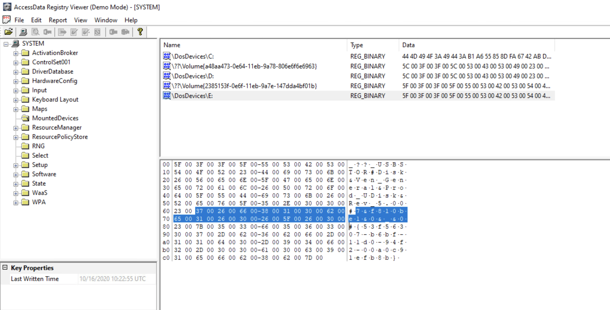
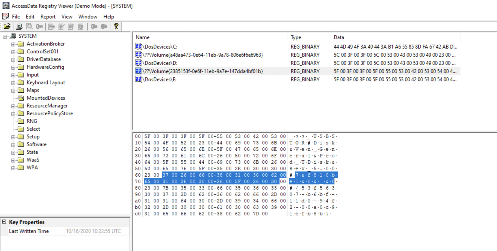
Volume Name of the USB - This information is present at `SOFTWARE\Microsoft\Windows Portable Devices\Devices`. Export `SOFTWARE` hive out of autopsy. It is also present at `C:\Windows\System32\config`. At that location in in registry, you'll find the same USB with the same Vendor ID, Product ID, and serial number. The `FriendlyName` key within that contains the Volume name information which is `USB` in this case.
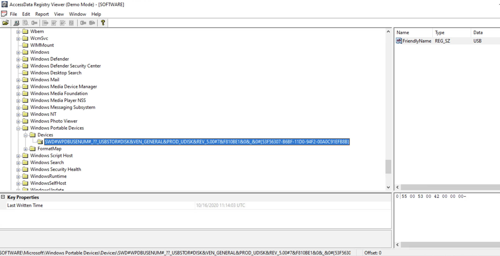

## Question 2

To find the user that connected the USB, we need to analyze `NTUSER.DAT` for each user account that is present on the laptop. We are looking for a subkey with the same volume GUID that we found earlier within `NTUSER.DAT\SOFTWARE\Microsoft\Windows\CurrentVersion\Explorer\Mountpoints2`

Within the laptop image, you'll notice three different user accounts. `NTUSER.DAT` is present in the home folder of each user account.

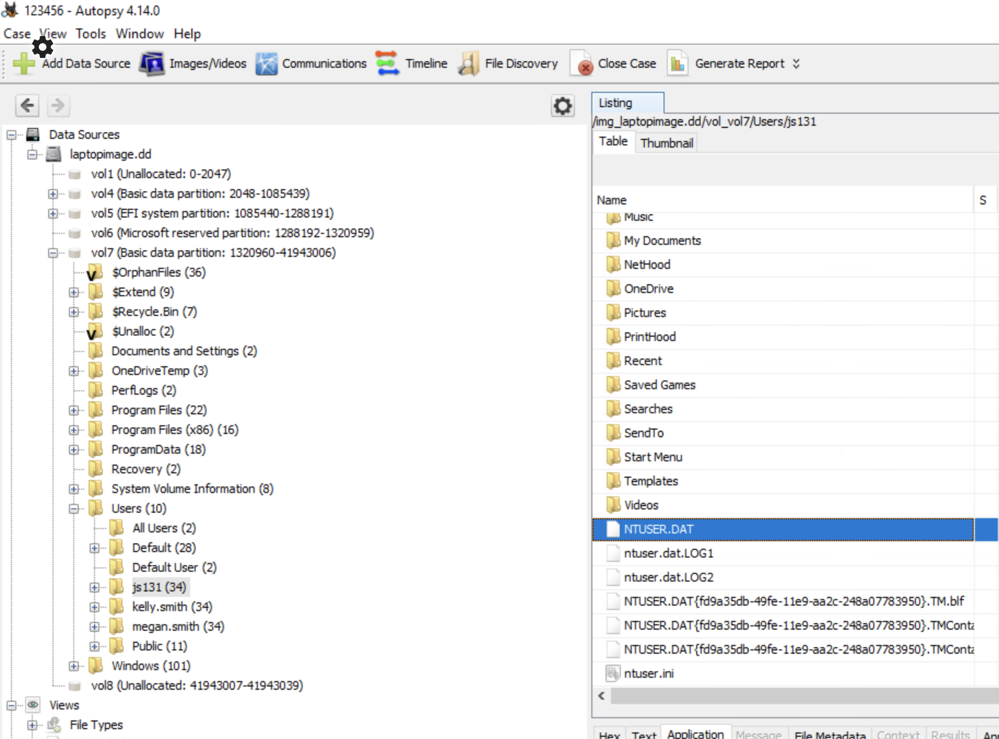

Check `NTUSER.DAT` for all three accounts. The one that contains the same volume GUID (`2385153f-0e6f-11eb-9a7e-147dda4bf01b`) present at `NTUSER.DAT\SOFTWARE\Microsoft\Windows\CurrentVersion\Explorer\Mountpoints2` is the user that connected the USB. In this case it is user `js131`.

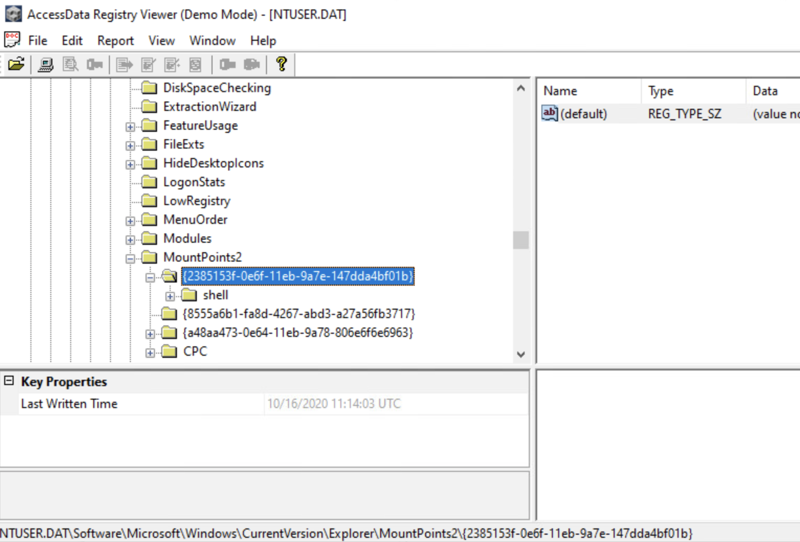

Next we need to find the name associated with this account. For this we need to analyze `C:\Windows\System32\config\SAM` hive. Within the hive, browse to `SAM\Domains\Account\Users\` and look for key properties of the key for `js131` account.

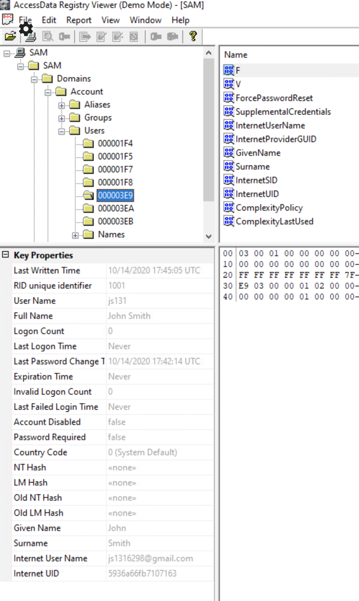

Full name is - `John Smith`

In Summary we know -

USB's Volume Name is `USB`

User `John Smith` connected it to the laptop.

It was first connected at `16 OCT 2020 10:22:54 UTC` and last removed at `16 OCT 2020 11:35:00 UTC`.

It was mapped to E:\

## Question 3, 4, 5 & 6

For these question we need to find the four files that are present on the USB. As we have seen earlier the USB image is corrupted and does not mount properly in autopsy. Our only option is to carve those four files from the USB image. As we do not know anything about those files, our best bet is to find some reference to those files within the laptop image. There are a couple of places where we can find info about those files -

- Recent Docs within registry `NTUSER.DAT\SOFTWARE\Microsoft\Windows\CurrentVersion\Explorer\RecentDocs`
- Recent Microsoft Office Docs within registry `NTUSER.DAT\SOFTWARE\Microsoft\Office\VERSION`
- Shortcut files at `C:\Users\<username>\AppData\Roaming\Microsoft\Windows\Recent`
- Jumplists

Out of the above options, `Quick Access` jumplist is the one that provides references to all four files in the USB. The idea is that all four files were accessed by the user `John Smith` while the USB was connected to the laptop between `16 OCT 2020 10:22:54 UTC` and `16 OCT 2020 11:35:00 UTC`.

`Quick Access` jumplist stores reference to all the files that were accessed on the system and it is one of the automatic jumplists. It is located at `C:\Users\js131\AppData\Roaming\Microsoft\Windows\Recent\AutomaticDestinations`

Export the entire folder out of Autopsy. Use the `JumpListExplorer` and to load the `Quick Access` jumplist. The filename is `5f7b5f1e01b83767.automaticDestinations-ms`. Or you could just load all the exported jumplists.

Analyze all the entries within `Quick Access` jumplist looking for any files accessed from E:\ within `16 OCT 2020 10:22:54 UTC` and `16 OCT 2020 11:35:00 UTC` time frame. Note the name and size of those files.

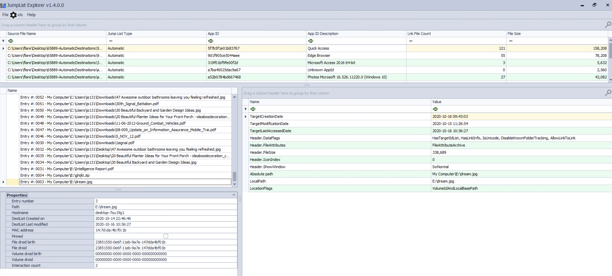

You'll find the following files (arranged in ascii order of their filenames) -

| Filename                   | Filesize (bytes) |
| -------------------------- | ---------------- |
| E:\Database11.accdb        | 417,792          |
| E:\Intelligence Report.pdf | 27,721           |
| E:\dream.jpg               | 338,689          |
| E:\ghijkl.zip              | 1,574,373        |

At this point we need to carve files out of the `usbimage.dd` file. We can limit file carving to `.accdb`, `.pdf`, `.jpg`, and `.zip` file extensions.

We'll use `foremost` file carving tool

First step is to modify the foremost configuration file present at `/etc/foremost.conf`.

Use `nano` to open the file

```
sudo nano /etc/foremost.conf
```

Uncomment the lines next to `jpg, pdf, and zip` file extensions. Comment any other file extensions that are enabled.

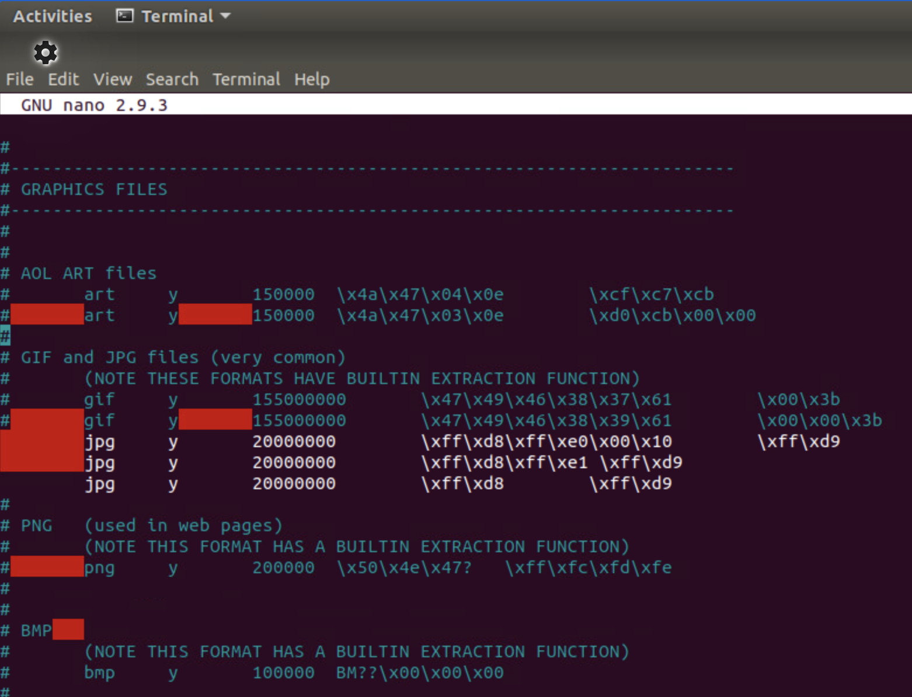

Also reduce the zip file size to `2000000`

Also note the header and footer for zip extension. Please note that there are 18 bytes following the footer that are also part of the zip file. (https://deurus.info/2017/10/list-of-file-signatures/)

You'll also notice that `accdb` is not present so we will add that.

`accdb` is a Microsoft Access database file. Its file signature can be found online https://www.filesignatures.net/index.php?search=accdb&mode=EXT

Let's add accdb file signature to the foremost configuration file.

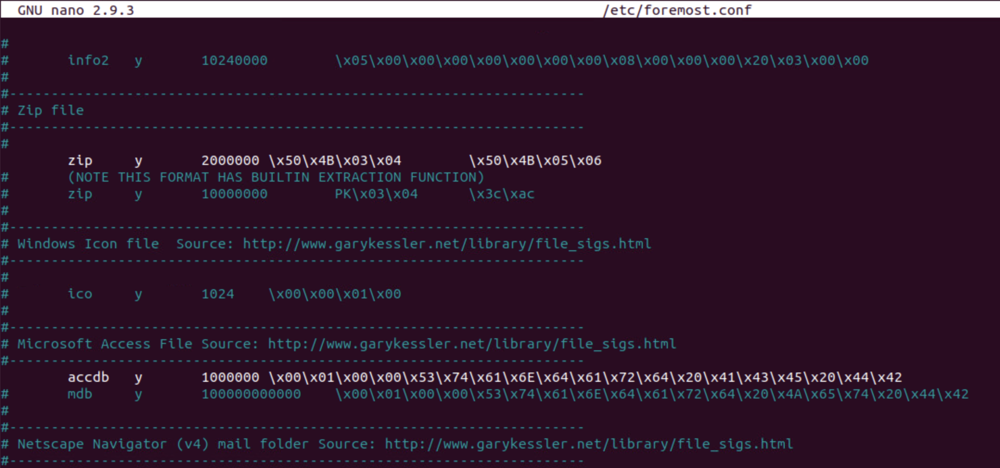

Save the configuration file and exit out of it.

At this point mount the evidence drive to SIFT workstation.

```
sudo fdisk -l | grep sd
sudo mount /dev/sdb1 /mnt/
cd /mnt/
ls
cd ~
```

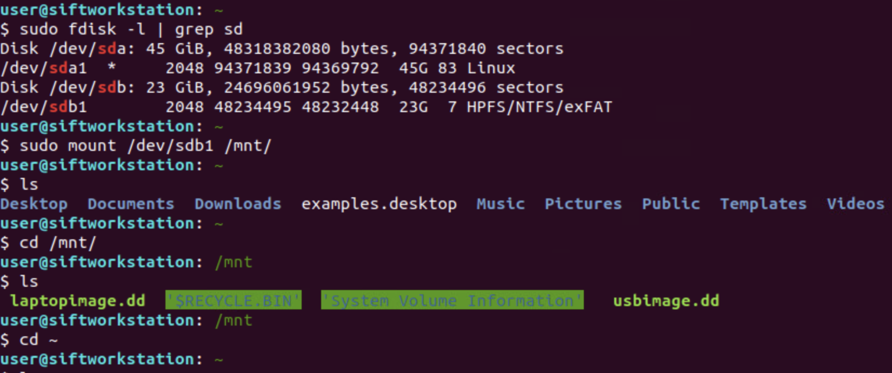

At this point run foremost against the usb image

```
foremost /mnt/usbimage.dd
```

It will take a few minutes. Once it is done processing, analyze the extracted files in the folder named `output`.

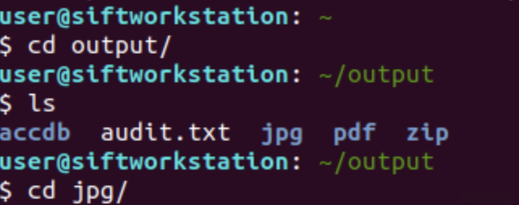

In the output folder, you'll find an `audit.txt` file and four folders - one for each file extension that we are interested in. Each folder will contain extracted files of that file type.

Search each folder looking for file size mentioned in the table above. For example - search the `jpg` folder for file size `338689` bytes

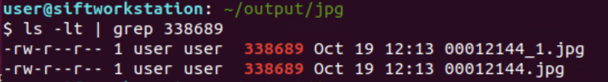

You can open either of the files. they are exactly the same. Find the md5 of the file.

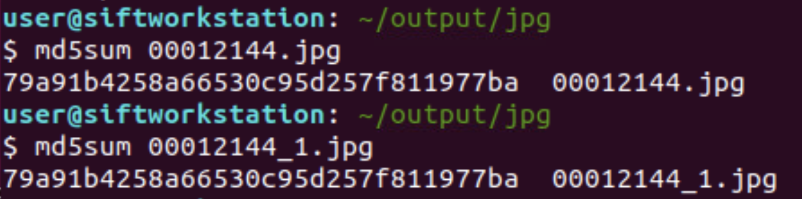

This is the 3rd file and hence the answer to Ques5.

Similarly, navigate to the pdf folder and find the file with file size 27,721 bytes. You'll notice that the file that is closest in size is 00015944.pdf (27720 bytes).

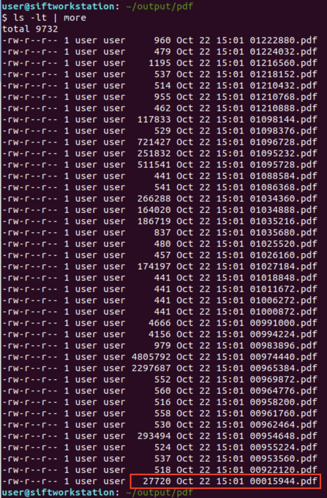

Now, navigate to accdb folder. You'll notice that only 1 file is present in that folder and the file size is not same as the file size that we are looking for. The reason is that we do not have any footer information mentioned in the foremost configuration file.

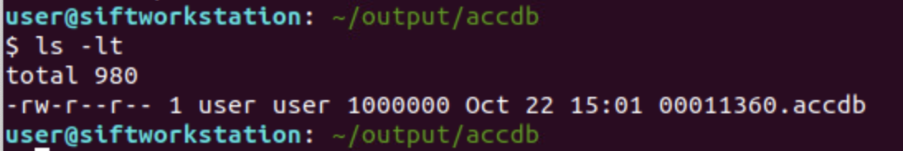

Similarly, look through the zip folder and you'll find a file which is 18 bytes lesser than the file size that we are looking for.

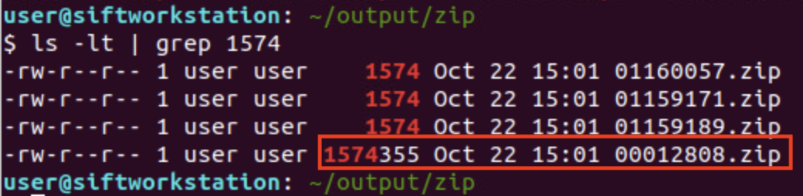

Note the byte offset of the above three files from `audit.txt` present in the `output` folder.

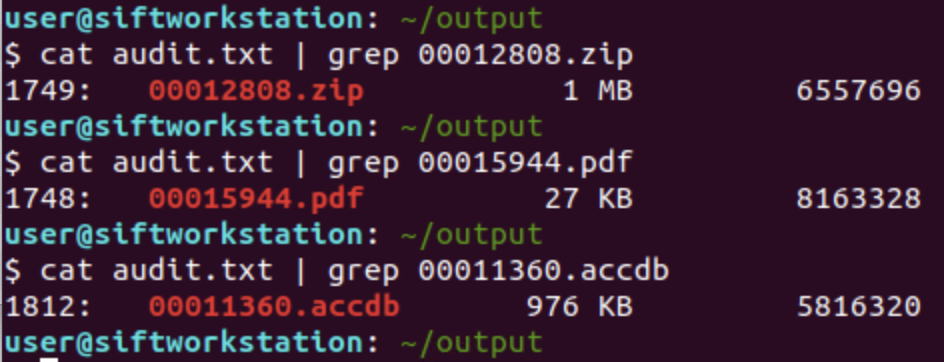

| File                       | Byte offset | File size (bytes) |
| -------------------------- | ----------- | ----------------- |
| E:\Database11.accdb        | 5816320     | 417,792           |
| E:\ghijkl.zip              | 6557696     | 1,574,373         |
| E:\Intelligence Report.pdf | 8163328     | 27,721            |

At this point we will use the `010` hex editor to extract all three files.

Open `010` hex editor. Open USB image within it.

Use the `Select Range` feature.

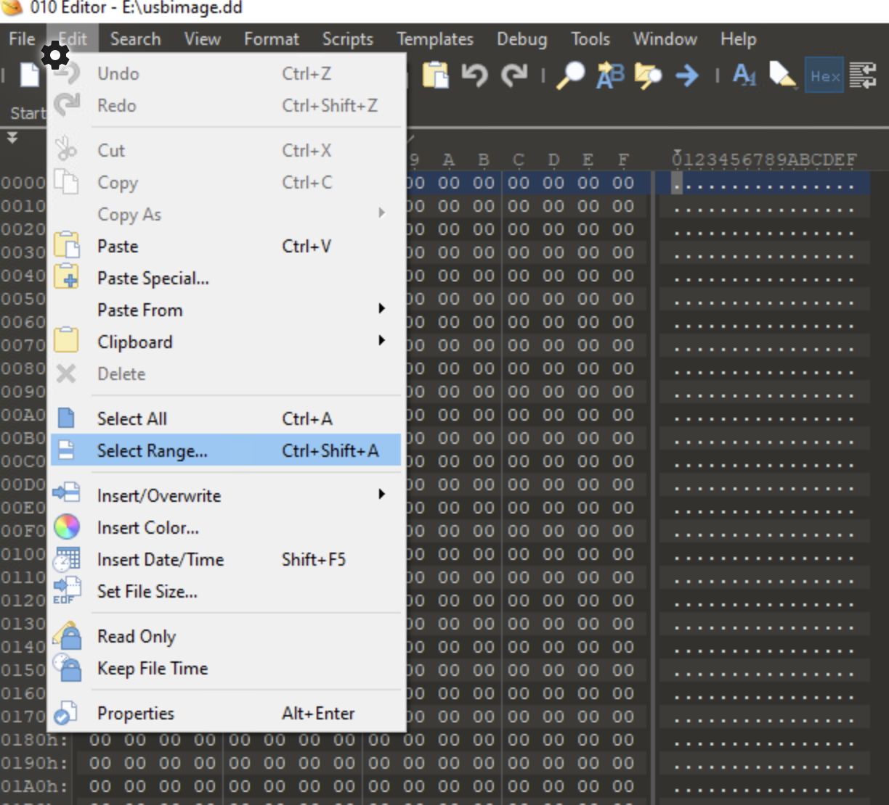

At the bottom of the screen, enter the the starting byte offset and the size of the file to be extracted. Screenshot is for zip file. Make sure `Decimal` is selected. Press Enter.

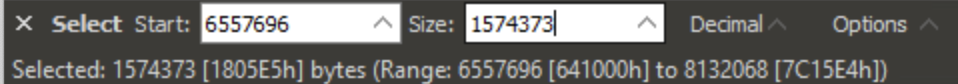

Right click on the highlighted data, and select copy.

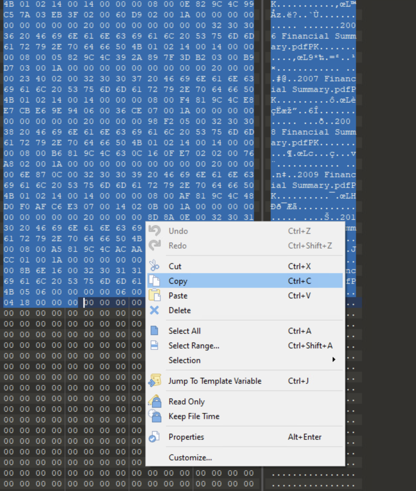

Now, open a new hex file. Click `File` -> `New` -> `New Hex File`

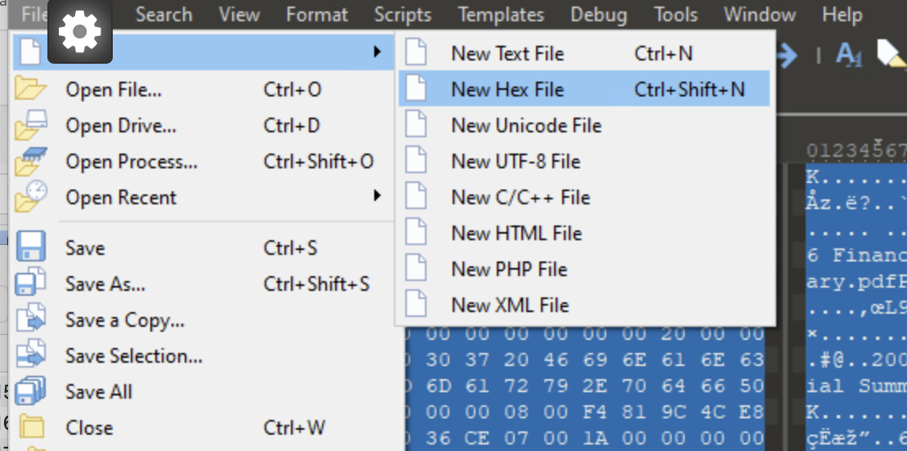

Right click within the New file and paste data.

Save the file and give it a name. For this example I am saving it as ghijkl.zip.

Lastly, use the `Get-FileHash` cmdlet in powershell to find the Md5 for the file.

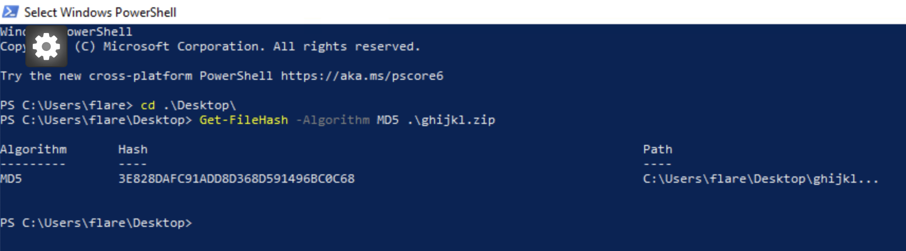

Repeat the above steps for other two files also.

The above method of file extraction will not work for the file named `Database11.accdb` because the file contents are not all stored together at one location on the disk.

To extract `Database11.accdb`, first we will parse the MFT entry for it to determine the clusters that are used for storing the file contents.

Use `010 Editor` application to open `usbimage.dd`

Click on `Search` -> `Find`

Search for unicode `Database11.accdb`<br>
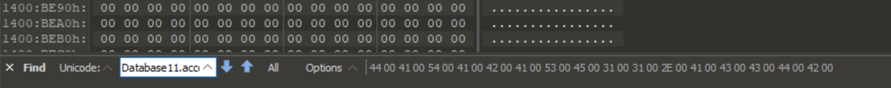

Fourth occurrence of the keyword is in the MFT entry for this file <br>
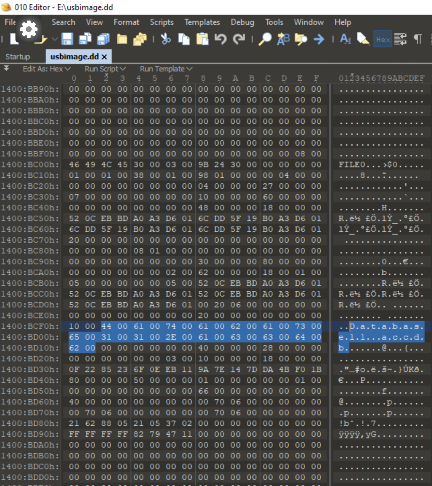

Let's parse this MFT entry<br>
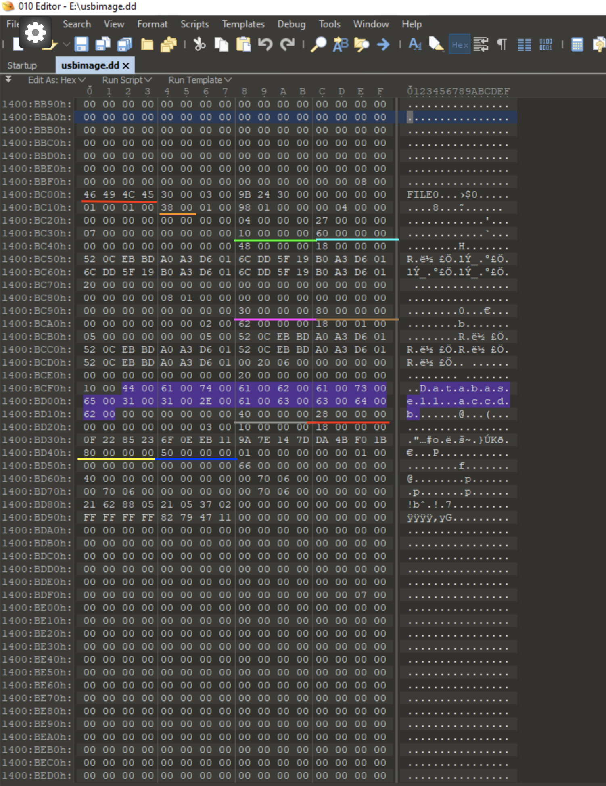
The MFT entry starts with `FILE` as underlined in Red <br>
Bytes 20-21 (underlined is orange) provides the offset to first attribute which is equal to 0038 hex -> 56 in decimal <br>

Moving to first attribute at byte 56. The first four bytes are marked in green. The first four bytes of an attribute represent the attribute identifier. The value is equal to x10 which is equal to 16 in decimal which means it $STANDARD_INFORMATION attribute. <br>
Next four bytes marked in turquoise represent the size of this attribute - x60 -> 96 bytes in decimal. <br>

Next attribute starts right after the previous one. Therefore, move 96 bytes from the beginning of first attribute. <br>
The first four bytes of the next attribute are highlighted in pink -> x30 -> 48 in decimal which means it is $FILENAME attribute. <br>
The size of this attribute is mentioned in the next four bytes highlighted in brown -> x80 -> 128 bytes in decimal.<br>

Move 128 bytes from the beginning of $FILENAME attribute to get to the next attribute <br>
the first four of the third attribute are x40 -> 64 in decimal. (underlined in Grey) <br>
The size of this attribute in marked in Red -> x28 -> 40 in decimal <br>

Move 40 bytes from the beginning of the third attribute and this brings us to the fourth attribute marked in yellow. <br>
The first four bytes -> x80 -> 128 in decimal which means this is the $DATA attribute and this the one we have to analyze to determine the clusters allocated to this file. <br>

Let's parse the $DATA attribute for the MFT entry corresponding to `Database11.accdb`

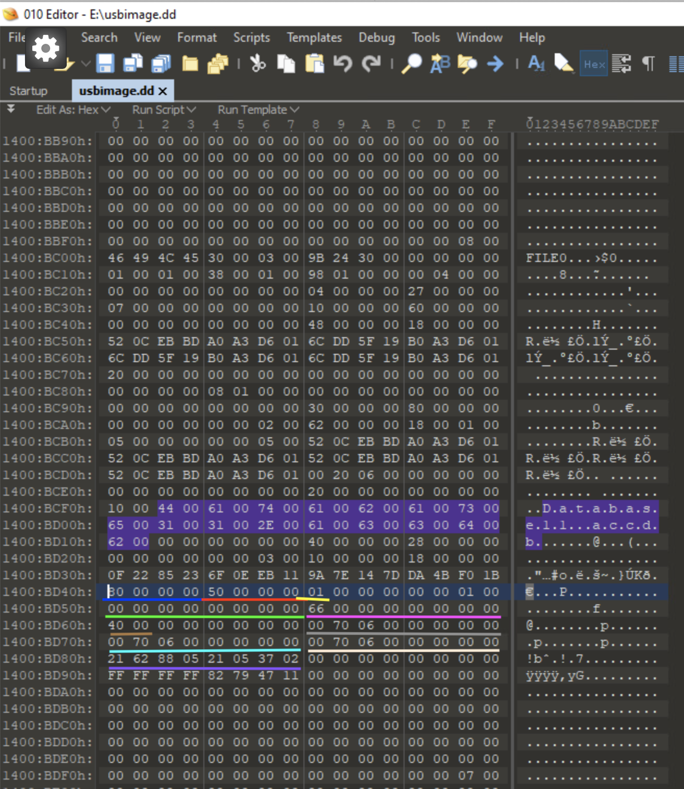

Byte 8 (marked in yellow) within the attribute determines if it a resident attribute or not. `01` means it is non-resident. <br>
The non-resident information starts at byte 16. <br>
Bytes 16-23 represent the starting virtual cluster number (VCN) of the runlist which 0 in this case<br>
Bytes 24-31 represent the ending VCN which is x66 -> 102<br>
Bytes 32-33 represent the offset of the runlist which is equal to x40 which is 64 bytes from the start of the attribute.<br>
Bytes 40-47, 48-55, and 56-63 are for the allocated, actual, and initialized amount of space for this file, and in this case are all set to x067000 (421888 bytes)<br>
In this case, byte 64 is where the run list starts and is mentioned below.<br>
21 62 88 05 21 05 37 02<br>
The first byte in the runlist is organized into the upper and lower 4 bits, which show how large each of the other fields are.<br>
The lower 4 bits of byte 64 which is equal to 1 show that there is 1 byte in the field for the runlength<br>
The upper 4 bits of byte 64 which is equal to 2 show that there are 2 bytes in the offset field.<br>
To determine the runlength, we will examine byte 65 which is equal to x62 -> 98 clusters<br>
To determine the offset, we will examine bytes 66 and 67 which is equal to x0588 -> which is cluster 1416.<br>
Therefore, the first run starts at cluster 1416 and extends for 98 clusters.<br>
The data structure for the next run starts after the previous one. <br>
Therefore, the next run starts at byte 68 which is equal to x21 which means 1 byte for runlength and 2 bytes for offset field.<br>
byte 69 -> runlength -> x05 -> 5 clusters<br>
byte 70, 71 -> offset -> x0237 -> cluster 567<br>
This offset value is relative to the previous one so we add 567 to 1416 = 1983<br>
This second run starts at cluster 1983 and extends for 5 clusters.<br>

Now we need to know the size of the cluster and where the cluster allocation begins on the disk. <br>
Based on the disk layout screenshot provided in the challenge description we know that the main partition starts at sector 32. This is where the cluster allocation begins which means cluster 0 starts at sector 32 on the disk.<br>
You'll also notice that both master boot record (starts at sector 0) and Volume boot record (starts where the partition starts, in this case sector 32) are both overwritten with zeros.<br>
The backup of the volume boot sector is present in the last sector of the partition.<br>
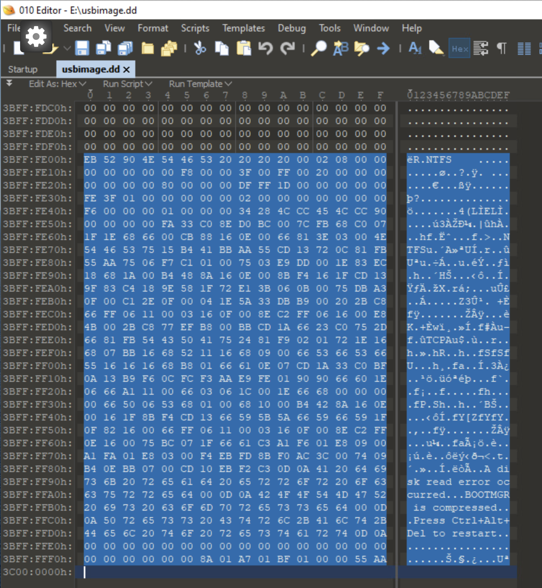

Byte 11 and 12 represents number of bytes per sector -> x0200 -> 512 bytes<br>
byte 13 represents number of sectors per cluster -> x08 -> 8 sectors per cluster<br>

Therefore, 1 cluster = 512\*8 = 4096 bytes<br>
This means the first data run starts at (1416x4096) + (32x512) = 5816320 byte<br>
and extends for 98x4096 = 401408 bytes<br>

Second data run starts at (1983x4096) + (32x512) = 8138752 byte<br>
and extends for (5x4096) = 20480 bytes<br>

total size = 401408 + 20480 = 421888 bytes<br>

which is same as the actual size of the file as determined above.

To extract the file use the `Select Range` feature and extract both data runs one by one (first one first) and paste it in a new file. Make sure to not leave any extra space.

Save the file as `Database11.accdb` and find the md5 of the file.<br>
Also, you can try to open the file in Microsoft Access.<br>

## Submission

1. 16 OCT 2020 10:22:54 UTC
2. John Smith
3. 51c70515e614cad47eda24e93ba5a93a
4. b714f4fda67d4fa96a50650ea30b47fd
5. 79a91b4258a66530c95d257f811977ba
6. 3e828dafc91add8d368d591496bc0c68
