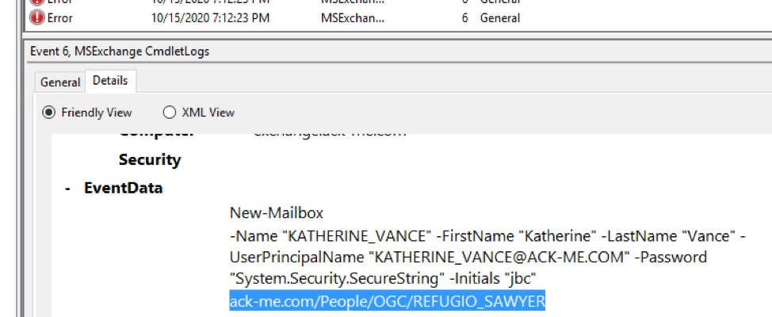
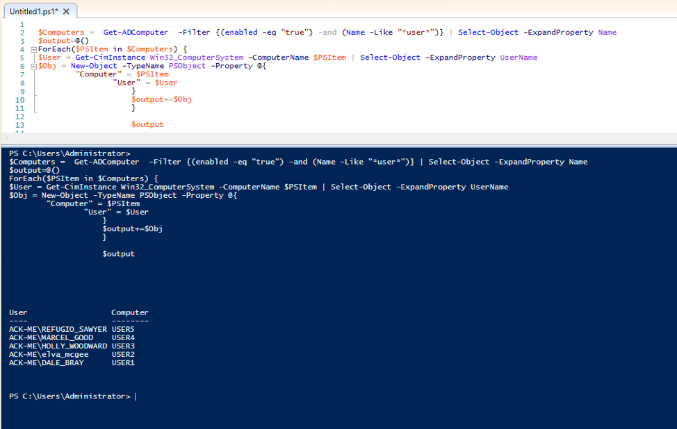
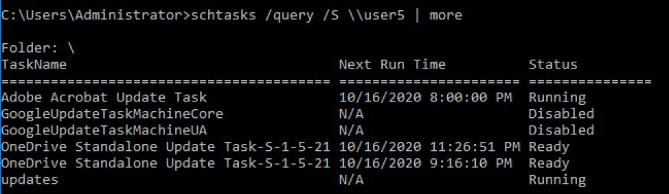
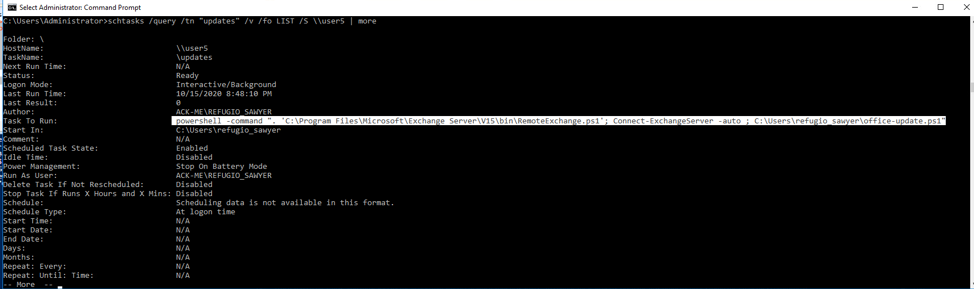
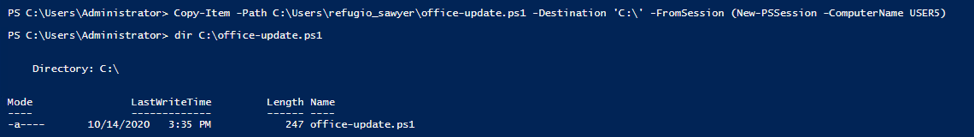
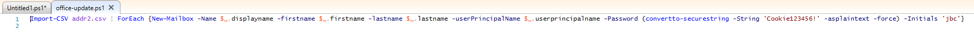
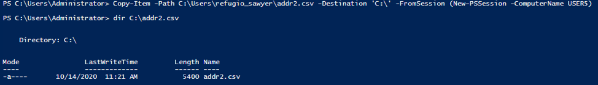
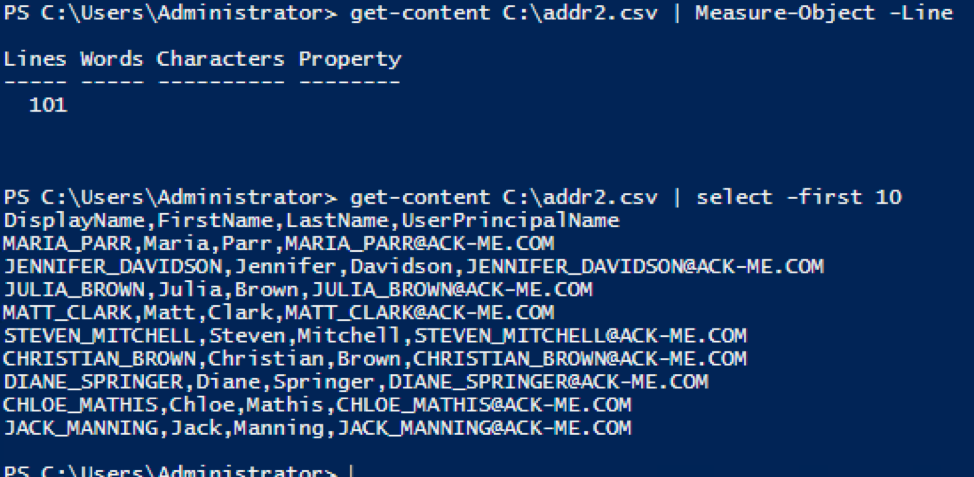

# Email for Sale Solution

Let’s start by identifying some of the accounts that were created around the date in question: 14 Oct, 2020 via this powershell script (run on the domain controller):

```
Import-Module ActiveDirectory
$Date = Get-Date 10/14/2020
Get-ADUser -Filter {whenCreated -gt $Date} -Properties whenCreated,EMailAddress | Select Surname,GivenName,SamAccountName,EMailAddress
```

This will list most of the accounts, but we need to dig in deeper to find out who created them.

Contestants may be tempted to setup audit logging in active directory for account creation. That’s chasing down the wrong rabbit hole, because the accounts are created directly via exchange remote management. Thus the accounts would show up as created by the Exchange\$ service account, not the actual person who created them.

The most straightforward way to solve this portion of the puzzle is to view the “MSExchange Management” Log on the exchange server. On the exchange server, launch event viewer and expand Applications and Services Logs -&gt; MSExchange Management.

In this log file, there will be a number of failed exchange account events that repeat every five minutes. This fits the pattern described in the challenge of “the accounts being re-created automatically”. Contestants can delete an account and observe that it is re-created but that is not necessary. Regardless of success or failure, these event logs contain details about who created the account:



The above log shows that **REFUGIO\_SAWYER** executed the “New-Mailbox” command to create an account named “KATHERINE\_VANCE”. KATHERINE\_VANCE should match one of the accounts returned by the Active Directory Powershell query in step one.

Next, we’ll need to identify which computer REFUGIO\_SAWYER is logged into. Running the following Powershell script on the DC will tell us that:

```
$Computers = Get-ADComputer -Filter {(enabled -eq "true") -and (Name -Like "*user*")} | Select-Object -ExpandProperty Name
$output=@()
ForEach($PSItem in $Computers) {
$User = Get-CimInstance Win32_ComputerSystem -ComputerName $PSItem | Select-Object -ExpandProperty UserName
$Obj = New-Object -TypeName PSObject -Property @{
	"Computer" = $PSItem
	"User" = $User
	}
	$output+=$Obj
	}
	$output
```



From the output of our script, we can see that REFUGIO\_SAWYER is logged into USER5.


Now we need to find the name of the powershell script that the user is using to create these accounts. Since we the account creation attempt happening at regular intervals, it’s a safe bet that it’s a scheduled task. Examine the scheduled tasks on USER5 via the following (there are also many other ways to do this…powershell, mmc, all should work):

```
schtasks /query /S \\user5
```



The task called “updates” is the one that the user is using to create the accounts. Let’s examine that in greater detail with this command:

```
schtasks /query /tn "updates" /v /fo LIST /S \\user5 | more
```



From that output, we can see that the scheduled task is connecting to the exchange server and then launching the script `C:\Users\refugio_sawyer\office-update.ps1`

We can examine this script. Note that the default admin share of c\$ is disabled in this environment, contestants could enable it, but we can use powershell to copy the file to the DC for examination via this command:

```
Copy-Item –Path C:\Users\refugio\_sawyer\office-update.ps1 –Destination 'C:\' –FromSession (New-PSSession –ComputerName USER5)
```



Opening the file that we copied (`C:\office-update.ps1`) in powershell editor, we see the commands that Refugio used to create the user accounts. This matches what we saw in the Exchange server logs:



We also find that the list of accounts that were created are contained in the file `addr2.csv`, presumably in the same file path. 

Let’s copy that file for examination using a similar command:

```
Copy-Item –Path C:\Users\refugio_sawyer\addr2.csv –Destination 'C:\' –FromSession (New-PSSession –ComputerName USER5)
```



Examining the file, we see a list of usernames that match what we saw in the exchange logs. The file contains data for 100 different accounts, 1 per line (minus a header row).



We therefore know that Refugio was attempting to create 100 accounts on Ack-Me’s exchange server.
