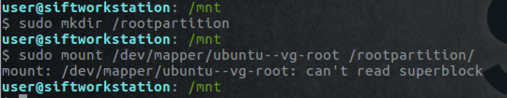

# Key to success

## Solution

During the competition, the competitors were provided with [SIFT](https://www.sans.org/tools/sift-workstation/) workstation to complete this challenge. You are free to use whichever tools you'd like. This solution guide uses SIFT for solving the challenge. 

1. View the partitions in the `image.dd`

   ```
   sudo fdisk -l image.dd
   ```

   

2. Try mounting the main partition from the hard drive image 

    ```
   sudo mkdir /mainpartition
   sudo mount -o ro,loop,offset=1305477120 image.dd /mainpartition
    ```

   The offset value is calculated by multiplying the start sector number (2549760) with sector size (512).

   

   From the output we can determine that the partition is encrypted. LUKS is the standard for Linux hard disk encryption

3. Let's find the next available loop device and use that to mount the encrypted partition

   ```
   sudo losetup -f
   sudo losetup -r -o 1305477120 /dev/loop0 image.dd
   ```

   Again the offset is the start of the LUKS encrypted partition in bytes.

4. Run `lsblk` command to verify the 8.8G partition is mounted at /dev/loop0

   

5. Use the following command to dump the LUKS header information for /dev/loop0

   ```
   sudo cryptsetup luksDump /dev/loop0
   ```

   

   From the output we can determine that it is using LUKS version 1, aes cipher, and key size of 512 bits along with other information.

6. At this point we need either the key or passphrase to open the LUKS encrypted volume. We can try to find the aes key in memory dump.

   ```
   findaes memdump.mem
   ```

   

   Since we know we are looking for a 512bit key and all the keys found in the output are 256bit keys, we can narrow our search to two keys that are next to each other in memory. 

   So we will use the keys at 0xb485070 and 0xb485260 byte offsets. We should combine the key in reverse order because of little-endian scheme.

7. Next step is to create a file named `key` on the Desktop and copy the two keys in the reverse order and remove the spaces in between. The file contents should look like below -

   

   This is the potential master key that might help in decrypting the partition

8. In order to use the master key, we need to convert it in a specific format.

    ```
    xxd -r -p ~/Desktop/key ~/Desktop/key.bin
    ```

9. To decrypt the volume use the following command 

    ```
    sudo cryptsetup luksOpen /dev/loop0 decrypted --master-key-file=/home/user/Desktop/key.bin 
    ```

10. Use `lsblk` to view the LVM volumes that are now available after decryption

    ```
    sudo lsblk
    ```

    

    `ubuntu--vg-root` is the root partition. 

11. Let's try to mount the root partition

    ```
    sudo mkdir /rootpartition
    sudo mount /dev/mapper/ubuntu--vg-root /rootpartition/
    ```

    

    You'll notice that it throws an error that the superblock can't be read.

12. Let's try to find an alternate superblock

    ```
    sudo dumpe2fs /dev/mapper/ubuntu--vg-root | grep superblock
    ```

    

13. Let's use the alternate superblock at 32768. To use the logical block 32678 on a filesystem with 4k blocks, use sb=131072 (32678*4)

    ```
    sudo mount -o sb=131072 /dev/mapper/ubuntu--vg-root /rootpartition
    ```

14. Once that is successful, search for the flag in the partition

    ```
    cd /rootpartition/
    ls
    sudo find /rootpartition/* | grep flag | more
    cat /rootpartition/home/user/flag.txt
    ```

### Submission

Flag is `starscantshinewithoutdarkness`