# The Mensch Connection Solution

As the majority of this challenge involves analyzing packet capture data
there are many different ways to approach the problem. This guide will
attempt to provide the most straight-forward/most logical approach from
the developer's standpoint. Assume that Wireshark is used for all pcap
analysis.

Part 1 - Uncovering the chat and usernames of the insiders
==========================================================

The first part asks, "List one of the users (chat nickname) involved in
coordinating the exfiltration attack?"

The guide mentions a chat server that was located in the MGMT network.
Therefore, one method to approach this would be to filter on traffic
involving the MGMT network only, such as using a filter of 'ip.addr ==
10.0.40.0/24". Once filtered for this traffic, go to Statistics -\>
Conversations and check the box to "Limit to display filter".

The results on the IPv4 tab will show a variety of conversation
originating from the users network to an IP in the MGMT network at
10.0.40.200.

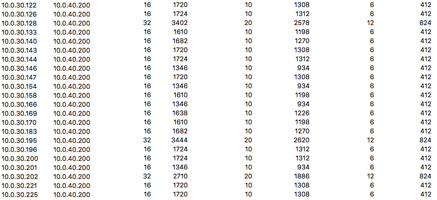

The results on the TCP tab will show that port used on the chat server
is 55555.

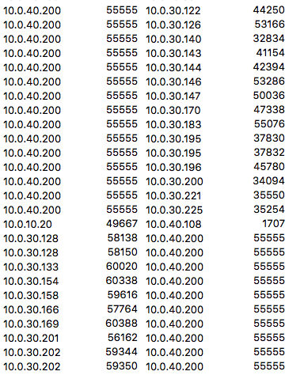

Depending on your preference, there are many ways to view these streams.
One easy method is to set a filter of "ip.addr == 10.0.40.200 and
tcp.port == 55555" and then return to the conversations windows and look
at each individual stream one by one.

When following any stream you will see chat messages sent in cleartext.
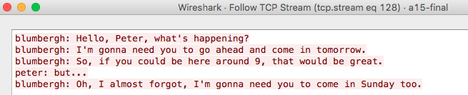

One of these conversations will allude to the exfiltration activity,
while all others are benign workplace discussions.

The conversation in question originated from 10.0.30.195.

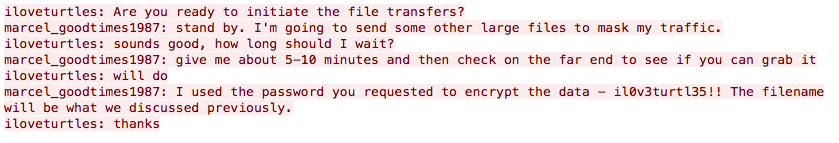

The two users in questions are "iloveturtles" and
"marcel\_goodtimes1987". Either of these chat nicknames can be entered
for credit for Part 1.

Part 2 - Finding the destination of the exfiltrated files
=========================================================

The second part asks, "What system (by IP) did the admin copy the files
to in preparation for extraction?

It should be easy to infer that "admin" implies someone in the MGMT
network. Players can also confirm that Marcel Good is an admin in the
DC.

Again, an easy first filter to apply would be to look only at traffic
involving the MGMT network -- "ip.addr == 10.0.40.0/24".

This heavily relies on familiarity with the statistics module in
Wireshark. Otherwise, it would be tedious to figure this out perhaps.
Using the Conversation module, while filtered for only traffic involving
the MGMT network, simply sort by Bytes to see who the "top talker" on
the network was during the capture.

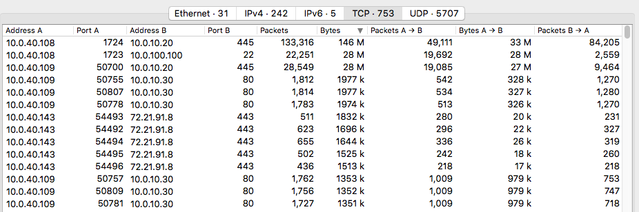

Even without applying the filter, this would still be the case, though
it helps eliminate some unnecessary traffic.

Pay attention to the ports in use. Port 445 is used for SMB, which makes
sense, because the file share on the DC is set up to use SMB. The other
IP that receives a large amount of data, relative to the rest, is
10.0.100.100, which is the DMZ web server, all over port 22, so it is
presumed that this was done via something like WinSCP and would be
fruitless to view in Wireshark as it is encrypted.

Players have the option to investigate both of these systems physically.
Browsing the share on the DC should show only innocuous files like
pdf's, word docs, and excel spreadsheets of nothing useful.

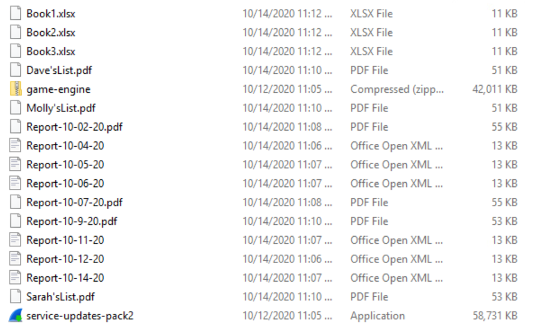

Knowing that the admin is Marcel Good, look at the DMZ web server and
browse to home/ to discover a directory for the user "mgood". There is a
file called "datadump.zip" which is password protected, and another file
called "update-pack1.exe". The admin mentions in chat that they would
send the files along with some chaff data to help cover their tracks.
Players can view the contents of the datadump.zip file, but they cannot
read the files inside without knowing the password.

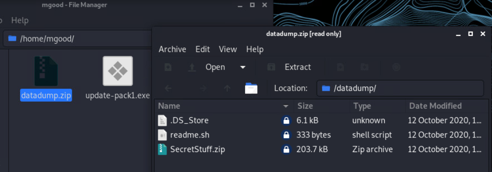

Judging from the contents, it seems like this is the file to be
concerned about, meaning that the files were sent to the DMZ Web Server
at 10.0.100.100 for exfiltration.

Part 3 -- Figuring Out What External System Retrieved These Files
=================================================================

The third part asks, "What external system (by IP) retrieved the
malicious files from the above source?"

Now that we know the files were placed on the DMZ Web Server, the
logical method of exfiltration might be via the web site itself. To
conform players can run a search for the datadump.zip file.

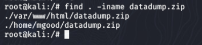

Indeed, the files were at one time placed in the /var/www/html
directory, exposing them to the public. The unzipped files have since
been deleted, but the admin forgot to remove the original zip (also, to
help ensure players can find evidence of this).

Additionally, since we know the DMZ Web Server is involved players can
search the packet capture and firewall states table for any entries
including the web server. The latter is the quicker method.

Looking at the packet capture there will not be any traffic to the DMZ
Web Server that did not originate from 10.0.40.108 in the MGMT network.
Since the question specifically references an external source, it's time
to look at the firewall states table.

Simply search for 10.0.100.100:

WAN tcp 109.226.198.112:42662 -\> 10.0.100.100:80 (75.33.141.250:80)
FIN\_WAIT\_2:FIN\_WAIT\_2 43956 590 B / 886 B

OPT1 tcp 109.226.198.112:42662 -\> 10.0.100.100:80
FIN\_WAIT\_2:FIN\_WAIT\_2 43956 590 B / 886 B

WAN tcp 109.226.198.112:42658 -\> 10.0.100.100:80 (75.33.141.250:80)
FIN\_WAIT\_2:FIN\_WAIT\_2 43923 216 B / 112 B

OPT1 tcp 109.226.198.112:42658 -\> 10.0.100.100:80
FIN\_WAIT\_2:FIN\_WAIT\_2 43923 216 B / 112 B

WAN tcp 109.226.198.112:42656 -\> 10.0.100.100:80 (75.33.141.250:80)
FIN\_WAIT\_2:FIN\_WAIT\_2 43923 216 B / 112 B

OPT1 tcp 109.226.198.112:42656 -\> 10.0.100.100:80
FIN\_WAIT\_2:FIN\_WAIT\_2 43923 216 B / 112 B

WAN tcp 109.226.198.112:42654 -\> 10.0.100.100:80 (75.33.141.250:80)
FIN\_WAIT\_2:FIN\_WAIT\_2 59 / 145 3 KiB / 207 KiB

OPT1 tcp 109.226.198.112:42654 -\> 10.0.100.100:80
FIN\_WAIT\_2:FIN\_WAIT\_2 59 / 145 3 KiB / 207 KiB

The states log shows that a system, 109.226.198.112 connected to the web
server over port 80, whereas no other system connected during this time
period. Additionally, the size in Bytes for the last transaction is
listed as 207KB where the SecretStuff.zip file is listed as \~204KB (see
screenshot above in Part2). So it can be inferred that the external
system at 109.226.198.112 retrieved the files in this manner.

Part 4 -- Access the External System to View the Token 
======================================================

The fourth part asks, "What is the token string retrieved from the
attacker's home directory within the stolen data?"

Since, we now know the external IP, check the firewall state logs for
this IP. The only other connection is an established connection coming
from 10.0.30.75.

OPT3 tcp 10.0.30.75:43888 -\> 109.226.198.112:52879
ESTABLISHED:ESTABLISHED 31 / 28 4 KiB / 5 KiB

WAN tcp 75.33.141.250:43112 (10.0.30.75:43888) -\> 109.226.198.112:52879
ESTABLISHED:ESTABLISHED 31 / 28 4 KiB / 5 KiB

Players could theoretically scan this system (perhaps) and see that the
port 52879 is actually SSH, but it's more than likely that this will be
the first thing they attempt to do via Putty or WinSCP. Using WinSCP is
proffered since they can the grab the token file for analysis on their
local machine. Connecting via Putty is a good test, but it's easier to
pull the file over versus analyzing it via an SSH shell.

Simply use the following credentials and data points to connect.

Username: iloveturtles (found in chat message)

Password: il0v3turtl35!! (found in chat)

IP/Host: 109.226.198.112 (found in fw state logs)

Port: 52879 (found in FW state logs)

Once connected you will have access to the readme.sh file (actually just
text) and the SecretStuff.zip file. The readme reiterates that the
password used to encrypt the file is what was provided in the original
chat (il0v3turtl35!!).

You may download both of these to your local system.

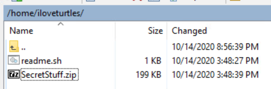

Once the zip is on your machine, extract/unlock the file using the
proper password.

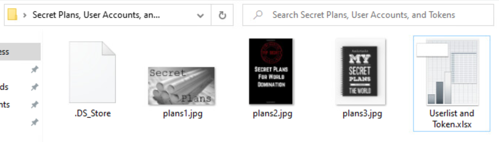

Opening the file "Userlist and Token" will open a csv file with a list
of usernames and passwords. One entry is highlighted in yellow and is
named "TOKEN" in bold capitalized letters. The associated password/token
is the token for submission.

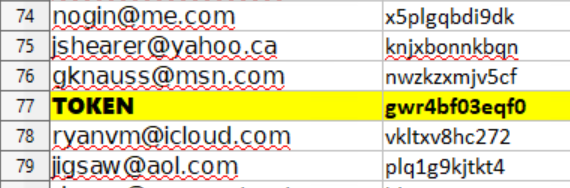
