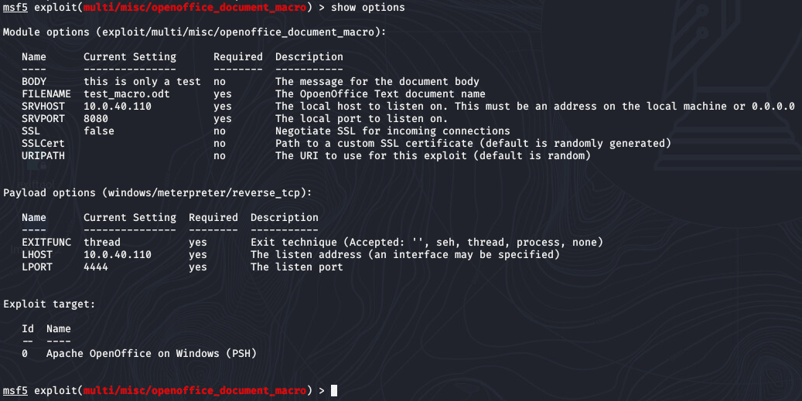
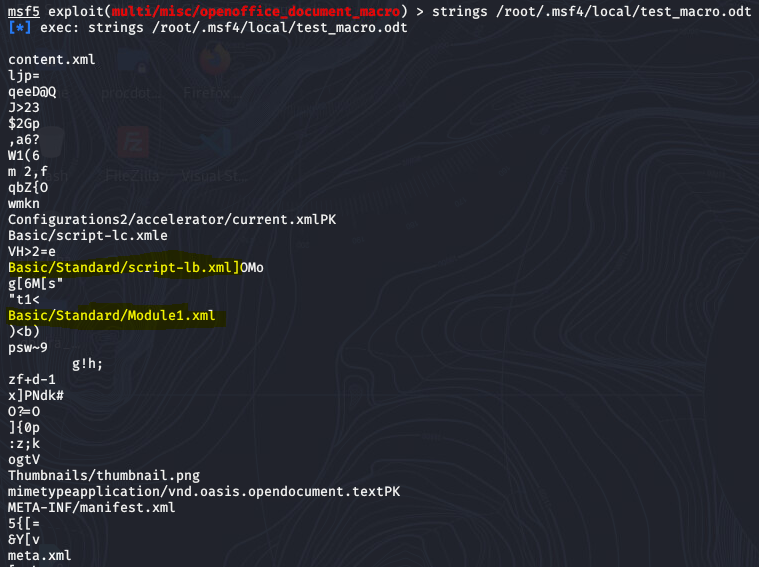
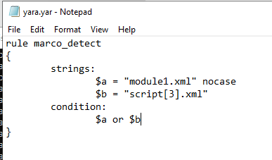
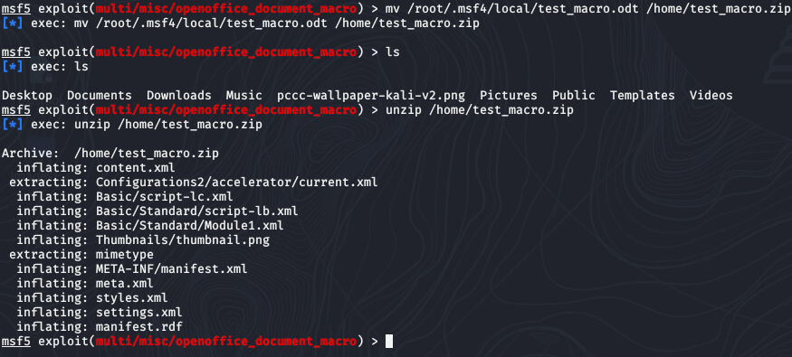
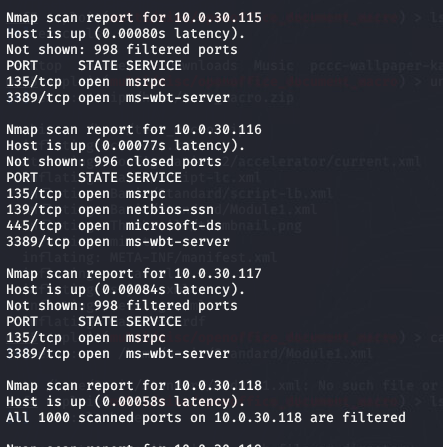
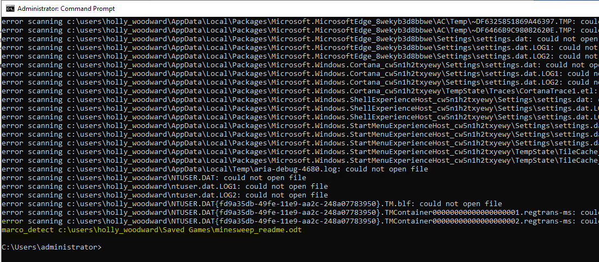
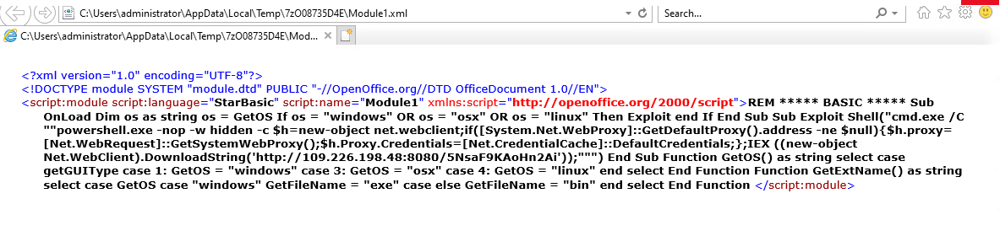
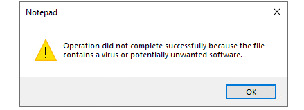
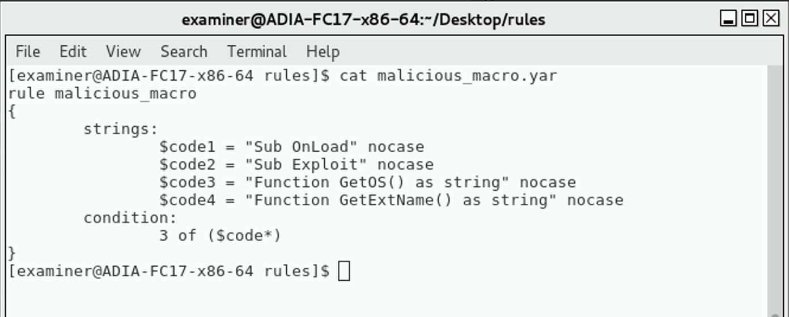
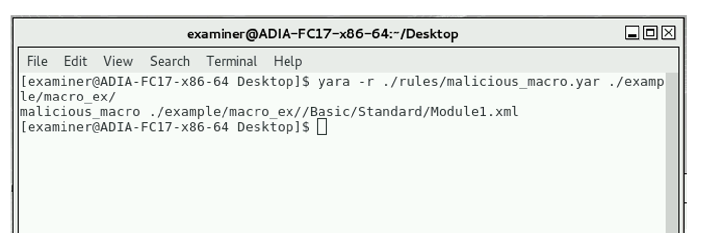

## Who Called the Doc? Solution

To solve this challenge, you will need to locate malicious office files by creating YARA rules to detect macro enabled office documents saved in ACK-ME User 3. You will start from a Kali Linux box (Player-Kali-MGMT) per the challenge instructions to recreate the payload based on CVE-2018-10583, which is a macro enabled.

1.  In terminal, start Metasploit (sudo msfconsole) and create a test file for analysis: (Use IP of player-kali-MGMT vm)
```
> msf \> use exploit/multi/misc/openoffice_document_macro
> 
> msf exploit(/multi/misc/openoffice_document_macro)
 \> show options
>
> ...set options...
> 
> msf exploit(/multi/misc/openoffice_document_macro)
 \> run
> 
```
 

2.  In terminal, navigate to the output directory and run **strings** against the file that was created during the exploit **/root/.msf4/local/test_macro.odt** 

 

3.  Notice in the example odt file that it consists of several
sub-files, indicating that it is a container for several code files. In this macro document you also find the odt contains strings of “Basic/script\*.xml†which may be a method to detect other macro enabled office files

4.  Based on this information you can create a rule to look for the
string Basic/Script\*.xml, which should tell us when a macro document is detected. Since the phrase /script\*.xml contains 3 various characters in the name you will have to account for that. The rule should therefore look like the following example: (Keep in mind this rule will be created on the user workstations which you will gain access to in step7)

 

5.  Remember, office files are simply containers that hold several files and you can rename most office files as .zip to view the contained files. Copy the **test_macro.odt** to **test_macro.zip**. Then, using the unzip command, decompress the contents of the zip file. Module1.xml is the code file that contains our malicious payload.

 

6.  Using this rule on the user workstations, you should be able to detect where odt files with macros exist. However since Windows workstations use DHCP, you will have to run a quick nmap scan from the Kali machine to find them. NOTE: Windows 10 blocks ping at its local firewall so the -Pn option is needed in nmap. The scenario states that RDP is open on your target machines, therefore you using that port will determine which machines you will scan.
```
nmap -p 3389 -Pn 10.0.30.100-250
```

 

Alternatively, you may also check DHCP lease addresses in the organization firewall to determine the 
addresses of the Windows 10 workstations on the network.

7.  Once the workstation targets are identified, you can use Remote Desktop along with the Domain Admin credentials (ACK-ME\Administrator, tartans@1)nto connect to each one of them. Create the rule file for yara as a .yar using notepad (refer to step 4) and run a yara scan using yara64.exe in a command prompt against the c:\users\ directory (this is indicated in the Getting Started section of the challenge). Syntax for your scan will look like **yara64.exe -r <your_rule_file> c:\users**

 

8.  Once the macro enabled .odt file is located, rename it to .zip and decompress. You will NEED TO open the Module1.xml with IE to view the IP address that malicious code is referencing. 

 

A caveat with this file is that opening it in notepad will result in an error message that the file contains a virus (Windows Defender). 

 

You should now be able to easily obtain the information for the file in this challenge.

**File**: C:\\Users\\holly\_woodward\\Saved Games\\minesweep\_readme.odt

**IP Address**: 109.226.198.48

**MD5**: C7108095CEE114086E0FEDC41B5528CF 


### Additional Analysis

Though not required you can also run another rule to detect the Module.xml contents and verify that the file 
does contain malicious code.

A.  Additional analysis on this file reveals that the “Sub OnLoad†code block determines an OS then executes the “Sub Exploit†code block. There is additional function that also help the malware determine which OS is being run. The presence of these code blocks should be a reputable indicator that a macro enabled office document is running something malicious. Here is what your YARA rule look like based on analyzing the functions that exist in this file.

 

B.  Running this rule against the directory you have decompressed the contents of bad\_office\_file.odt reveals a positive match for /Basic/Standard/Module1.xml and malicious

 

