# Insider Insidiousness Solution

You have been given access to a Windows 10 host on the network as a domain user. You must complete a series of tasks using WMI local and remote queries and submit the answers that you find with each task. 

### Question 1

Which of the top-level directories in the Questron file share on FS01 is a hidden directory? 

There are several options for using PowerShell or remote WMI queries to identify a hidden directory on a server of interest. First, to view the questron shares, one can query the Win32_Directory object with a filter for the drive and path of the Questron file share. 

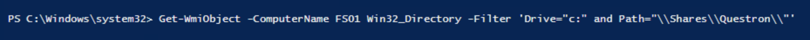

### Question 2

Based on the resources found under the Planning directory, name one of the Questron partner organizations. 

The participant will use remote WMI queries to enumerate file directories. 

This query will list all directories under the Questron Share:

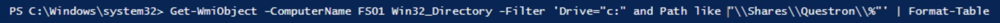

Planning is found under Management, and Partners is found under Planning, with three sub-directories, each named for a partner. 

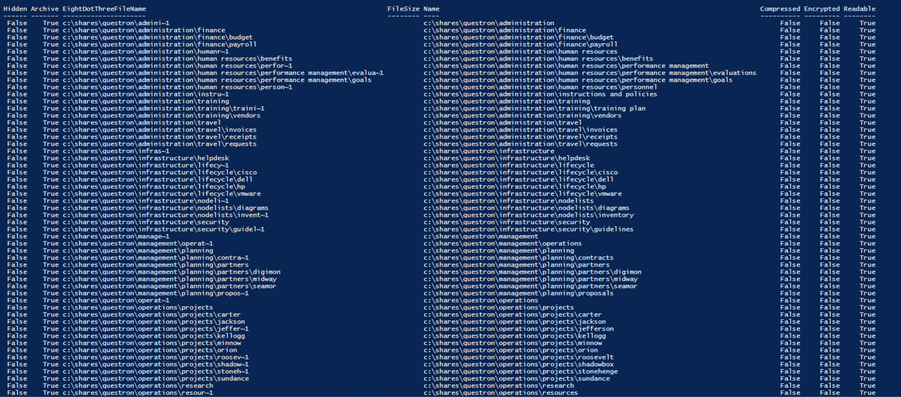

### Question 3

Name the Questron projects that are not named after a President (excluding the STONEHENGE project)? 

The participant will analyze results of remote WMI queries to enumerate files and directories. The same query as used in question 2 can be used:

The "Projects" directories are located under the Operations directory. 

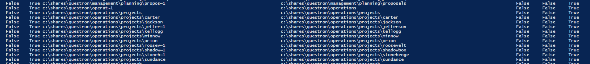

### Question 4

You have been asked to identify information within the Project Charter of the STONEHENGE project. View the project documents and give the last name of the Project Lead. 

The participant will analyze results of remote WMI queries to enumerate files and directories, and query objects with specific parameters to obtain targeted information. Based on the query from question 2, the path to the word document is "C:\\Shares\Questron\Operations\Projects\Stonehenge". The following query returns document properties:

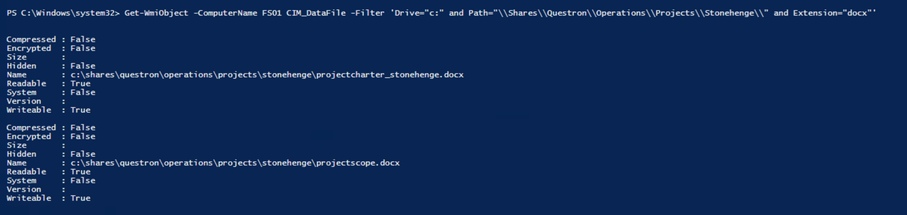

Now the file must be copied to the local system to view the contents:

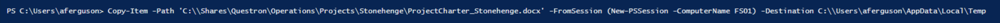

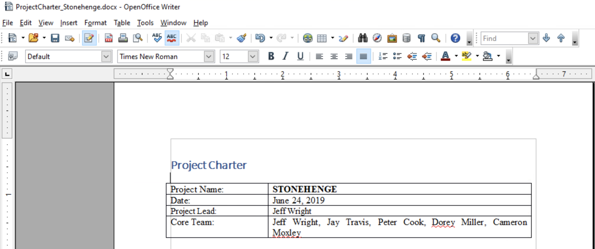

### Question 5

Locate an Excel spreadsheet containing a roster of Questron personnel. According to the roster, in what year did COO, Charles Lewis, begin working for Questron? (Hint: this is a hidden file)

The participant will query objects with specific parameters to obtain targeted information.

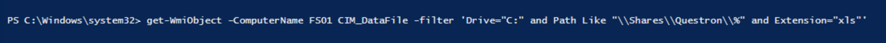

Information for the hidden file Roster.xls is returned. 

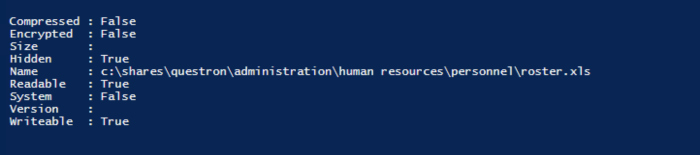

Again, the file must be copied to the local system to view the contents. Hidden files do not copy using Copy-Item by default. Below is one way of moving the file by writing and executing a script: 

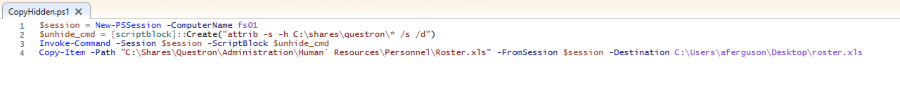

Running the script from the Win32 directory:

Looking at the file, Mr. Lewis's start date is in 1995. 

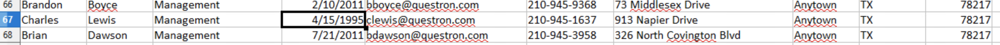
