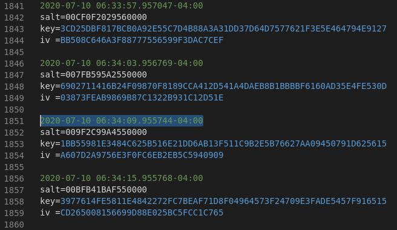

# OpenSSL && Open Sesame Solution

In each stage, an encrypted file and the associated information/files needed for decryption are provided. The solution detailed here strictly uses `OpenSSL` on a Kali VM to solve all stages of the challenge, however, there are many other possible solutions.

This solution guide has 5 sections - one for each stage of the challenge.

### **Section 1 - stage0**

1. Locate the `email2.txt.enc` file and move it to a working directory.

2. Since the passphrase is provided for **stage0**, just determine the proper usage of `openssl`. If unfamiliar with `openssl`, view the `man` or `help` pages, as well as online research to determine proper usage. All stages of this challenge rely on the `openssl enc` standard command.

3. Viewing the contents of the `email2.txt.enc` file shows a Base64 encoded value. We also know that AES-256 was used for encryption based off of the challenge description. This provides all of the information required to decrypt the file.

4. Run the following `openssl` command and enter the passphrase `tartans` when prompted:

```
openssl enc -aes-256-cbc -d -a -nosalt -in email2.txt.enc -out email2.txt
```

- `enc` - Encoding with Ciphers.
- `-aes-256-cbc` - Denotes which cipher to use. Since we only know AES-256 was used to encrypt the file, the cipher must have been either CBC or ECB, but ECB is rarely used anymore.
- `-d` - Denotes to decrypt the file.
- `-a` - Denotes to use Base64 decoding, which is needed since the file contents are Base64 encoded.
- `-nosalt` - Denotes to not automatically add a salt for encryption/decryption. We don't know whether this option was used during encryption, so a simple trial and error shows we need it.
- `-in` - Denotes the file to decrypt.
- `-out` - Denotes the output file in which to save the decrypted contents (optional).

5. View the contents of `email2.txt` for the **stage0** submission. 


### **Section 2 - stage1**

All of the remaining stages follow a similar methodology as **stage0**, but incorporate additional information or parameters into the file decryption.

1. Locate the `id10.txt.enc` file and the provided key & IV file (`key+IV.txt`). Move them to a working directory.

2. Run the same `openssl` command as before, but include the key (`-K`) and iv (`-iv`) as parameters:

```
openssl enc -aes-256-cbc -d -a -K $key -iv $iv -in id10.txt.enc -out id10.txt
```

5. View the contents of `id10.txt` for the **stage1** submission. 


### **Section 3 - stage2**

1. Locate the `PIN20.txt.enc` file and the provided key & IV file (`IV-KEY.output`). Move them to a working directory.

2. **stage2** is identical to **stage1**, however, there are now 10 key/IV pairings provided. Use whatever preferred method (manual, scripting, file modification) to try all possibilities until the correct pairing is found. Run the same `openssl` command as before, with the correct key/IV pairing:

```
openssl enc -aes-256-cbc -d -a -K $key -iv $iv -in PIN20.txt.enc -out PIN20.txt
```

3. When the file is successfully decrypted, view the contents of `PIN20.txt` for the **stage2** submission. 


### **Section 4 - stage3**

1. Locate the `phone232.txt.enc` file and the provided salt/key/IV file (`SALT-IV-KEY.output`). Move them to a working directory.

2. **stage3** is similar to **stage2**, however it includes a salt and now there are 20 salt/key/IV sets provided. Use whatever preferred method (manual, scripting, file modification) to try all possibilities until the correct set of parameters are found. This solution guide shows the usage of **VSCode** to convert the `SALT-IV-KEY.output` file to a `.sh` file, remove all whitespace, and comment out all salt/key/IV sets except for one. Then use the file as a `source` file to the active terminal. Repeat this "comment/source" process until the correct salt/key/IV set is found. Each time, run the same `openssl` command as before, but also include the salt (`-S`) as a parameter:

```
openssl enc -aes-256-cbc -d -a -K $key -iv $iv -S $salt -in phone232.txt.enc -out phone232.txt
```

3. When the file is successfully decrypted, view the contents of `phone232.txt` for the **stage3** submission. 

.  
.  
.  
.  
.  
.  

### **Section 5 - stage4**

1. Locate the `fingerprint_b64_464.txt.enc` file, the encryption log (`encryption.log`), and the file properties information (`file-properties.txt`). Move them to a working directory.

2. **stage4** is similar to **stage3**, however now there are hundreds of salt/key/IV sets that were stored in `encryption.log`. To determine which salt/key/IV set is the correct one, first view `file-properties.txt` to note the last modified time (UTC) of `fingerprint_b64_464.txt.enc`.


3. Now use the timestamps (Eastern) in `encryption.log` to locate the salt/key/IV set that best corresponds to the last modified time of `fingerprint_b64_464.txt.enc`. Note that the timestamps need converted between UTC and Eastern time.



4. Finally, run the same `openssl` command with the identified salt/key/IV parameters:

```
openssl enc -aes-256-cbc -d -a -K $key -iv $iv -S $salt -in fingerprint_b64_464.txt.enc -out fingerprint_b64_464.txt
```

5. When the file is successfully decrypted, view the contents of `fingerprint_b64_464.txt` for the **stage4** submission. 


## Answers

### stage 0:
- email2.txt.enc: `ardagna`
### stage 1:
- id10.txt.enc: `24381`
### stage 2:
- PIN20.txt.enc: `221311694913656`
### stage 3:
- phone232.txt.enc: `1785552520`
### stage 4:
- fingerprint_b64_464.txt.enc: `MzU5NzQxMjA=`

