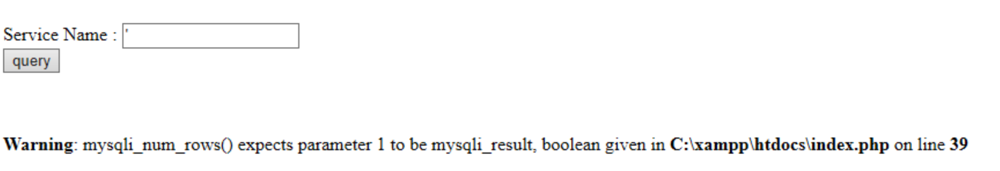
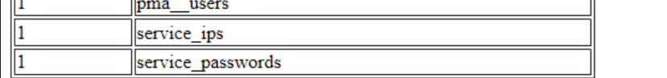
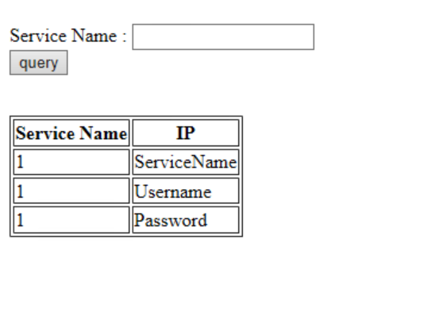
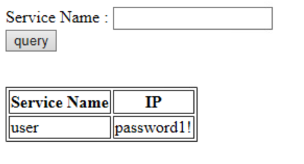

# Proprietary Information Solution

## Part 1: Get the Login Credentials For OctoPrint  

Visit the website `http://servicedb.makestuff.company` to begin gathering information about the services in the Domain.

Enter all in the search box to receive information on all of the services.  

Enter a `'` character into the search field to determine that this website is vulnerable to SQL Injection



Use a SQL Injection to determine the names of the tables that are available on the database. Enter the following into the search field:
```SQL
' UNION SELECT 1, table_name FROM information_schema.tables ; #
```

To break down the above query:

1. The `'` Character is to break out of the intended SQL query that the website is performing
2. The `UNION` keyword will allow us to perform our own SQL query. The query can be anything we want.
3. `1, table_name` is used as the select parameters because `UNION` statements require the second part of the query (our query in this case) to have the same number of columns selected as the first part of the query. The original website was selecting 2 columns of the table (ServiceName and IP), so we must select 2 as well. We can select `1` as a constant to make the query a bit easier. 
4. `FROM information_schema.tables` is used to select data from the MySQL Standard information schema. This allows us to list all the tables that the database has. 
5. `;` is used to terminate the query and `#` is used to comment out all remaining parts of the query that the website would have normally performed. These prevent SQL syntax errors. 




From the results of that SQL query, you can see a few tables at the bottom of the page called "service_ips" and "service_passwords".  We will be interested in the service_passwords table. 


We can use another SQL injection to determine the names of the columns in the "service_passwords" table. Enter the following into the search field:
```SQL
' UNION SELECT 1, column_name FROM information_schema.columns WHERE table_name = 'service_passwords
```


To break down the above query:

We are selecting different information (1, column_name) from a similar table as we did in the above query. We will be showing the `columns_names` `WHERE` the `table_name` is equal to `service_password` `FROM` the table called `information_schema.columns`. This will show us the names of the columns in the "service_password" table. 

Notice in this injected query, we do not require the `; #` because we will be making use of the remaining query from the website. Adding these characters to this query will not hurt, but you will need to ensure that you add a closing `'` after `table_name = 'service_passwords`. 


We can use the above information to perform one last query to get the username and password for the OctoPrint Service. Enter the following into the search field:

```SQL
' UNION SELECT username, password from service_passwords where ServiceName = 'octoprint
```


To break down the above query:

Using the same methods as above, we are selecting the `username` and `password` from the service_passwords table where the service name equals "octoprint".  We see the username and password for the service printed in the table. 


## Part 2: Login To OctoPrint and Getting The File

Visit the Octoprint web management console: `http://octoprint.makestuff.company:5000`.  Login using the Credentials you found above. On the right side of the webpage, in the files pane, click the Proprietary folder to navigate into the folder. Then click the download button next to the appropriate file and save that file to your machine. From linux, use the following command to get the md5sum of the file: `md5sum <file-name>`.  On Windows, use the following command to get the md5sum of the file `Get-FileHash <file-name> -Algorithm MD5`. 

## Answer to submit

098bd00d63dc1700d75126b6d4c2ca76

