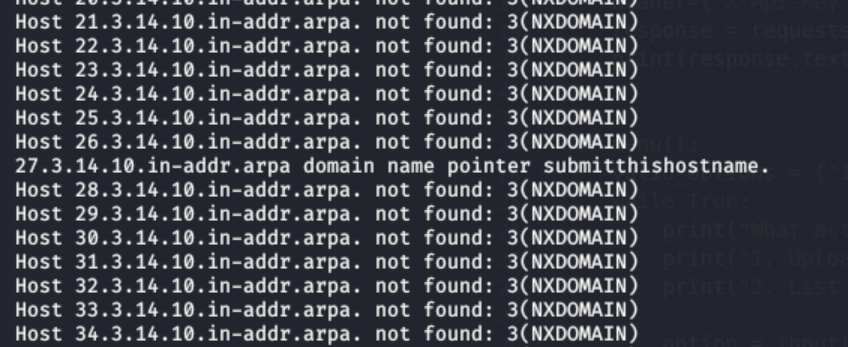
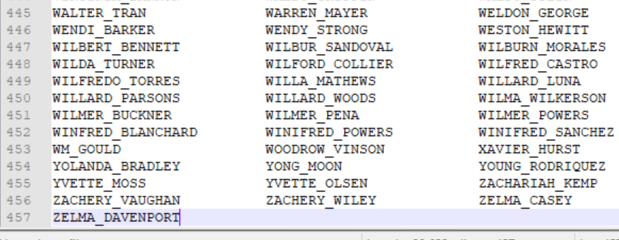

# Side Quests Solution

## Quest 1: 

Write the following bash script to perform reverse DNS queries on a range on IP addresses. When running this script you will notice a lot of `NXDOMIAN` responses, and only 1 hostname which produces a valid PTR record. 

```bash
#!/bin/bash
for i in 10.14.{0..255}.{0..255}
do 
    host $i
done
```



Answer: 
```
submitthishostname
```


## Quest 2: 

You can use the `net user` command on any domain joined windows system to find the user names of all domain users. 

```
net user /domain
```

This prints out a long 3 column list of all the users on the domain. You can use many methods to count how many items are in this list. I copied the list over to Notepad++, which has the row numbers listed. 



Multiply the number of rows by 3 (because there are 3 columns of usernames) to get the total number of usernames. `456 * 3 = 1,368`. This number should be rounded up to `1400` for the submission.

Answer:
```
1400
```

## Quest 3: 

The challenger is expected to use nmap and/or other scanning tools to find compliance problems on the network. They are also able to use Powershell for remote administration to attempt finding compliance problems on Windows machines. 

Users should only find 1 compliance problem on the network, which is done by following these steps:

1. Use nmap's wordpress enumeration script to scan the wordpress server (`www.makestuff.company`)

```
sudo nmap www.makestuff.company --script http-wordpress-enum
```

This will reveal the themes and plugins that are installed on the server. 

2. Lookup information regarding the installed themes to find that the theme `twenty fifteen` has a vulnerability.   
References:  [CVE-2015-3429](https://cve.mitre.org/cgi-bin/cvename.cgi?name=CVE-2015-3429),   [wpscan](https://wpscan.com/vulnerabilities/7965), [Wordpress Vulnerability Report](https://wordpress.org/news/2015/05/wordpress-4-2-2/)

This vulnerability results in the application being out of compliance. 