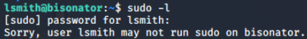
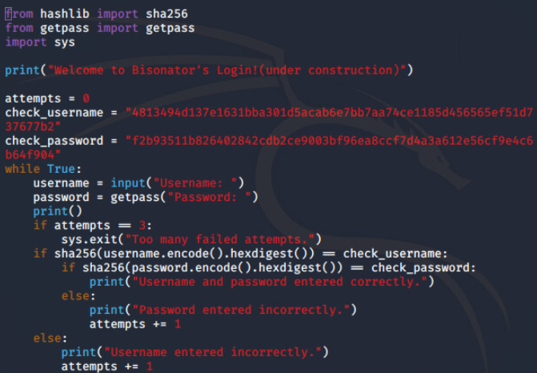
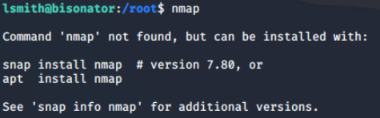
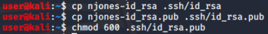
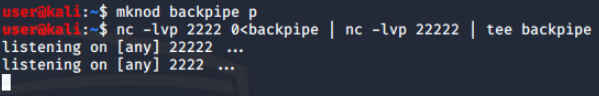
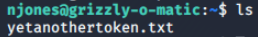
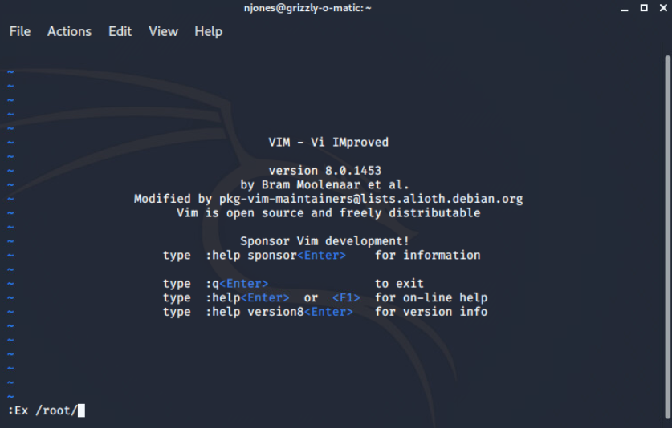

# 2 Boxes 4 Shells Solution

ip addr

sudo vim /etc/network/interfaces

add the system to the 10.8.14.0/24 network

Restart service and confirm IP change.

Scan the /24 network and review results.

NOTE: Nmap shows we have FTP, SSH, and HTTP available on .13 and HTTP on
.71. SSH appears to be filtered on .71.

Browse to each box's 8000 port.

 

NOTE: We notice that lsmith is the owner of Box 1 and njones is the
owner of box 2.

Browse to the 'Liam Only' directory.

View the Vulnerability Report.

 

NOTE: Please review this document as it will be used to exploit both
box's user accounts at minimum.

Box 1 User Exploit
==================

Launch FileZilla

Enter lsmith as both the username and password (identified in vuln
report) and connect to the 10.8.14.13 host's port 21.

Download all four of the keys found.

 

The four files are now found in user's home directory.

Since lsmith is the owner of Box 1, let's try his SSH keys.

 

We are warned that the private key is too open regarding its permission.
Change the key to 600 and try again.

We are in Box 1 as a user! View the current directory to find the token.

 Box 1 Root Exploit
==================

Now that we have user access to Box 1, we can check if lsmith can run
sudo on the box.

NOTE: This requires the challenger to use lsmith as the password
(similar to the FTP access).

The challenger is directed that the token is in the /root/ directory,
navigate there.

We can see the token we need; however, we cannot view it. We do notice
the login.py that our user (lsmith) is the owner of. Run login.py.

As indicated by the message, this python script is in development and
may not be fully functional. Let's view the script.

 

Here we see a username and a password hash! The script appears to state
this hash is SHA256. You can confirm this with the utility
hash-identifier if you'd like. Let's crack these hashes with rockyou.txt
(as indicated by the vuln report).

Copy both hashes from this SSH session to your local Kali.

Let's crack box1user first after we unzip our local copy of rockyou.txt.

 

 

The username is root! Crack the password.

Navigate back to the bisonator ssh shell and use the username and
password to su into root and view the token.

Box 2 User Exploit
==================

We saw Box 2 is listed as internal on its webserver. We also saw that 22
was filtered (blocked if you tried) from our Kali machine. Let's see
what common ports are available on Box 2 from Box 1.

Unfortunately, nmap is not available. Let's use netcat. Here we see that
only port 22 has given us a connection that was not refused.

If the challenger would like to check all ports, this will only take
\~20 seconds.

Let's verify we get an actual ssh prompt from Box 1 (unlike if we tried
from our Kali). Let's try Box 2's owner (njones).

We are able to access Box 2's SSH service from Box 1. How can we access
this box? One way is pivot.

Since njones is the owner of Box 2, copy and update permissions for
njones' ssh keys.

Create a netcat relay to pivot.

 

 

We are now asked to give a passphrase for njones. The vuln report stated
that SSH passphrases were crackable via rockyou.txt. Crack njones'
id\_rsa key's passphrase.

Re-establish the netcat relay pivot if needed and ssh into njones with
the passphrase found.

We are in!

View current directory and read the token.

No hidden files appear to be present.

sudo -l showcases that we can run vim as root!

NOTE: challenger must use the same passphrase from the ssh key as their
account password.

Launch vim with sudo.

We can use vim to browse directories and open files.

 

Here we see our fourth and final token. Open this token with vim to view
the content. Congrats!!!

