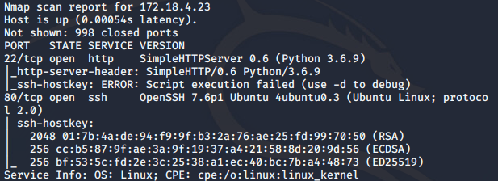
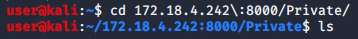
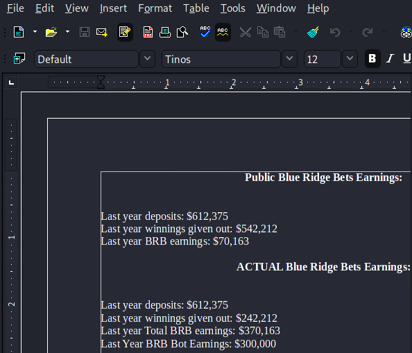

# All Bets Are Off Solution

1. Your computer has been attached to the corporate switch; however, no DHCP is available. You have arrived to work early and no support is available. All you know is the subnet is 172.[16-31].4.0/24. Find the correct subnet, connect to it, and stay connected throughout. The last octet of .90-.95 is safe to use, other than that, nothing is promised nor known. What is the numerical value of the second octet?

Tcpdump off of the interface and you will see this traffic indicating th 172.18.4.0/24 network is the correct answer.

 

… now you must connect your machine to the 172.18.4.0/24 network.

 

 

… and verify changes were applied.

2. What is the most common version of SSH on BRB network? (e.g., x.x format)

Nmap scan the entire network with the -A flag will give you this level of insight. It might also be helpful to output the results for use later.

 

Here we see that OpenSSH’s most popular version is 7.6. Also, one of the device’s appears that SSH is running off 80 and the webserver is running off port 22!

3. What is the Code Name of the WordPress version of the WordPress site?

In the above nmap scan, we are told the WordPress version is 5.4. The codename for this version can be found online. 

4. What directory is entirely disallowed by the WordPress site from web crawlers, except one php file?

Browsing to the WordPress /robots.txt file shows the answer.

5. Each Blue Ridge Bets account has its own directory and its associated hash within. How many total Blue Ridge Bets account directories are found in the financial server?

After viewing the first webserver, nothing regarding finances is found.

Let’s look for another webserver found in the nmap scan.

Browse to 172.18.4.242:8000

Alliance and Public directories have information relevant to the storyline. The Private directory shows all of the accounts.

Browsing any of these directories shows a hash file within, thus confirming these directories are associated with an account.

 

Gaining a count of the total directories is unreasonable. Download the entire directory locally to analyze.

Change into the newly created directories with the downloaded data.

 

Counting these directories by hand is unrealistic. There are multiple ways to get a count. Below are a couple of ways

 

6. Intel states that Blue Ridge Bets has bots that appear as players, win money, and keeps it within the company. Intel states that bots can be identified if their hash represents 000 or 0000 or 00000. How many of the total Blue Ridge Bets accounts are bots?

Since we know all hashes are SHA1, we must calculate what 000 0000 and 00000 are represented in SHA1.
   

Grepping all files for the first 8 characters of the hashes of 000, 0000, and 00000 showcases that 6 accounts have a hash that represent a bot account.

7. Somewhere there is a document that states how much money the bot accounts stole. How much money did the bot accounts win/steal?

As indicated by the initial nmap scan, there is another webserver but it’s on port 22. Browsing to the webserver shows this locally enforced restriction.

wget the website does showcase a webserver is present as the index.html is downloaded.

To browse the website, follow Mozilla support guidance.

Follow these instructions.

 

 

Now you can browse to the website.

Moving the mouse around shows different buttons that are clickable. Also, CTRL+A (or equivalent) highlights all text on the website.

Clicking into the Business Truth directory, a file is found. Download it.

Opening the file reveals the data.

8. What is the last name of William? He is believed to be the author of fraudulent financial earnings documents both public and private.

There is multiple ways of finding William’s last name. One way is to launch a financial document found on 172.18.4.23:22, click ‘File’ -> ‘Properties’

Another way is to run strings against the file from command line.

9. Somebody is trying to send a message to Tom about meeting up tomorrow. Your agency needs this location to catch the perps in the act. Find the messages being sent. What is the store name of the proposed location?

As found in the initial tcpdump, there is traffic going between 172.18.4.123 and 172.18.4.134. These IPs also were found in the nmap scan. Launch wireshark and view network traffic.

10. What IP address was somebody trying to reach Tom at (Tom’s IP address)?

As shown in the screenshot above, Tom’s IP is 172.18.4.134.

 