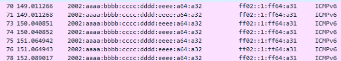
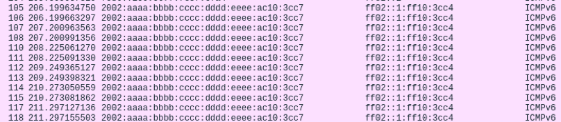
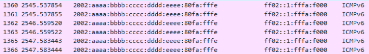
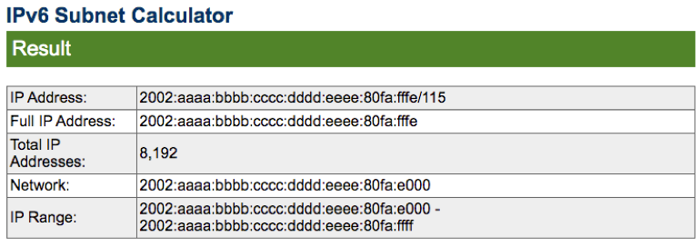
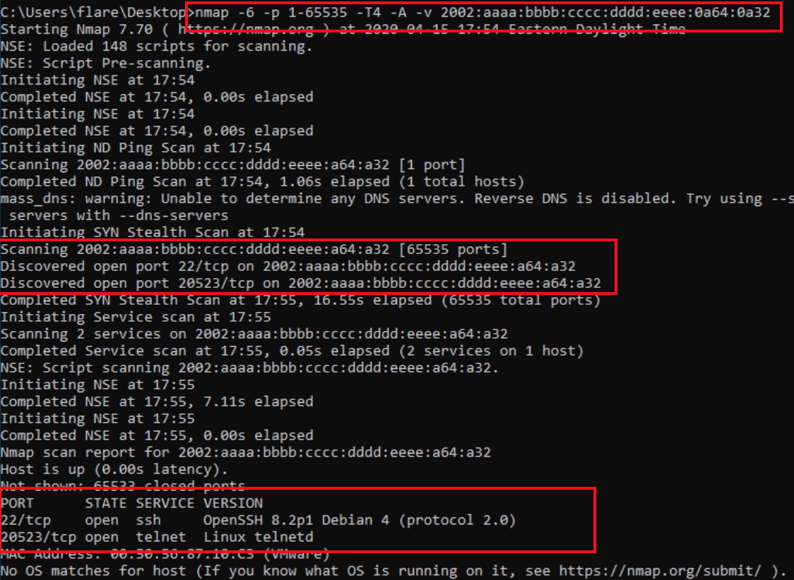
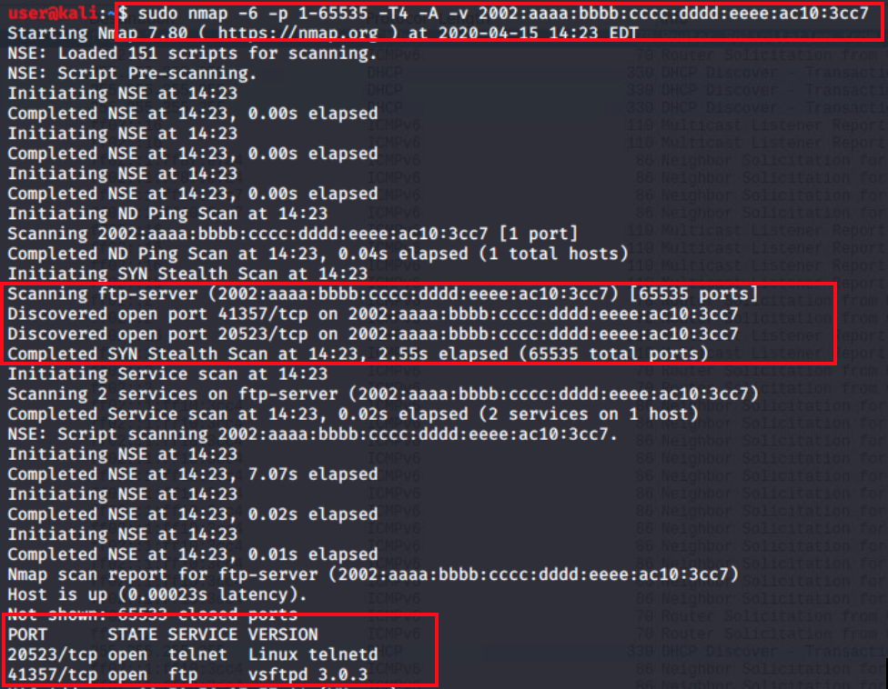
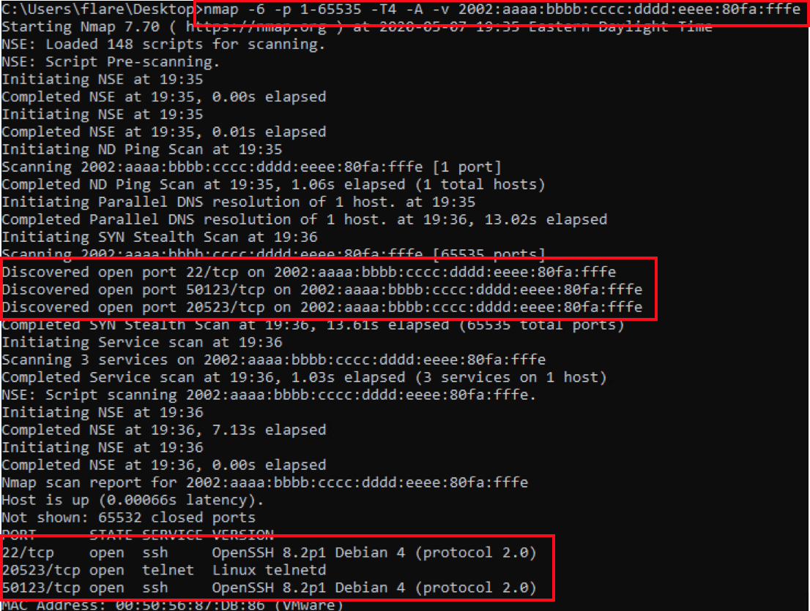
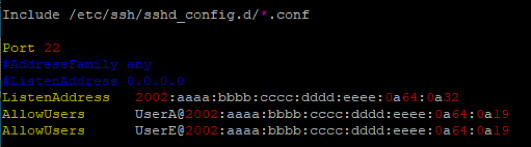

# ConnectFour (but with IPv6) Solution

1.  Discover hidden systems

    From each system simply open wireshark and watch the traffic.
    You will see pings coming from a 2002:aaaa:bbbb:cccc:dddd:eeee:xxxx:xxxx address roughly once per minute.
    
    Windows A: ***(2002:aaaa:bbbb:cccc:dddd:eeee:0a64:0a32)***
    
    
	
	Kali: ***(2002:aaaa:bbbb:cccc:dddd:eeee:ac10:3cc7)***

	

	Windows B: ***(2002:aaaa:bbbb:cccc:dddd:eeee:80fa:fffe)***

	

2.  Configure systems
    
	For each system, the team must use the guidance in the challenge guide to determine the proper IPv6 address 	for the team systems.
    
    Windows A:

	The IPv6 address is already provided by the challenge guide, ***2002:aaaa:bbbb:cccc:dddd:eeee:0a64:0a19***. This is a softball just to get them configuring an adapter correctly. The subnet in the doc is too small and must be expanded to at least a /122 mask, anything larger will also work. Otherwise the system will try to use a gateway that doesn’t exist.

	Kali:

	The conversion of 172.16.60.198 to hex is: 172 = AC, 16 = 10, 60 = 3C, 198 = C6. This makes the proper IPv6 address ***2002:aaaa:bbbb:cccc:dddd:eeee:ac10:3cc6***. The previous subnet mask was /30 when using IPv4. This equates to two hosts. The equivalent mask in IPv6 would be /127. It really doesn’t matter again, as long as the subnet mask is larger than this value, due to there being no actual gateway.

	Windows B:

	This is the only address that requires discovering the hidden system first. If the hidden system has an IPv6 address of 2002:aaaa:bbbb:cccc:dddd:eeee:80fa:fffe. A subnet mask of /115 equates to 8,192 hosts which is 2000 in hex. Since the last address in this subnet would end in FFFF, you can subtract 2000 in hex form this to get to DFFF but must actually go up one since FFFF is included. This makes the first viable address in the subnet ***2002:aaaa:bbbb:cccc:dddd:eeee:80fa:e000***.

	

3.  Next, the teams should scan the hosts discovered in part 1. The best
    scans to use are intensive tcp port scans of all 65535 ports.
    Otherwise, they may not find the open ports.
    
    Windows A: ***port 22/SH***

	
	
	Windows A should find open ports on 22 (SSH) and 20523 (telnet),
	however telnet will refuse their connection due to firewall rules on
	the hidden system.

	Kali: ***port 31457/FTP***

	

	Kali should find open ports on 20523 (telnet) and 41357 (vsftp), similar to Windows A, telnet will be blocked by the hidden system’s firewall.

	Windows B: ***port 20523/Telnet***

	

	Windows B will find port 22 (ssh), 20523 (telnet),  and 50123 (ssh) open, but only SSH over port 50123 will accept the connection.

4.  The next step is to connect with the appropriate accounts from the
    specific machines and to the specific destinations to find the
    answer files. The answer files will be different for each of the 4
    variations of the challenge. These files are copied at deployment.
    
	Windows A:

	Should connect via Putty to 2002:aaaa:bbbb:cccc:dddd:eeee:0a64:0a32 over port 22 using UserA/tartans. All other user accounts will be denied. Inside the home folder (/home/UserA) will be answer1.txt which contains ¼ of the answers for submission and 1/3 of UserD’s password.

	Kali:

	Should connect via FTP or Filezilla to 2002:aaaa:bbbb:cccc:dddd:eeee:ac10:3cc7 over port 41357 using UserB/tartans. All other user accounts will be denied. Inside the landing folder (/var/ftp/UserB) will be answer2.txt which contains ¼ of the answers for submission and 1/3 of UserD’s password.

	Windows B:

	Should connect via SSH (using Putty) to 2002:aaaa:bbbb:cccc:dddd:eeee:80fa:fffe over port 50123 using UserC/tartans. Other user accounts will be denied from this address. Inside the landing folder (/home/UserC) will be answer3.txt which contains ¼ of the answers for submission and 1/3 of UserD’s password.

5.  Now that all 3 answer files have been found, the team can assemble UserD’s password. This password is different for each of the 4 variations of the challenge and is set on deployment. The only connection out of the previous 3 that will allow this user (UserD) access is the SSH (port 22) connection.

6.  Once connected via SSH from Windows A, UserD has specific permissions in the sudoers file. These permissions allow UserD to ls directories but cannot view files, other than the sshd\_config. UserD also should not be able to read the final answer file in /home/UserE. Teams must figure out the location of the sshd_config file, either by common knowledge or by looking online or searching the filesystem. Once they find the file, they can edit the file with vi, vim, or nano as long as they use sudo and a password of ‘tartans’. The simplest way to effect the change is to copy the line that allows UserA access and replace ‘A’ with ‘E’. Then save the file.

	
	
	The team must also restart the ssh service to put the change into effect. They can so this with either ***sudo systemctl restart sshd*** or ***sudo service sshd restart***. In one test this restart did not close the current connection, so they should not lose access from this simple change, if done correctly.
	
7. Lastly, connect to the hidden system via Putty to 2002:aaaa:bbbb:cccc:dddd:eeee:0a64:0a32 over port 22 using UserE/tartans. Inside the home folder (/home/UserE) will be answer4.txt which contains the fourth and final answer for submission.