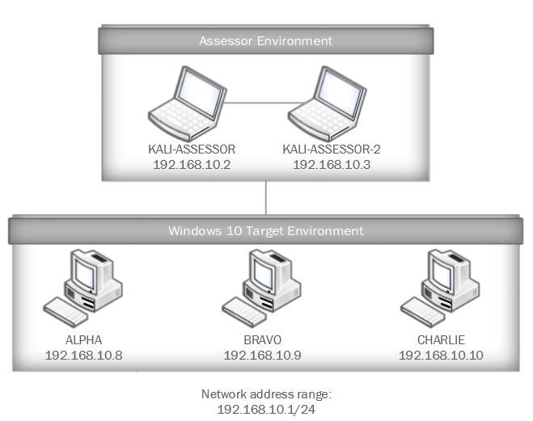

# Cyber Thimblerig

Cyber Thimblerig is a game that challenges players to digest unstructured threat intelligence information and use it in conjunction with vulnerability assessment tools to determine the risk to three remote target machines. One of the three machines will be more susceptible than others and will require further interrogation to find the token to submit for this challenge.

**NICE Work Role:** 

- [Vulnerability Assessment Analyst](https://niccs.cisa.gov/workforce-development/nice-framework)

**NICE Tasks:**

- [T0549](https://niccs.cisa.gov/workforce-development/nice-framework).  
- [T0028](https://niccs.cisa.gov/workforce-development/nice-framework) - Conduct and/or support authorized penetration testing on enterprise network assets.  
- [T0188](https://niccs.cisa.gov/workforce-development/nice-framework) - Prepare audit reports that identify technical and procedural findings, and provide recommended remediation strategies/solutions.

# IMPORTANT

This challenge does not have any downloadable artifacts. You may complete this challenge in the hosted environment.

## Background

A recent outbreak of a new ransomware variant by a known threat actor has your organization's leadership team in panic mode. When news breaks of the first organizations hit by the ransomware, they ask your team to assess the risk to the organization and locate the vulnerable assets on your network. However, information on the variant is limited, so you will need to disseminate actionable steps from unstructured threat intelligence provided to you. Using this information and your Kali Linux assessment machines, determine which one of three machines is vulnerable to the attack. Your team will then need to extract a running file name from the machine to help provide indicator of compromise information back to the security community. The name of the malicious file will be the submission for this exercise.

## Getting Started

In the game Thimblerig, players are challenged to find a single object hidden underneath one of three cups. The cups, each turned upside down are shuffled to disorient the player and cause them to select a cup that does not contain the object, thus losing the game. Cyber Thimblerig operates on the same premise. To start this challenge, you are presented a pdf below with threat intelligence information in an unstructured format, specifically in the form of blog posts, tweets and public reports. The information will be mostly devoid of indicators of compromise. Your objective is to use this information to determine which one of three target machines is susceptible to this attack. Once you've collected relevant information, you will need to survey, enumerate, and verify three machines to identify the vulnerable system. After that, you can remotely connect to it and extract an indicator of compromise in the form of a file name.

[Click to download Threat Intelligence.pdf](challenge/Threat_Intelligence.pdf)

  ## Answer Format

  The answer to the challenge is the **filename.ext** which is running on the compromised machine.

