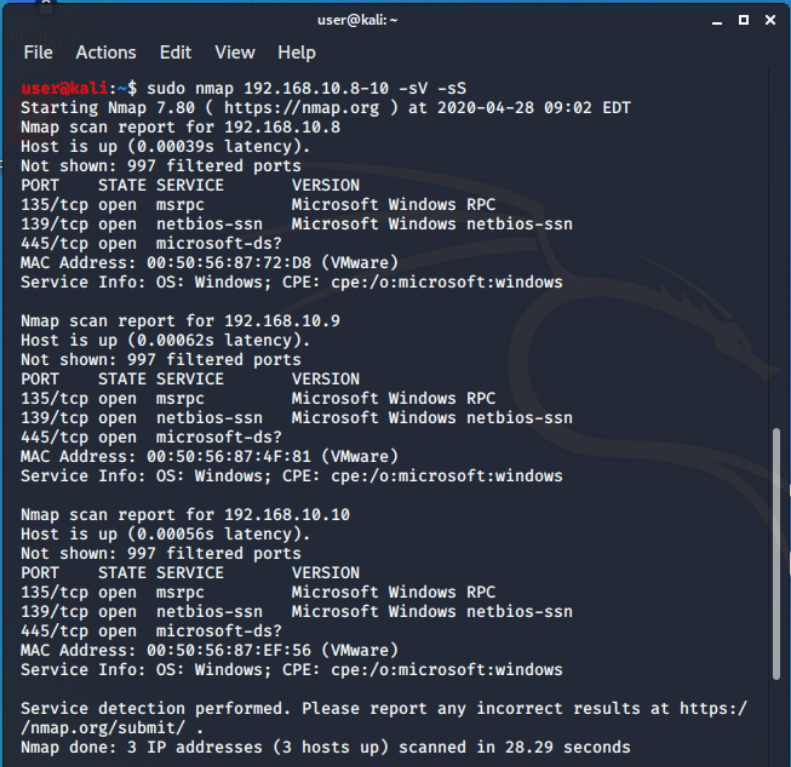
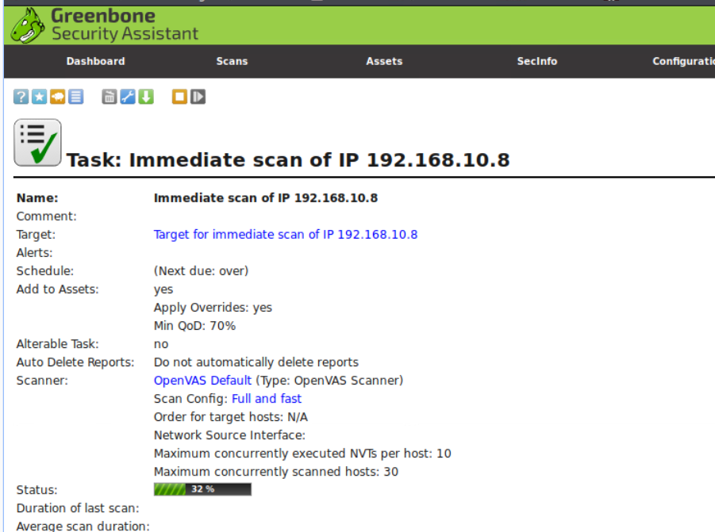
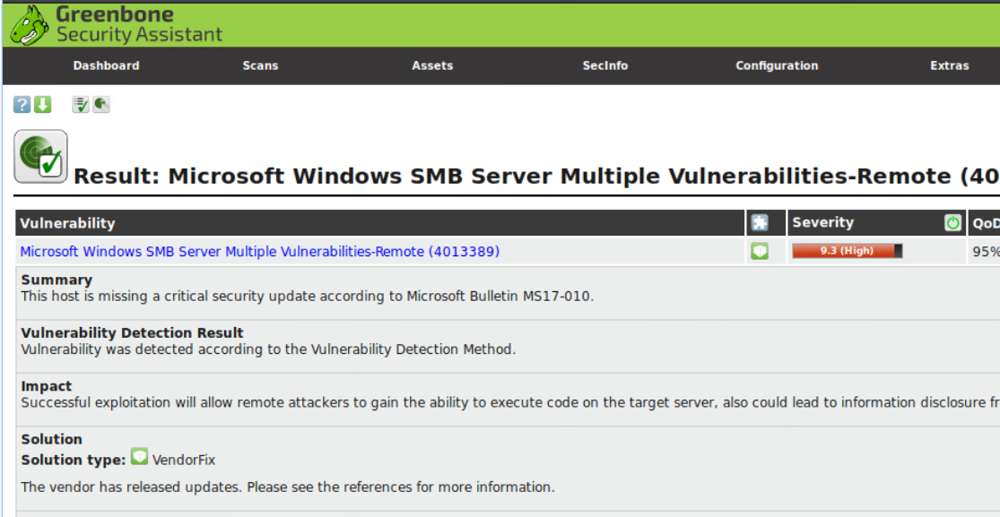
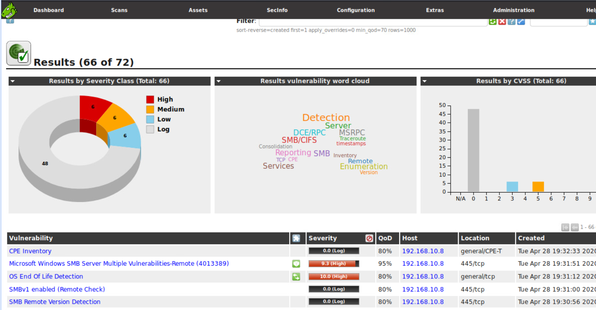
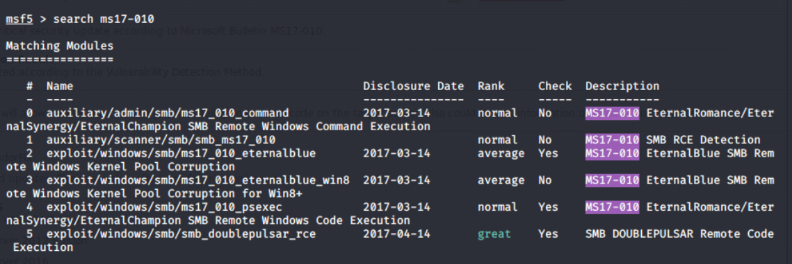
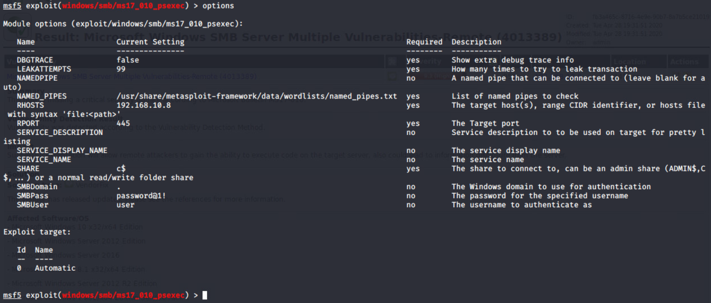
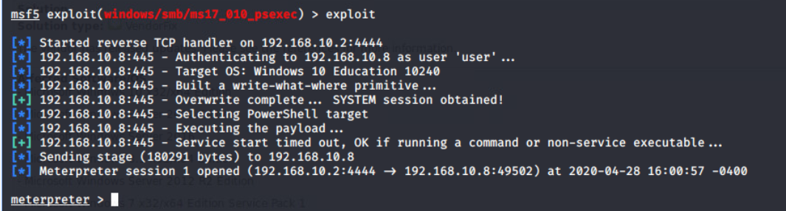
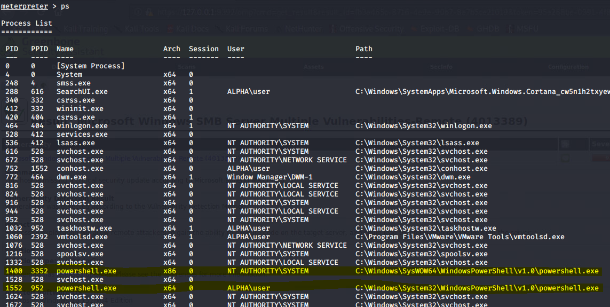
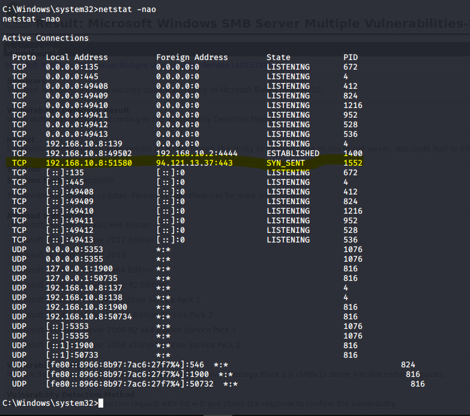
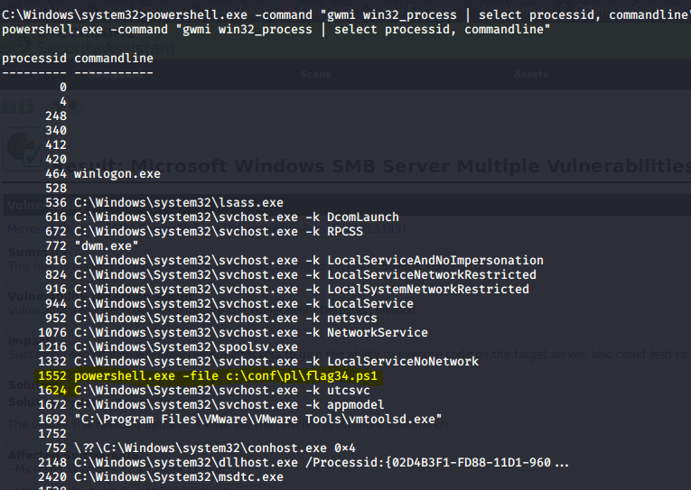

# Cyber Thimblerig Solution

Based on the intel provided with the challenge you should be able to get
actionable TTPs to complete the challenge.

To begin assessing the machines, you will need to first survey them to
determine what open ports are available

1.  Using NMAP, you will find that port 139 is open across all three of
    your target machines.

    

2.  Using this information, you can take the assessment a step further
    and enumerate vulnerabilities on each host. For this, we will use
    OpenVas for the enumeration.

    a.  First start OpenVas (it is not running by default in order to
        conserve VM resources).

3.  Initiate a scan of the hosts that you have just identified:

    a. Go to the Scans tab and  start a new task. 
    
        For example, an immediate task can
        be executed for a single host. (**NOTE**: Average scan time is
        around 5 minutes per

4.  When the scans complete, you will find that one of the three target
    machines have specific SMBv1 vulnerabilities enabled that the others
    do not. Specifically, the vulnerability for MS17-010 that has not
    been patched.

    
    
    

5.  Using this knowledge, you can now target this victim machine and
    verify the the ability to exploit the vulnerability using Metasploit.

6.  Open the msfconsole on the Kali host and a simple search will reveal
    several exploits available for *MS17-010*

    

7.  Since the second flag requires that we get a script name from the
    vulnerable machine, we will need to select an exploit that gives us
    a remote shell to the machine. The exploit ms17\_010\_psexec should
    work for our case. To select this exploit, write the following: 
    ```
    use /exploit/windows/smb/ms17_010_psexec
    ```

8.  Set the options according to the information that you have on hand
    for this target. You can do this by using the `set` command. Example: 
    ```
    set RHOSTS <target_ip>
    ```

    

9.  ....and we have a meterpreter shell

    

10. Based on the intelligence we now need to look for a PowerShell
    process and likely an underlying script, so running the 'ps' command
    would start our search.

    

11. Since there are multiple powershell.exe processes, we will need to
    narrow this down further based on the intel artifact information.
    This requires getting into a command shell and running a netstat
    command to determine which powershell.exe PID is connecting to
    94.x.x.x addresses based on the intel

    

12. Now we know that the PID is 1552 on the victim machine.

13. To achieve name of the script we will need to obtain the command
    line parameter of the process to get script name. This can be
    achieved through several different ways and in this case, we chose
    to invoke a WMI query using Powershell.exe.

    

14. Based on this query, we now find that the file name is
    **flag34.ps1**
