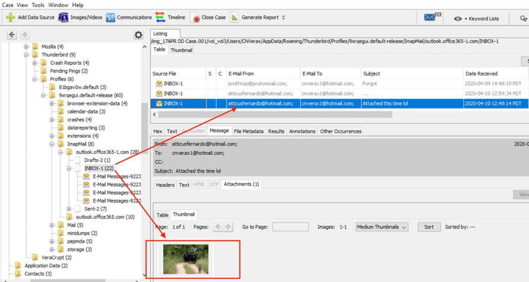
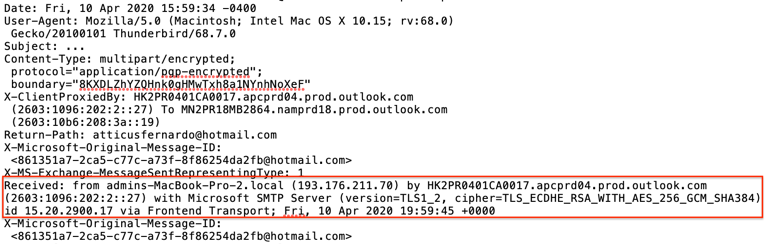
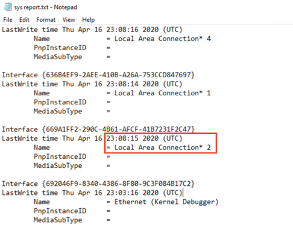
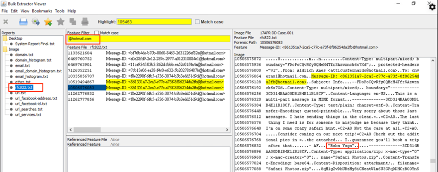

# Spies Like Us Solution

## Beginning 
The picture Klaus received via unencrypted email
from Aldrich on 10 APR 20 at 14:48 CT:

The key file used to open the `VacationPics.zip` container is a photo
image named `Recent Safari.jpg` One method to retrieving the file is by
searching the Thunderbird inbox within Autopsy. There is no need to
rename or re-format the file type after extraction.

## Submission 1 

The sender IP address (`193.176.211.70`) is in the “INBOX” file located in
the roaming Thunderbird profile. The file can be extracted and then
viewed in any text editor/viewer. The challenger will need to convert
pacific time to UTC to determine that the email was sent at **19:59 UTC**.

## Submission 2

One way to solve this is by exploiting the system registry file using
REGRIPPER and then querying “Local Area Connection\* 2.” The challenger
could also search for the Network GUIDs for the answer in the same file.
The answer in this case is **23:08:15**. This is the password for the outer
volume of the `OutdoorPics.zip` container.

**AT THIS POINT YOU SHOULD BE ABLE TO OPEN THE OUTER VOLUME OF THE
`OutdoorPics.zip` FILE USING VERACRYPT.** The keyfile is a photo
named `Zebra KEYFILE` from the `VacationPics.zip` container. The
password is **23:08:15**.

## Submission 3

This can be determined by using Bulk Extractor to exploit the `rfc822.txt`
file which is a result of running the email extraction module. The
challenger will need to query the `rfc822.txt` file for to retrieve the
information needed to complete the challenge. In this example, the
filter “@hotmail” was used to narrow the search results. The challenger
could also query the subject line “Info” if they rebuilt the Thunderbird
profile and exposed the subject line, or search the message ID of the
encrypted email that can be obtained by viewing the Thunderbird inbox
file in a text viewer. Bulk Extractor is able to retrieve the plaintext
version of the encrypted emails due to the way PGP/MIME processes
temporary plaintext variants of the email prior to the messages being
sent.

The file contains remnants of the encrypted email. The encrypted subject
line is “Info” and the quote at the end of the email says **babayaga**.
This is the password used to open to final container. There are no
capital letters, spaces, or quotes in the password.

**AT THIS POINT YOU SHOULD BE ABLE TO OPEN THE HIDDEN VOLUME OF THE
`OutdoorPics.zip` CONTAINER USING VERACRYPT.** Open the volume with
the keyfile named `Lion KEYFILE`, which is found in the outer volume.
The password is **babayaga** as described above.

## Submission 4 

The final flag is hashtag text overlaid on an image file stored within
the hidden volume of the `OutdoorPics.zip` container. All other aspects
of the challenge must be solved to obtain the keyfile and password
needed to open the hidden volume in the container. The submission
verbiage should include the hash tag mark and without any spaces: **#tigerking4life**

