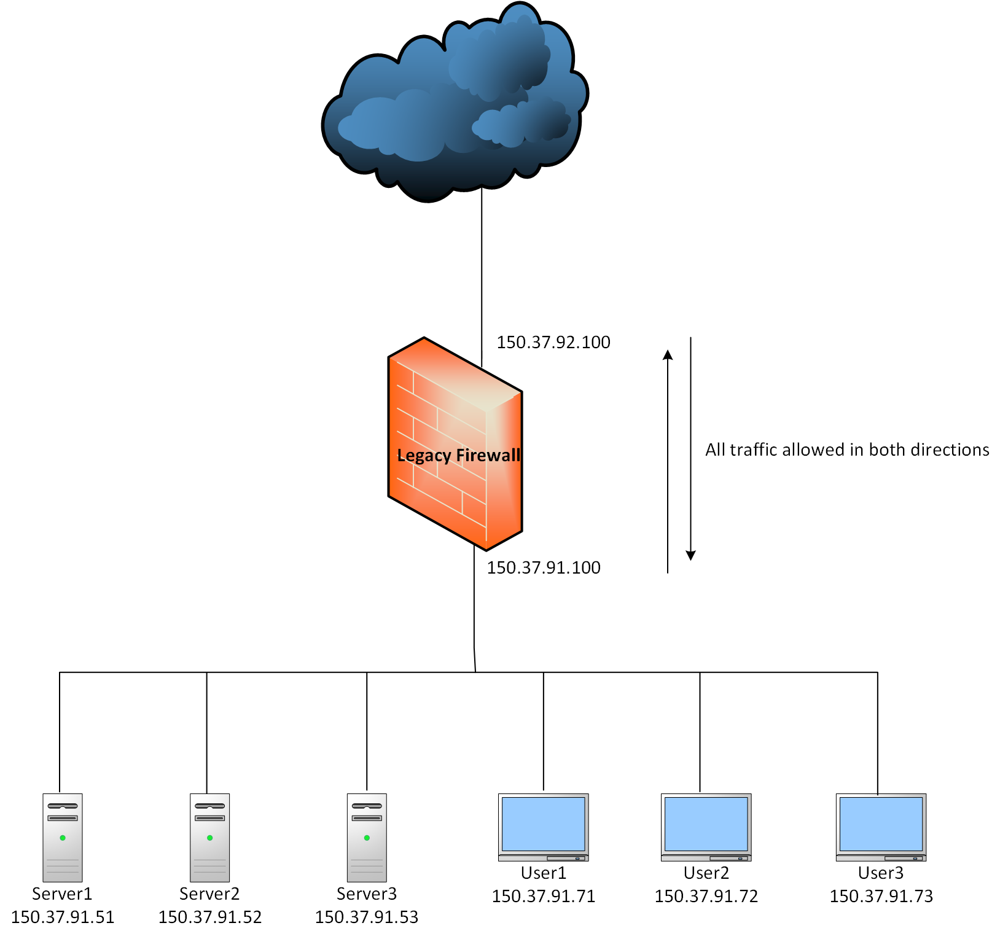
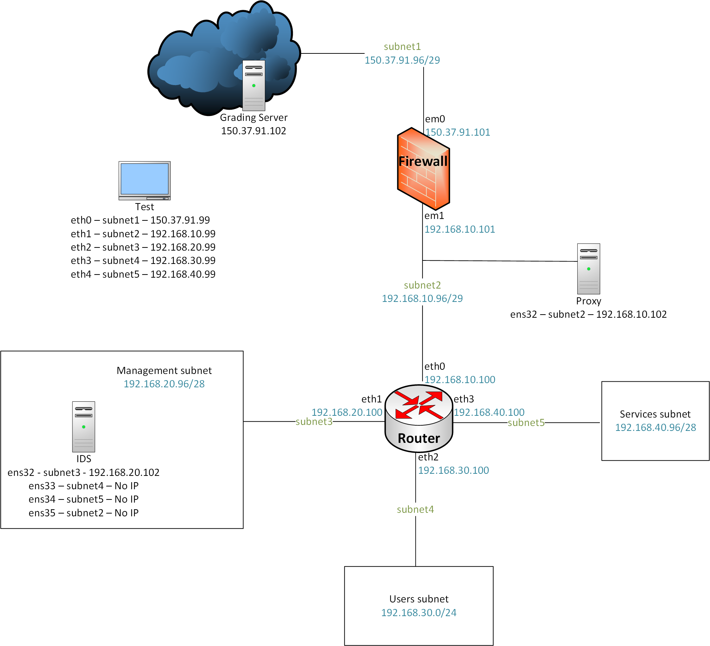

# Build a Fortress

Build a network topology by configuring a firewall, a router, an IDS, and a web proxy.

**NICE Work Role:** 
- [Cyber Defense Infrastructure Support Specialist](https://niccs.cisa.gov/workforce-development/nice-framework)

**NICE Tasks:**
- [T0042](https://niccs.cisa.gov/workforce-development/nice-framework) for specialized cyber defense applications.
- [T0335](https://niccs.cisa.gov/workforce-development/nice-framework) - Build, install, configure, and test dedicated cyber defense hardware.
- [T0420](https://niccs.cisa.gov/workforce-development/nice-framework).
- [T0438](https://niccs.cisa.gov/workforce-development/nice-framework).

## IMPORTANT

This challenge does not have any downloadable artifacts. You may complete this challenge in the hosted environment.

## Background

Rupt Bank got hacked recently. It's no wonder they did. Look at their network topology. No network segmentation or monitoring, all traffic is allowed inbound/outbound, use of public IP space for all systems, use of legacy systems - to list a few issues in their infrastructure.

## Getting Started

You are a group of Infrastructure Support Specialists called in to configure the new systems and rebuild their network from scratch using the following topology map. Your CISO is an open source evangelist. As such, you are provided access to a pfSense firewall, VyOS router, Security Onion IDS, Ubuntu Server for installing and configuring Squid proxy, and a Kali machine for testing purposes.

Please note that all systems in the network are at their default vanilla state with nothing configured on them except -

- On Security Onion, the management IP address is configured and the other three interfaces are assigned for sniffing.

Your end goal is to determine and implement the configurations in the network that will allow you to pass the following three grading checks. Overall these grading checks/tasks enforce the defense-in-depth methodology.

| Grading Check | Grading Check Description | Weight |
|-------------|----------|----------|
| 1 | - Only HTTP traffic is allowed outbound   -  No traffic is allowed inbound   -  Outbound NAT is configured to translate traffic leaving the internal network to the IP address of the WAN interface of the firewall | 40% |
| 2 | A functional squid web proxy | 35% |
| 3 | Snort is configured to alert on any non-HTTP traffic originating from Users Subnet and is destined for the internet | 25% |

A grading script is executed every 5 minutes and the results are published to `http://150.37.91.102`.

Things to keep in mind –

- The underlying networking (layer 1 and layer 2) is in place. The network adapters for all the systems are connected to the proper/correct networks.

- Use the IP address scheme as defined on the network map.

- The first phase of Security Onion setup is already done for you. This includes configuring the management interface IP address, and assigning the remaining three as sniffing interfaces.

- The Squid Debian package is mounted as an ISO to the Proxy system.

- Make sure the Squid web proxy is listening on its default port.

- Grading Server IP address can be used as the upstream gateway for the firewall.

- A Kali (Test) system is available for testing the configuration. It has an interface in all 5 subnets. The IP address that can be used for each interface is mentioned on the network topology map.

- The grading results URL (`http://150.37.91.102`) is accessible from 150.37.91.101 (Firewall) and 150.37.91.99 (Test system) only.

**Please note: Do *NOT* configure bridging on any of the systems as that will result in losing access to the VMs and the Gamespace. You will not be able to restart/relaunch this challenge and 0 points will be allotted for this challenge to your team.**

## Submission Format

The answer to each grading check is a code (string of random characters)
