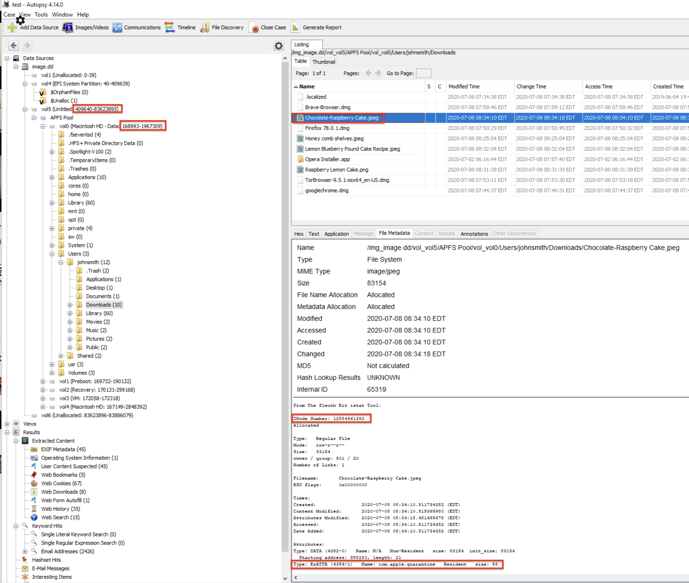

# Dissecting an Apple Solution

## Question 1

1. Analyze the calendar entries located at `/Users/johnsmith/Library/Calendars/`

   Each `.calendar` folder will have an `Events` folder within it. One of those `Events` folder will have the calendar entries(`.ics` files) created by John (the laptop owner). 

2. Analyze those `.ics` files and look for `DTSTART` time. 

3. Convert that time to `UTC`.

## Question 2  & 3

1. Analyze the `Maps` application data located at `/Users/johnsmith/Library/Containers/com.apple.Maps/Data/Library/Maps/`

2. Export `GeoHistory.mapsdata` 

   Irrespective of its extension it is a plist file

3. Open it with a plist editor. 

4. Within `MSPHistory`  -> `records`, analyze the `contents` subkeys for each GUID. It will contain the restaurant name and location. It will also contain the same `current location` in all of the `contents` subkeys

## Question 4

For this question, we can either analyze the files associated with 7 different browsers present on this machine or just analyze the `extended attributes` of the file to find the answer. This guide explains the latter approach by using sleuthkit tools

1. The command to execute is `icat.exe -o 409640 -B 168993 E:\image.dd 12884961393-4354-1`

   `-o` is the offset for the volume containing the data

   `-B` is the APSB block number for `Macintosh HD - Data` volume

   `12884961393-4354-1` is the `inode number` followed by `com.apple.quarantine` extended attribute ID for the file under analysis

   

## Question 5

This can be determined by analyzing the most recently used (MRU) applications on the system. The data is present in `Users/johnsmith/Library/Application Support/com.apple.sharedfilelist/com.apple.LSSharedFileList.RecentApplications.sfl2` file. It is an NSKeyed Archiver formatted binary plist file. 

1. Analyze the file using a plist editor.

   

## Question 6

This can be determined by using the `pstat.exe` sleuthkit tool

`pstat.exe -o 409640 E:\image.dd`

