# Pwning PowerShell Solution

This solution guide has 4 sections: **ScriptMod**, **PrivEsc**, **CodeExec**, **Hidden** - one for each Windows 10 VM in the challenge. 

## **Section 1 - ScriptMod**

The *ScriptMod* VM has two tokens worth 5% each. The challenger is referred to two files--`encoded-script.txt` and `encrypted-script.ps1`--in the `C:\Users\flare\Documents` directory. The `encoded-script.txt` file contains a Base64 encoded PowerShell script that will print out the first token, as well as the password and salt required to decrypt the second token contained in the `encrypted-script.ps1` file. 

1. `encoded-script.txt`
      - To output the contents of the Base64 encoded script, the challenger must simply execute the PowerShell command with the `-EncodedCommand` or `-E` switch.  
      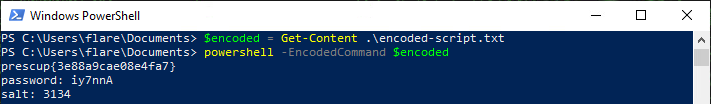

      - If the challenger is unfamiliar with PowerShell or unsure where to start, he or she should observe the VM name "ScriptMod" as per the instructions. Since all parts of this challenge can be completed using PowerSploit, observing the PowerSploit module at `C:\Program Files\WindowsPowerShell\Modules\PowerSploit` or conducting a web search will lead the challenger to the cmdlets supported under the "ScriptModification" folder of PowerSploit. The `Out-EncodedCommand` and `Out-EncryptedScript` cmdlets are in use here.

      - As per the challenge guide hints, the challenger can use the built-in PowerShell help utility `Get-Help` to view the `Out-EncodedCommand` usage and examples. EXAMPLE 2 shows that "`powershell -E <encoded text>`" will execute the Base64 encoded PowerShell script.  
      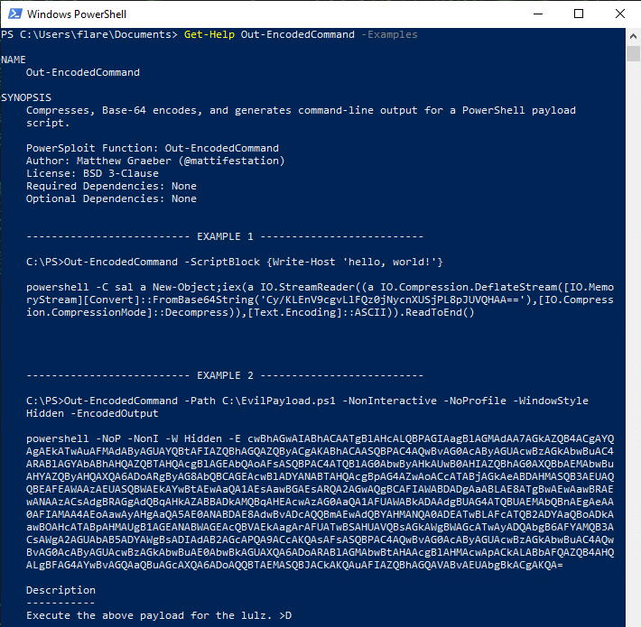

2. `encrypted-script.ps1`
      - Given the password and salt as was output from the execution of `encoded-script.txt`, the challenger can again use the built-in PowerShell help utility `Get-Help` to view the PowerSploit `Out-EncryptedScript` cmdlet usage and examples.  
      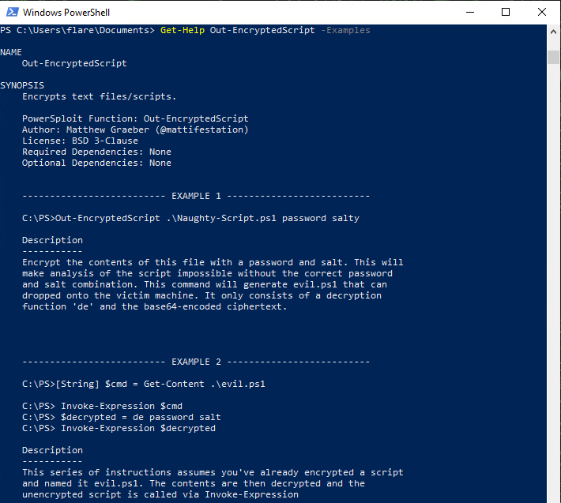

      - Executing the steps as shown in EXAMPLE 2 will output the second token contained in `encrypted-script.ps1`.  
      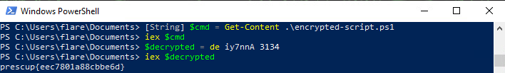


## **Section 2 - PrivEsc**

The *PrivEsc* VM has a single token worth 25%. The challenger only has user permissions and must escalate his or her privileges to an administrator to view the token located at `C:\Users\admin\Documents\token.txt`. Since Windows Defender/AMSI is already disabled, the PowerSploit module will be loaded automatically when PowerShell is started; the challenger will only have to determine how to use the proper PowerSploit cmdlets to find and exploit vulnerable services.

1. The challenger should observe the VM name "PrivEsc" as per the instructions. Since all parts of this challenge can be completed using PowerSploit, observing the PowerSploit module at `C:\Program Files\WindowsPowerShell\Modules\PowerSploit` or conducting a web search will lead the challenger to the cmdlets supported under the "Privesc" folder of PowerSploit. The challenger must first find a vulnerable service to exploit. PowerSploit uses the well-known "PowerUp" library to find and exploit privilege escalation vectors. 

2. The challenger could use individual PowerUp cmdlets to find vulnerable services, however the `Invoke-AllChecks` cmdlet will run all functions in the PowerUp library that check for various Windows privilege escalation opportunities.
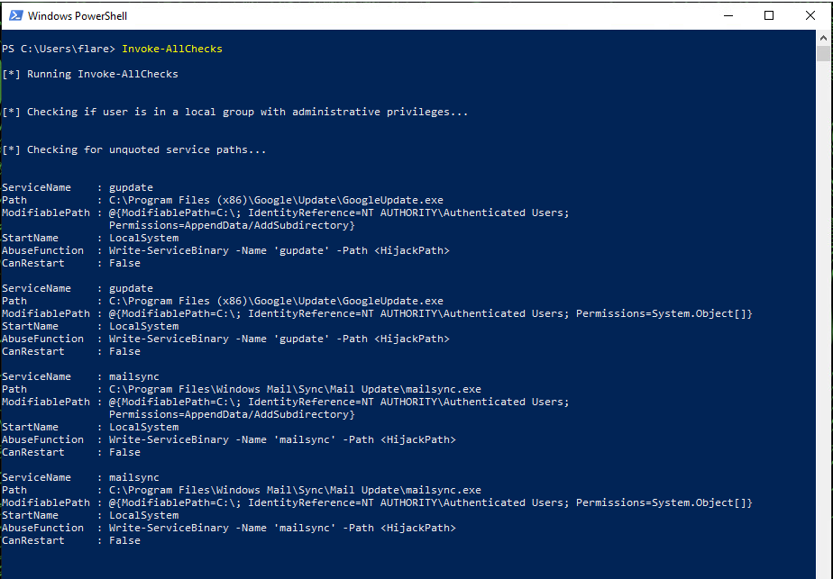  
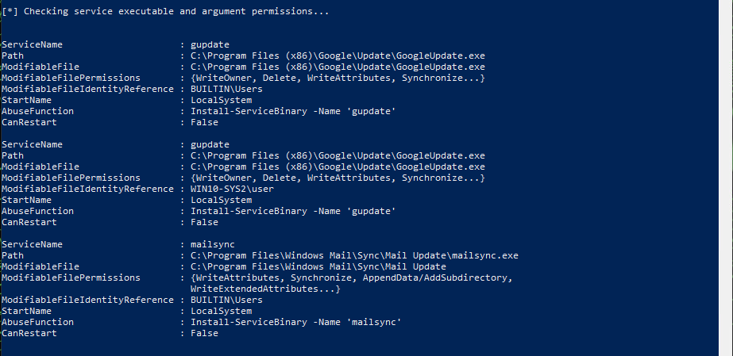

3. `Invoke-AllChecks` will return many possible services and DLLs to exploit, however only a select few privilege escalation methods will actually work. 

      - The simplest service to exploit is `gupdate` under the "`[*] Checking service executable and argument permissions...`" output from `Invoke-AllChecks`. Using the recommended `AbuseFunction` verbatim will replace the `gupdate` service executable (GoogleUpdate.exe) with a simple executable that will create a new administrator account (default username: john / password: Password123!). This malicious executable will run whenever the `gupdate` service starts.  
      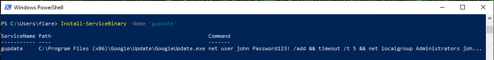

      - The next service that could be exploited is `mailsync` under the "`[*] Checking for unquoted service paths...`" output from `Invoke-AllChecks`. The challenger can use the recommended `AbuseFunction`, however he or she must understand the unquoted service path vulnerability to know where to place and what to name the malicious executable.
      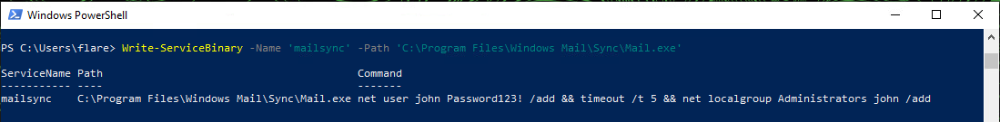
     
      - The final possibility is to again exploit the `gupdate` service, but using the `Write-ServiceBinary` abuse function with the proper path provided instead of the `Install-ServiceBinary` method.
      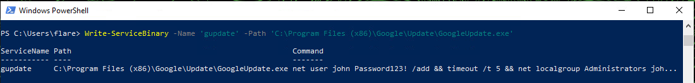

4. With the malicious executable in place, the challenger must now restart the computer which will force the vulnerable service to restart and run the malicious executable as SYSTEM to create the new administrator account.

5. After the computer has restarted, the new administrator account will have been created. The challenger can now view the token at `C:\Users\admin\Documents\token.txt` using the newly created administrator credentials (default: john/Password123!)  
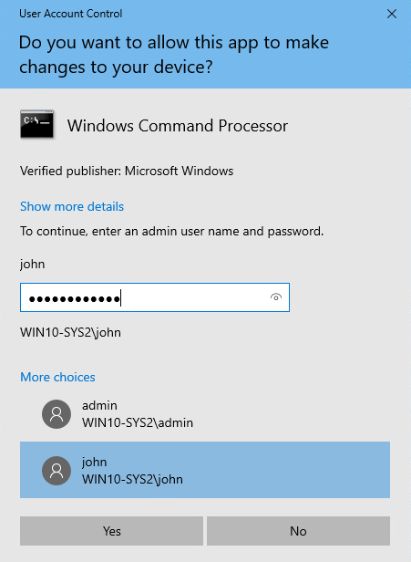  
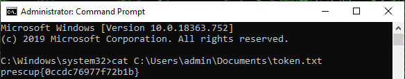


## **Section 3 - CodeExec**

The *CodeExec* VM has a single token worth 25%. The challenger is referred to a file located at `C:\Users\flare\Documents\shellcode.txt` that contains a PowerShell payload the user must execute. This payload was constructed using MSFvenom and will simply print the token to the console when executed. Windows Defender/AMSI is now fully enabled and therefore will block any attempts to import or execute malcious PowerSploit cmdlets. The challenger only has user permissions so he or she must first use known techniques to bypass AMSI, and then determine how to use the proper PowerSploit cmdlets to execute the provided shellcode.  

1. The challenger should observe the VM name "CodeExec" as per the instructions. Since all parts of this challenge can be completed using PowerSploit, observing the PowerSploit module at `C:\Program Files\WindowsPowerShell\Modules\PowerSploit` or conducting a web search will lead the challenger to the cmdlets supported under the "CodeExecution" folder of PowerSploit. The `Invoke-Shellcode` cmdlet provides the functionality to execute the payload from `shellcode.txt` in the memory of the current PowerShell process. Since Windows Defender is enabled, AMSI will block any attempts to use `Invoke-Shellcode` or import the PowerSploit module.  
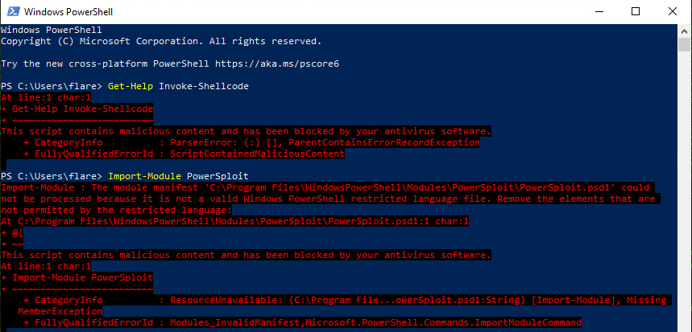  

2. The challenger must first bypass AMSI in the current PowerShell instance. There are multiple posts online detailing methods to bypass AMSI. Many of the common attempts to bypass AMSI are now detected by current versions of Windows Defender, however very simple obfuscation techniques to break up "dirty words" are still successful.   
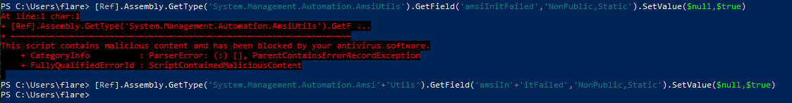  

3. With AMSI bypassed, the challenger can now use the built-in PowerShell help utility `Get-Help` to view the `Invoke-Shellcode` usage and examples. EXAMPLE 3 shows that "`Invoke-Shellcode -Shellcode @(shellcode text)`" will execute custom shellcode.  
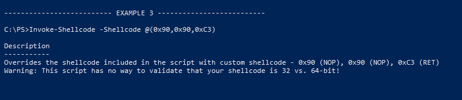

4. The challenger can now copy and paste the shellcode from `shellcode.txt`, or get the file contents and invoke the expression in PowerShell (this will save the shellcode in the `$buf` variable), and execute `Invoke-Shellcode` to output the token.  
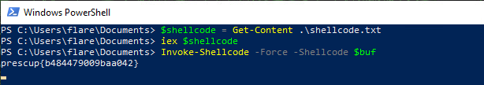 


## **Section 4 - Hidden**

The *Hidden* VM has a simple token worth 5%, as well as the final token submission of the NTLM hash of the user *Scotty* worth 35%. The challenger does not have access to the *Hidden* VM desktop, so he or she must first use one of the other three VMs to locate the VM and gain command line access. With access, the first token is readily available. Multiple actions will be required to obtain the final token. A simple and widely known method to obtain an NTLM hash off of a Windows host is to use Mimikatz. PowerSploit has a cmdlet, `Invoke-Mimikatz`, that combines the Mimikatz functionality with PowerSploit's ability to execute commands within the memory of a running PowerShell instance. On the *Hidden* VM, Windows Defender is fully enabled and the PowerSploit module is not installed. The challenger will again have to bypass AMSI, while also using one of the other VMs to provide access to the PowerSploit module. Only then will the challenger be able to obtain the NTLM hash of the user *Scotty* using PowerSploit.

1. From any other VM, the challenger must locate the *Hidden* VM. Since `nmap` comes preinstalled on all Windows VMs in the challenge, the fastest and simplest method to locate the *Hidden* VM would be to use `nmap` to scan the local network.  
     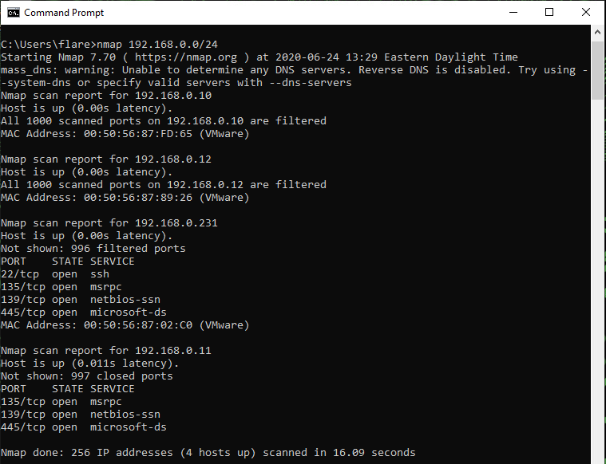  

     Alternatively, the challenger could use the lightweight port scanner that is provided by PowerSploit:
     ```
     Invoke-Portscan -Hosts 192.168.0.0/24
     ```
     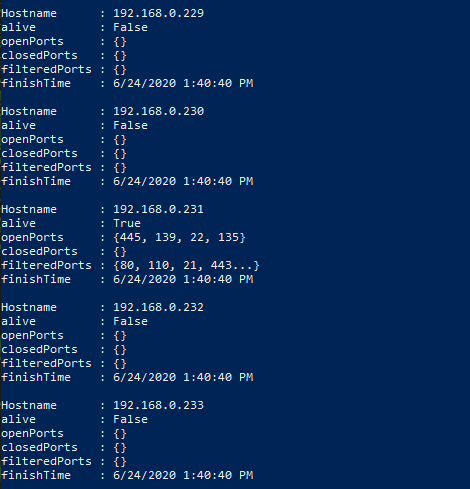  


2. The result of the port scan shows that there is a machine at `192.168.0.231` with port 22 open. The challenger can now ssh into the *Hidden* VM using the provided credentials (user/tartans).  At this point, challenger can view the first token at `C:\Users\flare\Documents\token.txt`.  
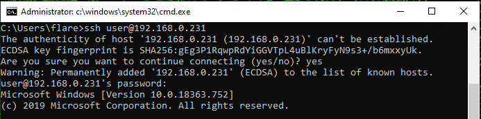  
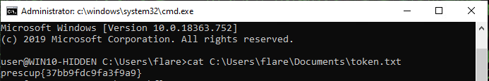  

3. Now the challenger must determine how to get access to PowerSploit scripts since PowerSploit is not present on the *Hidden* VM. As per the hint provided in the instructions, Python is installed on all machines and Python has a lightweight HTTP server built-in. The challenger can host the PowerSploit module as a web server from one of the other challenge VMs. Since Windows Firewall is enabled on all machines, this is best done from the *PrivEsc* VM after the challenger has already gained administrator access on the machine. As an administrator on the *PrivEsc* VM, the challenger will be able to add a Windows Firewall rule to allow incoming connections to the Python web server port.   

     - From the *PrivEsc* VM, as an administrator add a firewall rule to allow inbound connections to the Python web server port. (This step could also easily be completed using the Windows Defender Advanced Security desktop application)  
     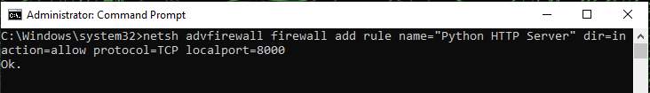

     - From the *PrivEsc* VM, navigate to the directory with the PowerSploit module is located and start a Python web server.  
     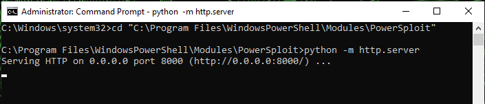


4. Windows Defender/AMSI will not allow for the downloading of malicious scripts. In order to download the `Invoke-Mimikatz` cmdlet from PowerSploit, the challenger must bypass AMSI on the *Hidden* VM. From the ssh terminal of the *Hidden* VM, start PowerShell and then execute the same AMSI bypass as previously used on the *CodeExec* VM.  
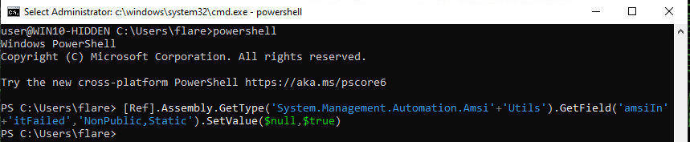  

5. Many online web blogs/posts detail instructions for downloading and executing a new object in the memory of the currently running PowerShell instance. This technique specifically comes up quite often in example usage of PowerSploit functionality such as `Invoke-Shellcode` or `Invoke-Mimikatz`. The challenger must download the `Invoke-Mimikatz.ps1` script from the *PrivEsc* VM into the running PowerShell instance on the *Hidden* VM. This action is similar to running `Import-Module -Name <module name>` in PowerShell. Upon execution of the command, the challenger should notice that their Python web server has a `GET` request from the *Hidden* VM at `192.168.0.231` and it responds with a `200 OK`.  
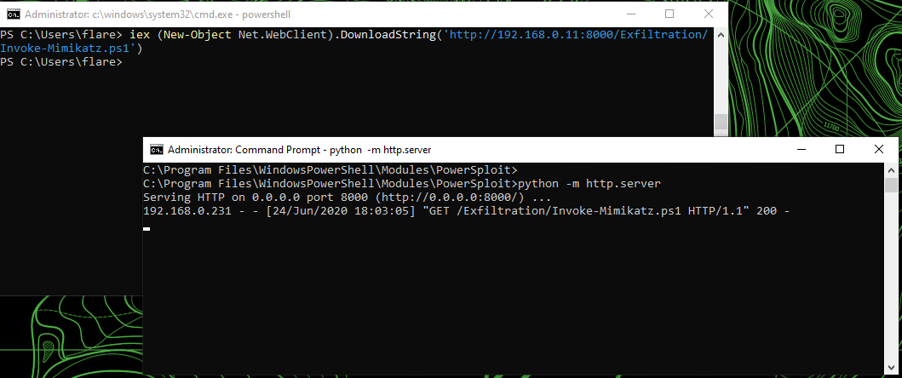  

6. Finally, the challenger can use the `Invoke-Mimikatz` PowerSploit cmdlet to obtain the NTLM hash of the user *Scotty*. 

     - As per the challenge guide hints, the challenger can use the built-in PowerShell help utility `Get-Help` to view the `Invoke-Mimikatz` usage and examples. Output of the `Invoke-Mimikatz` help utility shows that the challenger can dump the credentials on the system (of the users that have previously logged on), dump the current certificates of the system, or execute any other Mimikatz command(s).  
     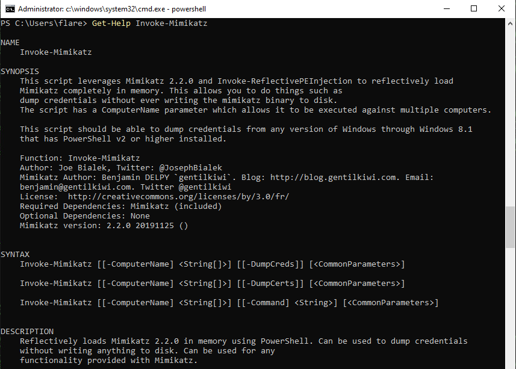  

     - The best method to use the `Invoke-Mimikatz` cmdlet to obtain the NTLM hashes of all users is to feed the cmdlet the well-known Mimikatz commands to dump the contents of the SAM file. It sends three Mimikatz commands to the cmdlet to set the privilege level to `debug`, elevate the authentication token to `SYSTEM` privileges, and then dump the contents of the SAM file. This output will provide the final submission token, i.e. the NTLM hash of the user *Scotty*.     
     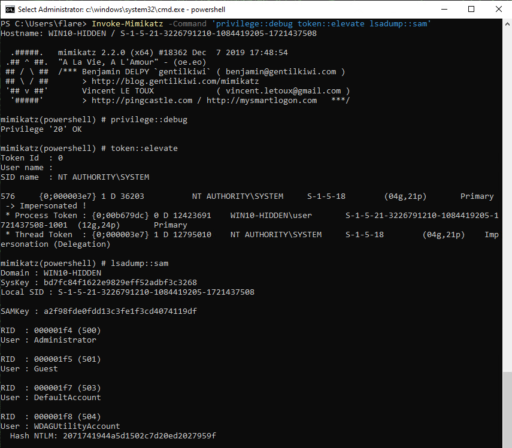  
     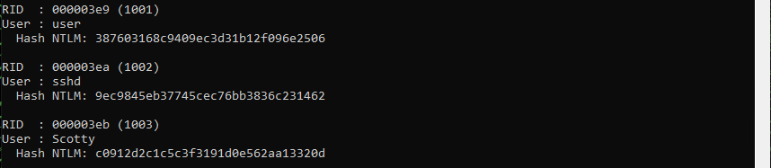  


## Submission

Submissions/outputs for each version are listed below:

## Version 1
 - ScriptMod: `encoded-script.txt`
      ``` 
      prescup{3e88a9cae08e4fa7}
      Password: iy7nnA
      Salt: 3134
      ```
 - ScriptMod: `encrypted-script.ps1`
      ``` 
      prescup{eec7801a88cbbe6d} 
      ```
 - PrivEsc: `token.txt`
      ```
      prescup{0ccdc76977f72b1b}
      ```
 - CodeExec: `shellcode.txt`
      ```
      prescup{b484479009baa042}
      ```
 - Hidden: `token.txt`
      ```
      prescup{37bb9fdc9fa3f9a9}
      ```
 - Hidden: NTLM hash of user *Scotty*
      ```
      c0912d2c1c5c3f3191d0e562aa13320d
      ```
