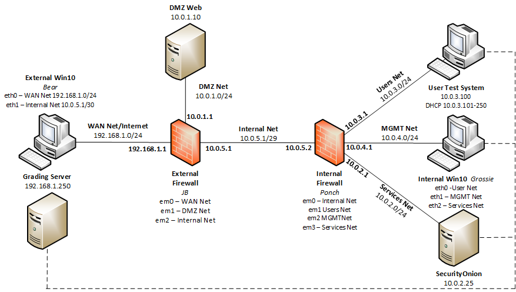

# Welcome to Traffic School

Teams will be required to properly configure two network firewalls as well as local firewall rules in order to block/allow traffic as dictated by the challenge guide.

**NICE Work Role:** 

- [Cyber Defense Infrastructure Support Specialist](https://niccs.cisa.gov/workforce-development/nice-framework)

**NICE Tasks:**

- [T0335](https://niccs.cisa.gov/workforce-development/nice-framework) - Build, install, configure, and test dedicated cyber defense hardware.
- [T0420](https://niccs.cisa.gov/workforce-development/nice-framework).
- [T0438](https://niccs.cisa.gov/workforce-development/nice-framework).

## IMPORTANT
This challenge does not have any downloadable artifacts. You may complete this challenge in the hosted environment.

## Background
Your network firewalls were destroyed in a massive fire, and no configuration backups survived. To save money (and time), your team decided to install pfSense firewalls in their place. You must configure the necessary routing, port-forwarding, and firewall rules to meet a specific set of conditions. Otherwise, CHiPS, the Computer High-intensity Protection Services will be forced to shut down your network.

## Getting Started
You are provided with direct console access to both the external firewall, JB, and the internal firewall, Ponch. You also have access to two Windows test systems:

* **Bear** has its interfaces in both the _WAN_ and _Internal_ networks.
* **Grossie** has interfaces in the _Users_, _MGMT_, and _Services_ networks.

You may use these systems to test the various traffic types and access the firewall web consoles, but will need to configure IP addresses for them as necessary. **Avoid assigning IP addresses that end in 250 or above, as these belong to grading systems.**

Both of your firewalls come with the interfaces correctly  pre-configured, but you must configure the necessary routing, port-forwarding, and rule sets to meet the set of conditions that follow. Currently, ALL traffic is allowed.

A grading server exists in the WAN network at 192.168.1.250 and is accessible from Bear at challenge start. The site will also become available from Grossie once all FW conditions are met to allow web traffic to the WAN Net. This server's web page (http://192.168.1.250) will display your grading results as you complete the challenge. The grading site will also be used to test web connectivity from the internal network for grading purposes. The grading results page will refresh every minute, though grading scripts run every 5th minute and may take 1-2 minutes to complete. As grading checks run, grading data may temporarily be rewritten to the page.
___
Given the following network map image:

Ensure the following grading checks can be passed. Each check is worth 20% of the overall challenge score and will provide one  of four challenge tokens once the check is passed.

_Grading Check #1 - External Access_
1. Verifies that ICMP requests inbound are blocked.
2. Verifies that the DMZ web page is accessible at 192.168.1.1, which requires the proper port forwarding on JB.

_Grading Check #2 - Internal ICMP_
1. Verifies that the MGMT systems can ping Users, the SecurityOnion, and the DMZ web server.
2. Verifies that Users and the Service network cannot ping anything, including their own gateway.

_Grading Check #3 - Internal Web Access_
1. Verifies that Users within the DHCP range only and all MGMT systems can access **both** the DMZ web page at 10.0.1.10 and the external grading site at 192.168.1.250.
2. Verifies that the Service network cannot access this page.

_Grading Check #4  - Remote Access from MGMT_
1. Verifies that MGMT systems can access Users via RDP
2. Verifies that MGMT can access the SecurityOnion via SSH
3. Verifies that no other ports are open to connections on those systems via port scans.

If all 4 checks can be achieved simultaneously for one full grading cycle, then a 5th token will be generated to provide the final 20% of the challenge score.

Each grading requirement can be met individually, though the only way to achieve a full score for the challenge is to achieve all conditions simultaneously.
___
## Submission Format

The answer to each grading check is an 8-character alpha-numeric string

Hints
1. The User Test System and SecurityOnion system may have local firewall rules that need to be modified as well. 
2. \"so-allow\" can enable analyst access to SecurityOnion.
3. Remember that traffic tests from the test systems may require you to temporarily change static routes or enable/disable other interfaces on the system to ensure traffic flows from the correct interface.
4. Think about the perceived source of ICMP requests going to the DMZ from MGMT. 
