# Welcome to Traffic School Solution

This challenge involves configuring various firewall settings on multiple devices in order to achieve a specific set of network traffic conditions. Once these conditions are met, grading checks will provide the challenge tokens to the team. If all four (4) checks can be passed simultaneously during the same grading cycle, then the team will be given the fifth and final token.

To pass the four grading checks, you will need to configure port forwarding on the external firewall for the DMZ web server/site, and then add/delete/edit the various firewall rules across the network to meet the necessary conditions. Both firewalls must be configured plus the **User** test system and the **SecurityOnion** because local firewall rules do not exist or must be changed in order to pass all four checks. 

This solution guide details the configuration steps by system, and can be done in any order.

> **Note:** The Initial Setup steps have already been completed in the start state. They are included here for reference, or in case we revert the firewalls to an "out of the box" state at challenge start to add more work to the challenge or make the challenge more difficult. 
>
> Otherwise, skip to the Advanced Setup sections.

There are a number of ways that you could achieve the grading requirements. This document describes the most probable or simplest way of doing so. Not every rule is even necessary in this guide, but they are the rules that a logical security professional would make, so those cases are accounted for.

## Initial Setup

## External Firewall 

The first step is to assign interfaces as WAN, LAN, and OPT1.

At the pfSense firewall console, Enter an option: as 1.
When asked Should VLANs be set up now \[y\|n\]?, type n and press Enter
Enter the WAN interface name as em0
Enter the LAN interface name as em1
Enter the OPT1 interface name as em2
When asked Do you want to proceed \[y\|n\]?, type y and press Enter

The next step is to configure IP address for both interfaces.

At the pfSense firewall console, Enter an option: as 2
When asked Enter the number of the interface you wish to configure: 

type 1 for WAN interface and press Enter
When asked Configure IPv4 address WAN interface via DHCP? (y/n), type n
Enter the new WAN IPv4 address as 192.168.1.1
Enter the new WAN IPv4 subnet bit count as 24
Enter the new WAN IPv4 upstream gateway address, as 192.168.1.250 and press Enter
Configure IPv6 address WAN interface via DHCP6? (y/n), type n and press Enter
Enter the new WAN IPv6 address as Press Enter for none.
Do you want to revert to HTTP as the webconfigurator protocol? (y/n), type y and press Enter (to avoid certificate warnings).
Press Enter to continue

At the pfSense firewall console, Enter an option: as 2

When asked Enter the number of the interface you wish to configure: type 2 for LAN interface and press Enter
Enter the new LAN IPv4 address as 10.0.5.1
Enter the new LAN IPv4 subnet bit count as 29
Enter the new LAN IPv4 upstream gateway address, press Enter for none
Enter the new LAN IPv6 address, press Enter for none
Do you want to enable the DHCP server on LAN? (y/n), type n and press Enter
Note the URL for web interface to this firewall
Press Enter to continue

At the pfSense firewall console, Enter an option: as 2

When asked Enter the number of the interface you wish to configure: type 3 for OPT1 interface and press Enter
When asked Configure IPv4 address OPT1 interface via DHCP? (y/n), type n
Enter the new OPT1 IPv4 address as 10.0.1.1
Enter the new OPT1 IPv4 subnet bit count as 24
Enter the new OPT1 IPv4 upstream gateway address, press Enter for none
Configure IPv6 address OPT1 interface via DHCP6? (y/n), type n and press
Enter
Enter the new OPT1 IPv6 address, press Enter for none
Press Enter to continue

## Internal Firewall 

Follow the same steps as above with the following changes.

Map the interfaces in this fashion:

em0 -- WAN
em1 -- OPT1
em2 -- LAN (this ensures that the MGMT network can access the web gui)
em3 -- OPT2

Configure the interface addresses in the following way:

em0 -- WAN -- 10.0.5.2/29
Set the upstream gateway as 10.0.5.1

em1 -- OPT1 -- 10.0.3.1/24
Enable the DHCP server with a start address of 10.0.3.100 and an ending
address of 10.0.3.250

em2 -- LAN -- 10.0.4.1/24
em3 -- OPT2 -- 10.0.2.1/24

Do not enable DHCP or use any IPv6 addressing unless otherwise directed.
You should revert the webconfigurator to HTTP to avoid certificate
warnings.

## Advanced Configuration

## External Firewall

At this time, the team can login to the external firewall\'s (JB) web interface to perform the remainder of the configurations. Until routing is configured on the internal firewall (Ponch), the team will need a system in the internal network between the firewalls to connect to JB\'s web interface. To do so, you may use Bear to access the firewall's administration web gui at http://10.0.5.1.

First, on Bear, you must configure Ethernet1 with an IP of 10.0.5.3/29 (or something within the 10.0.5.0/29 range that is not already in use).

Once internal routing is functional, you may also use Grossie to access the firewall's administration web gui at http://10.0.5.1, assuming that you have set the network adapter to an address in the 10.0.4.20/24 network and a default gateway of 10.0.4.1.

Use Firefox or Chrome to browse to the external firewall\'s web interface (http://10.0.5.1).

Login with user/tartans.

## Configure Routing

First, configure static routing to the LAN side networks.

Select System -\> Routing from the top menu
Select Gateways
Click Add
Select Interface as LAN, type Name as LAN, type Gateway address as 10.0.5.2.
Click Save
Click Apply Changes

Click on Static Routes
Click Add
Type Destination network as 10.0.2.0, select subnet bit count as 24 from the drop down, select Gateway as LAN from the drop down.
Type Description as Static route to Services subnet
Click Save

Click Add
Type Destination network as 10.0.3.0, select subnet bit count as 24 from the drop down, select Gateway as LAN from the drop down.
Type Description as Static route to Services subnet
Click Save

Click Add
Type Destination network as 10.0.4.0, select subnet bit count as 24 from the drop down, select Gateway as LAN from the drop down.
Type Description as Static route to Services subnet
Click Save and Apply changes

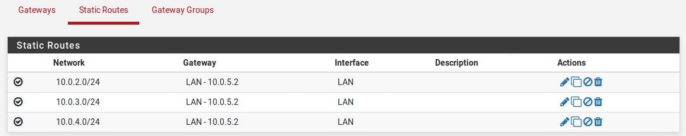

## Port Forwarding

Next, we are going to configure Port Forwarding for mapping the web server's site to the external address of the firewall.

Select Firewall -\> NAT
Select Port Forward
Click either Add button
Leave the Interface and Destination as the WAN address
Change the Destination port range to HTTP
Change the Redirect target IP to 10.0.1.10 and the Redirect target port
to HTTP
Add a Description if you wish and then Save and Accept Changes

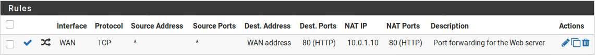

When done correctly, this also creates the rule on the WAN to allow web traffic in to the DMZ web server. You can test this on Bear by browsing to http://192.168.1.1 and verify that the page appears as below (assuming you have configured Ethernet0 2/adapter 1 with a valid address on this network).

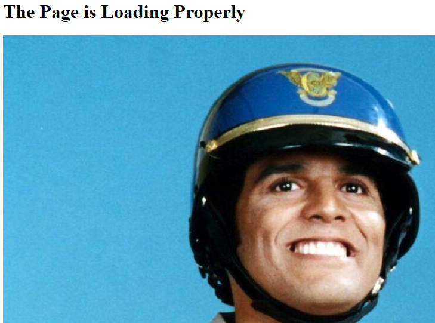

## Adding the Necessary Rules

The last thing to be configured on the external firewall is the specific traffic rules to allow only HTTP traffic inbound to the web server, allow only HTTP traffic outbound, and allow only ICMP from MGMT to the DMZ web server.

Click on Firewall -- Rules

Then click on the WAN rules tab
The only two rules that exists should now be the rule allowing port forwarding to the web server and the default allow all rule.
Click the Edit button next to the default Allow All rule and change the action to Block.
Click Save
On the rules list, grab and move the port forwarding rule above the
Block All rule.
Click Save and Accept Changes.

Your WAN rule list should look similar to the following:

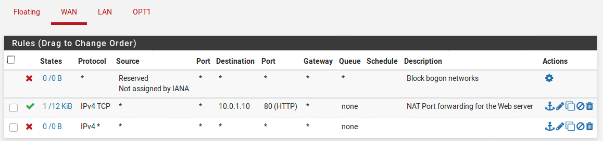

You can test that this still works by browsing to 192.168.1.1 from Bear. You should see the DMZ web page as above.

Secondly, attempt to ping the external interface of the firewall or any address within the network from the 192.168.1.0/24 network. These attempts should fail. You would have to set a default gateway of 192.168.1.1 to attempt to ping from 192.168.1.0/24 to the internal networks.

At this point Grading Check \#1 should return as passed.

Click on the OPT1 rules tab

Click on the Add above button which is furthest to the left.
Leave the Rule options as they are.
Change the Source to Single host or alias and enter a Source Address of 10.0.1.10.
Click Advanced and change the Source Port Range to HTTP.
Add a description if desired and Click Save.

Edit the default Allow All rule, which should now be last in the list.
Change the Action from Allow to Block and click Save.
Click Apply Changes.

> **Optional:** You could add a rule that allows ICMP echo replies back to any if pings are not working as expected later in the challenge.

Your OPT1 rule list should look similar to the following:

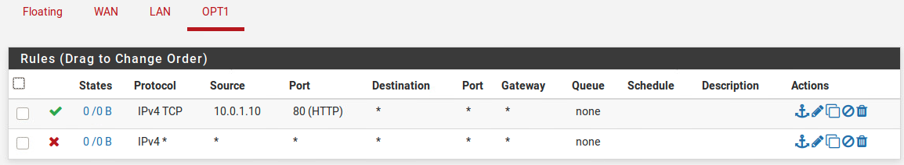

Click on the LAN rules tab

Click on the Add above button which is furthest to the left.
First, create the HTTP only outbound rule on the LAN interface.
Change the Destination to WAN net, or you could set a destination network as 192.168.1.0/24.
Set the Destination Port Range as HTTP (80) to HTTP (80).
Leave all other settings as they are.
Add a description if desired and click Save.

Next, Copy this same rule, only change the destination to a single host of 10.0.1.10.
Add a description if desired and click Save.

Add another rule to allow ICMP from the MGMT network to the DMZ web server.
Change the Protocol to ICMP.
Change the Source to a Single Host of 10.0.5.2 (due to the fact that pings will appear to come from the internal firewall WAN address when coming from MGMT).
Change the Destination to a single host of 10.0.1.10.
Add a description if desired and click Save.

Lastly, edit the default Allow All rule and change the Action from Allow to Block.
Click Save and Apply Changes.

Your LAN rule list should look similar to the following:

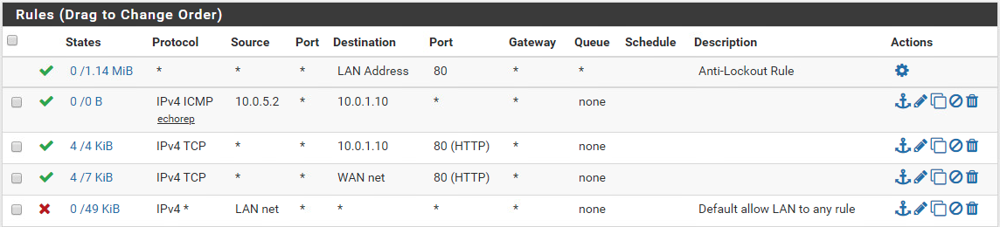

You can now test that these rules are working, assuming all of the internal firewall rules are properly configured, with the following steps:

Try to ping the webserver, 10.0.1.10, from Grossie while on the MGMT network. It should succeed.

Try to ping the gateway for the DMZ, 10.0.1.1 from Grossie while on the MGMT network. It should fail.

Browse to 10.0.1.10 from Grossie while on the MGMT or Users network (between 10.0.3.100-250), or from the User test system (when RDP'd in).
This should load the DMZ web page.
Browse to 192.168.1.250 from Grossie while on the MGMT or Users network (between 10.0.3.100-250), or from the User test system (when RDP'd in).
This should load the grading site.

## Advanced Configuration: Internal Firewall 

To access the internal firewall's (Ponch) web gui, you should use Grossie while on the MGMT network.

On Grossie you may use Ethernet1 with IP settings of 10.0.4.20/24 to attach to the MGMT network. You should add a default gateway of 10.0.4.1 as well.

From Firefox or Chrome, browse to http://10.0.4.1.

Login with user/tartans

There is no need to set any routing on this firewall as everything is directly connected or will traverse the default gateway of 10.0.5.1 to reach the DMZ or WAN net.

Click on Firewall-\> Aliases

While on the IP tab click Add
Here you should create an Alias for the DHCP range of Users, which is 10.0.3.100-250
Enter a Name of Users
Enter an IP or FQDN of 10.0.3.100-10.0.3.250

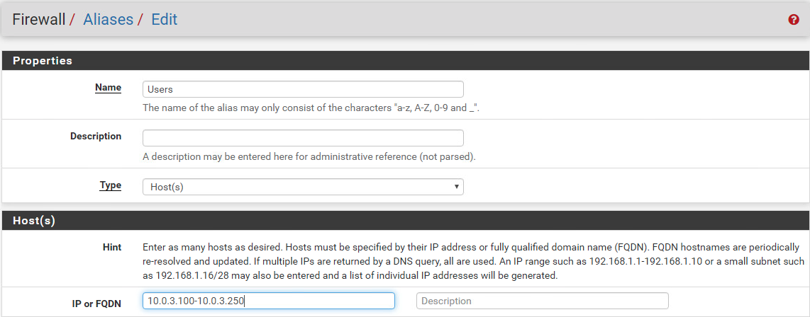

Click Save when complete and then make sure to click Apply Changes on the following screen

## Adding the Necessary WAN rules

Click on Firewall -\> Rules

Then click on the WAN rules tab

The only rules that exists should be the default allow all rule. You may want to leave this open for now, but can change it to Deny all at some point. For the purposes of the challenge, it really does not matter if this is left as is. In the real world, you would likely want to block everything.

## Adding the Necessary LAN Rules

Click on LAN
Remember that the LAN network in this case is the MGMT network.
Click on the Add above button which is furthest to the left.
First, create the ICMP rule to all other networks.
Change the protocol to ICMP.
Change the Source to Network with a value of 10.0.4.0/24 or mark as" LAN network".
Leave all other settings as they are.
Add a description if desired and click Save.

Next, create the HTTP outbound rule to the WAN net.
Change the Source to Network with a value of 10.0.4.0/24 or mark as "LAN network".
Change the Destination to Network with a value of 192.168.1.0/24.
Set the Destination Port Range as HTTP (80) to HTTP (80).
Leave all other settings as they are.
Add a description if desired and click Save.

Next, create the HTTP outbound rule to the DMZ web site.

Copy the rule above to save some time.
Change the Destination to Single host or alias of 10.0.1.10.
Leave all other settings as they are.
Add a description if desired and click Save.

> **Note:** If both firewalls have been configured properly up to this point, you should be able to access the DMZ web page at 10.0.1.10 and the grading site at 192.168.1.250 from Grossie. You should also be able to ping the DMZ web server at 10.0.1.10. Pings to the User test system or the SecurityOnion will still fail due to local firewall rules.

Next, create the RDP outbound rule to the Users net.

Change the Source to Network with a value of 10.0.4.0/24 or set to "LAN network".
Change the Destination to Single host or Alias with a value of Users (as you begin to type Users, it should provide a dropdown to select the alias that you created earlier).
Set the Destination Port Range manually to port 3389, or select MS RDP (3389) from the drop down.
Leave all other settings as they are.
Add a description if desired and click Save.

Next, create the SSH outbound rule to the Service net SecurityOnion.

Change the Source to Network with a value of 10.0.4.0/24 or set to "LAN network".
Change the Destination to Single host or alias with a value of 10.0.2.25 for the SecurityOnion server.
Set the Destination Port Range manually to port 22, or select SSH (22) from the drop down.
Leave all other settings as they are.
Add a description if desired and click Save.

Lastly edit the default Allow all rule to Block instead.
Click Apply Changes to save the rules.

> **Optional:** You could add a rule that allows ICMP echo replies back to the LAN network if pings are not working as expected later in the challenge.

Your LAN rule set should look something like the following:

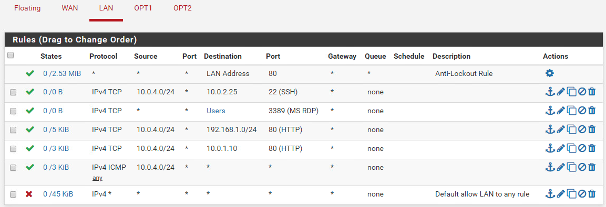

At this point Grading Check #4 - Remote Access from MGMT should pass. Note that this check could technically pass earlier if connectivity is working, but will degrade as other rules are added.

## Adding the Necessary Users Network Rules

Click on OPT1 to set the Users network rules.

Click on the Add above button which is furthest to the left.

Change the Source to Single host or alias with a value of with a value of Users (as you begin to type Users, it should provide a dropdown to select the alias that you created earlier).
Change the Destination to Network with a value of 192.168.1.0/24.
Set the Destination Port Range as HTTP (80) to HTTP (80).
Leave all other settings as they are.
Add a description if desired and click Save.

Copy this rule to create the rule that will allow HTTP traffic to the DMZ web site.

Change the Destination to Single host or alias with a value of 10.0.1.10.
Leave all other settings as they are.
Add a description if desired and click Save.

There is no requirement to add a Block all rule at the end, as this could have negative effects on RDP connectivity.

> **Optional:** You could add a rule that allows ICMP echo replies back to the LAN network if pings are not working as expected later in the challenge, and block ping requests sourced from the 10.0.3.0/24 network to anything else instead of the block all rule. Either will pass the checks, though you may have to do this in order to complete the RDP connection from MGMT to the User test system. Sometimes the Block all rule will prevent the return RDP traffic to complete the handshake.

The LAN rule set should look similar to the following.
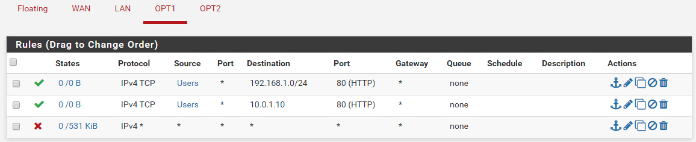

## Adding the Necessary Services Network Rules

Lastly, click on OPT2 and edit the default Allow all rule to Block instead.
Click Apply Changes to save the rules. This will allow SSH inbound, but might prevent connections from completing, even though the check will still pass. See optional note below on how to resolve the ability to make an actual SSH connection while also passing the check, though this is not required.

> **Optional:** You could add a rule that allows ICMP echo replies back to the LAN network if pings are not working as expected later in the challenge, and block ping requests sourced from the 10.0.2.0/24 network to anything else instead of the block all rule. Either will pass the checks, though you may have to do this in order to complete the SSH connection from MGMT to the SecurityOnion. Sometimes the Block all rule will prevent the return SSH traffic to complete the handshake.

## Configuring User

Teams must RDP to the User Test System at 10.0.3.100 in order to set the local firewall to allow ICMP. To connect over RDP type "mstsc" into the Start menu and click on Remote Desktop Connection. Connect to 10.0.3.100 and use the creds: user/tartans.

By default Windows 10 does not allow pings. So this must be done via local system firewalls.

Type "firewall.cpl" into the Start menu of the User system and click the only result to open the firewall, then click on "Advanced Settings"

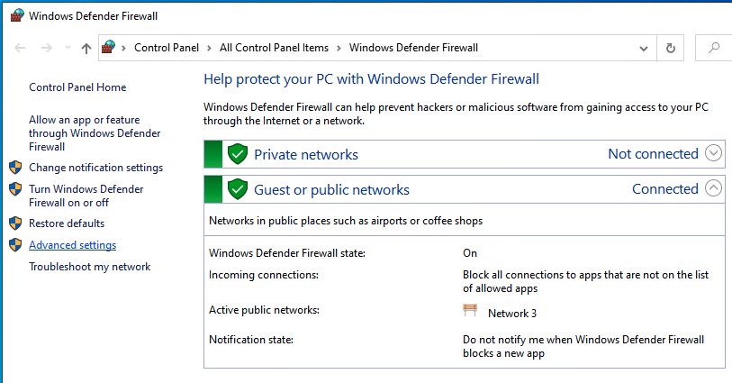

Click on "Inbound Rules" on the left. Then, click "New Rule" on the right.

Select "Custom" as the Rule Type and click Next.

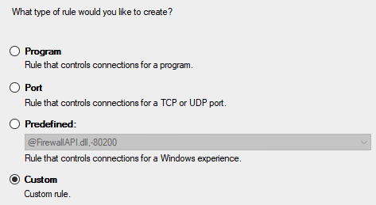

Leave the Program type as "All Programs" and click Next.

Change the Protocol type to "ICMPv4" and click Next.

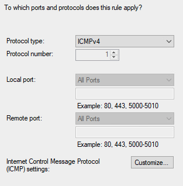

You can leave the local or remote addresses empty, since the internal firewall handles this and click Next.

Leave the defaults and click Next two more times.

Add a name and description and click Finish.

While on the User system you can test whether or not the DMZ web page and grading site are accessible. You may also change the IP to one outside of the DHCP range to verify that you cannot access the sites
form that address

Verify that you can now ping the system (10.0.3.100) from the MGMT network on Grossie.

## Configuring SecurityOnion

From Grossie, and while on the MGMT network, SSH to the SecurityOnion using Putty at 10.0.2.25 and the creds: user/tartans. This connection should pass by default, but you do also have access to the SecurityOnion directly. The check only verifies that port 22 is accessible from the LAN network (MGMT) so you may need to add a specific return traffic rule to complete a test session. However, this is not required for the check to pass.

Just in case:
Due to this system being a SecurityOnion, the command "so-allow" will enable analyst permissions to the system in case the grading check fails or traffic is allowed but the SecurityOnion does not appear to take your connections.

At a command terminal, type and enter: sudo so-allow (tartans if prompted for the sudo password)

Then chose 'a' for analyst.
Last enter the MGMT network IP range of 10.0.4.0/24, which will in turn allow ssh to the system.

The only thing that teams discover is being blocked is ICMP as well.

SecurityOnion uses the Ubuntu Firewall, or UFW.

In order to edit the ufw rules edit the file /etc/ufw/before.rules

-A ufw-before-input -p icmp \--icmp-type destination-unreachable -j ACCEPT
-A ufw-before-input -p icmp \--icmp-type source-quench -j ACCEPT
-A ufw-before-input -p icmp \--icmp-type time-exceeded -j ACCEPT
-A ufw-before-input -p icmp \--icmp-type parameter-problem -j ACCEPT
-A ufw-before-input -p icmp \--icmp-type echo-request -j ACCEPT

Restart the ufw service: sudo service ufw restart

You can now test that pings and the SSH connection are working from Grossie. Remember to ensure that you are sending both tests over the MGMT interface and through the internal FW.

Grading Check #3 should pass at this point.