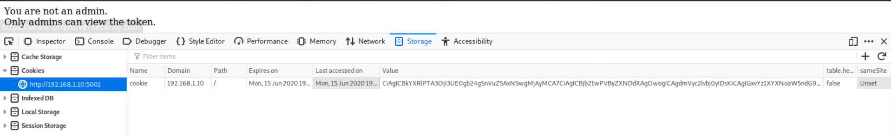

# World Wide Whoops Solution

This solution guide is broken down into 4 sections - one for each of the 4 websites that are part of the challenge. 

## Section 1 - http://192.168.1.10:5001

The website at http://192.168.1.10:5001 is a Python Flask website. Based on the website code provided to the challenger, it can be determined that the website uses cookies to authenticate administrators. Upon visiting the website for the first time, the user is issued a new cookie. If the user already has a cookie, the same one is used. There is a weakness in the cookie that is used, that allows a user to become authenticated as an administrator. 

1. Visit the website and examine the cookie you are issued with the browser's storage inspector by right clicking the page and selecting `inspect`  

2. The cookie value shown in the inspector is base64 encoded. Copy and paste the string into any base64 decoder.

3. Search the decoded text for the string `admin=no`. This is likely what the website uses to determine if the visitor is an administrator. 

4. Change `admin=no` to `admin=yes` and base64 encode the new block of text. 

5. Double click the original cookie value in the browser's storage inspector to edit it. Replace the original value with the new value that was generated after changing the text to include `admin=yes`. 

6. Refresh the web page after setting the updated cookie and you should be presented with the submission token. 

## Section 2 - http://192.168.1.10:5002

The website at http://192.168.1.10:5002 is a Python Flask website. This observation is key to the vulnerability that exists in this code. Based on the website code provided to the challenger, it can be determined that the website uses Jinja2 to render templates on the page. 

1. Read the website code to notice that Flask and Jinja2 templates are used to render the webpage. A function called get_file_content is loaded into the Jinja processing scope on `line 22`, so it can be called from within the template parser. 

2. Notice the use of user input from a GET query parameter in the template that is rendered on `line 9`.  Directly using the user-controlled variable, `name`, results in a Server Side Template Injection (SSTI) vulnerability.

3. To exploit the SSTI vulnerability, a user can pass Jinja template rendering syntax to the server via the `name` query parameter. An example of calling a function from inside the Jinja template processor is seen on `line 11` where the template is reading the contents of the `instructions.txt` file.  Visit the URL: `http://<web-server-and-port>/?name=test{{get_file_content("token.txt")}}` (the word 'test' in the URL is just so we see where user input starts/ends). The submission token will appear after the word 'test' on the web page. 

## Section 3 - http://192.168.1.10:5003

The website at http://192.168.1.10:5003 is a PHP website. The site landing page (`index.php`) has a link to download further instructions which state the the file `token.txt` can only be accessed locally from the web server. Downloads are handled by the file `download.php`. 

1. Notice in `download.php` that there is support for URLs to files that include "http". This can lead to a Server Side Request Forgery (SSRF) vulnerability. This happens when a web request appears to be coming from the web server, but is being returned back to the visitor of the website. 

2. Exploit the SSRF vulnerability by visiting the following URL: `http://192.168.1.10:5003/download.php?file=http://127.0.0.1:5003/token.txt`.  This requires insight that the request for `token.txt` will come from the webserver, allowing the address `127.0.0.1` to access the token file "locally".  The submission token will be inside the downloaded `token.txt` file. 

## Section 4 - http://192.168.1.10:5004

The website at http://192.168.1.10:5004 is a PHP website that allows users to either login with an existing user, or register for a new user account. The submission token for this part is the password for the user `admin`.

1. Notice the use of direct user input on in the SQL Query for registering a new user. This contrasts the use of escaped strings when using user input for SQL Queries during the login portion of the code. This leads to a SQL Injection vulnerability that can be exploited via the register text field.

2. Type in `admin` in the register field. Notice that it says the username is already registered.   Type in `user` in the register field. Notice that it says registration is disabled.  The different responses when a successful and a failed SQL Query occur can be used as part of a SQL Injection.

3. The password for `admin` will need to be brute forced one character at a time by taking advantage of the SQL Injection. A query of `admin' AND Password LIKE '<char>%` where <char> is a valid character for the password (lowercase alphanumeric), for example, f. A response of "User is already registered" means that the guessed character is the correct character for the password and "Registration is Disabled" means that the incorrect character was guessed.  Write a script that will send these requests and parse what is returned by the server. When the correct character is guessed, move on to guessing the next character.   The Python3 script included([blindsql.py](blindsql.py)) is a working example of a script that automates the character-by-character brute force in this way. 

## Submission

Tokens are listed below

 - http://192.168.1.10:5001  - fwogeomcck3fvre8
 - http://192.168.1.10:5002  - 6nok8699yntb0fom
 - http://192.168.1.10:5003  - 25ot8f801u6fp5gl
 - http://192.168.1.10:5004  - vp2p4w87kxmqjeam

